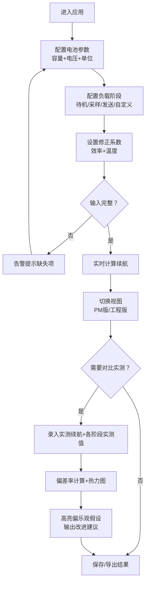

## 1. 产品概述
面向硬件团队的便携式检测仪电池续航专业估算工具，解决样机阶段电池容量"看着够"但多阶段负载（待机/采样/无线发送）叠加、低温降容、转换效率损耗导致实际续航不达预期的问题。
- 核心用户：硬件工程师（参数配置+计算细节核查）、产品经理（续航时长汇报）、测试工程师（实测回填+差距分析）
- 价值：在打样阶段快速量化典型/最差续航，识别负载假设偏乐观项，减少迭代成本

## 2. 核心功能

### 2.1 用户角色
| 角色 | 使用场景 | 核心需求 |
|------|----------|----------|
| 硬件工程师 | 样机设计阶段参数建模 | 单位混用兼容、负载阶段灵活配置、效率/温度修正、完整计算链路可追溯 |
| 产品经理 | 需求评审/客户汇报 | 简洁直观的续航时长结论、典型/最差场景对比 |
| 测试工程师 | 样机测试后数据回填 | 录入实测数据、自动对比估算偏差、定位偏乐观负载假设 |

### 2.2 功能模块
1. **电池参数配置区**：容量（mAh/Wh切换）、标称电压、电芯类型（影响温度系数默认值）
2. **多阶段负载配置区**：动态增删「待机/采样/无线发送/自定义」阶段，每阶段配置功耗（W/mW）、持续时间、循环次数占比
3. **修正系数配置区**：电源转换效率（DC-DC/LDO分级设置）、工作温度（℃）、温度修正系数曲线
4. **双视图输出区**：产品经理视图（简洁卡片+时长结论）、工程视图（分步计算明细+单位换算过程）
5. **智能告警系统**：负载阶段缺失、效率>100%、温度≤-20℃、容量-功耗不匹配等异常提醒
6. **实测对比分析区**：录入实测续航、各阶段实测功耗，自动计算偏差率，高亮偏乐观假设

### 2.3 页面详情
| 页面名称 | 模块名称 | 功能描述 |
|----------|----------|----------|
| 主页面（单页应用） | 电池参数卡 | mAh/Wh双向换算，实时联动电压；支持1S/2S/3S串联配置自动计算电压 |
| 主页面 | 负载阶段编辑器 | 阶段卡片可拖拽排序、增删；每阶段独立单位选择；饼图可视化占比 |
| 主页面 | 修正系数面板 | 效率滑块+手动输入；温度下拉预设（-40/-20/0/25/45/60℃）+自定义；温度系数可编辑 |
| 主页面 | 续航结果卡（PM视图） | 典型续航/最差续航大字展示；小时/分钟/天数智能格式化；电量耗尽时间轴 |
| 主页面 | 续航结果卡（工程视图） | 分步计算过程：每阶段能耗→总能耗→效率修正→温度修正→可用容量→续航时长；所有中间单位展示 |
| 主页面 | 告警横幅 | 分级告警：⚠️警告（效率>100%等）、💡提示（阶段缺失等）、❌错误（单位矛盾等） |
| 主页面 | 实测对比模块 | 实测续航输入、各阶段实测功耗回填；偏差百分比热力图；自动标注"假设偏乐观"的阶段 |

## 3. 核心流程
用户进入页面→配置电池参数（容量+电压）→添加/编辑至少一个负载阶段（功耗+时长+占比）→设置效率和温度修正→实时查看典型/最差续航（可切换PM/工程视图）→测试完成后录入实测数据→查看差距分析并优化负载假设

## 4. 用户界面设计

### 4.1 设计风格
- **主色调**：深空蓝 (#1e3a5f) + 电光青 (#00d4aa) 渐变，体现专业工程感与科技感
- **辅助色**：琥珀橙 (#ff9f43) 用于警告告警，森林绿 (#10b981) 用于典型续航，深红 (#ef4444) 用于最差续航
- **按钮风格**：圆角 8px，轻微悬浮投影，主按钮使用渐变填充，次按钮描边+hover填充
- **字体**：标题使用「JetBrains Mono」等宽字体突出工程感，正文使用「PingFang SC / Noto Sans SC」中文无衬线
- **布局风格**：三栏栅格布局（左输入/中结果/右对比），卡片化分区，玻璃拟态半透明背景
- **图标风格**：线性简洁图标（电池芯、电路板、温度计、波形、尺子等），尺寸 16/20px

### 4.2 页面设计概览
| 页面名称 | 模块名称 | UI元素 |
|----------|----------|--------|
| 主页面 | 电池参数卡 | 左侧电池图标SVG动画，单位切换Tab，输入框+实时换算值 |
| 主页面 | 负载阶段卡 | 可展开阶段行，每行含：名称标签、功率输入+单位、时长输入、占比滑块、删除按钮；底部"+添加阶段"胶囊按钮 |
| 主页面 | 修正系数卡 | 效率滑块带刻度、温度下拉+温度计图标SVG、温度系数展开面板 |
| 主页面 | 续航结果卡 | 切换Tab（产品经理/工程师）；PM视图双数值大字对比；工程视图可折叠分步计算详情 |
| 主页面 | 告警区 | 顶部横幅堆叠展示，每条可关闭，含图标+文案+定位跳转链接 |
| 主页面 | 实测对比卡 | 折叠展开，输入组+偏差率热力网格，结论段落自动生成 |

### 4.3 响应式设计
- Desktop-first，断点 1024px / 768px / 480px
- ≥1024px：三栏布局（左参数35% / 中结果35% / 右对比30%）
- 768-1024px：左右合并为上半区输入，下半区结果+对比并排
- <768px：单列垂直堆叠，全部卡片全宽，Tab切换核心视图

### 4.4 动效设计
- 页面加载：卡片依次上滑淡入（stagger 80ms）
- 数值变化：续航时长数字滚动动画（duration 400ms，ease-out）
- 告警出现：顶部下拉弹入 + 轻微左右震动
- 阶段添加：从底部滑入 + 高度展开
- Tab切换：背景滑块平滑过渡 + 内容交叉淡入
