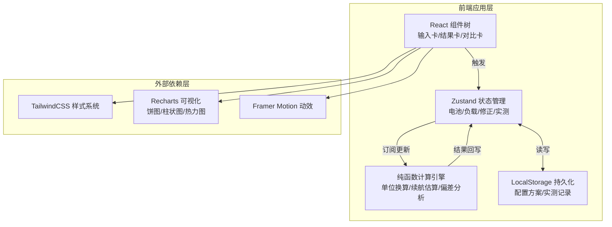

## 1. 架构设计
纯前端单页应用，无后端依赖，所有计算、存储（LocalStorage）、导出均在浏览器端完成，保证硬件团队离线可用。



## 2. 技术栈说明
- **前端框架**：React@18 + TypeScript@5
- **构建工具**：Vite@5（HMR + 快速构建）
- **样式方案**：TailwindCSS@3.4 + CSS Variables（主题变量集中管理）
- **状态管理**：Zustand@4（轻量、支持 persist middleware 持久化）
- **图表可视化**：Recharts@2（饼图展示负载占比、柱状图展示阶段能耗、热力图展示偏差）
- **动效库**：Framer Motion@11（数字滚动、卡片进入、Tab切换等微交互）
- **工具库**：date-fns（时长格式化）、uuid（负载阶段唯一ID）
- **代码规范**：ESLint + Prettier + husky + lint-staged

## 3. 路由定义
单页应用无多路由，使用锚点/状态切换子视图。

| 虚拟路由（状态） | 用途 |
|------------------|------|
| /（默认） | 主界面：输入+结果+对比三栏完整视图 |
| ?view=pm | 分享链接模式：仅展示产品经理简洁视图 |
| ?view=eng | 分享链接模式：仅展示工程计算详细视图 |

## 4. 数据模型

### 4.1 类型定义
```typescript
// ---- 电池参数 ----
type CapacityUnit = 'mAh' | 'Wh';
type CellType = 'LiPo' | 'Li-ion' | 'LiFePO4' | 'NiMH';
interface BatterySpec {
  capacity: number;          // 数值，配合 unit 解释
  capacityUnit: CapacityUnit;
  nominalVoltage: number;    // V，标称电压
  seriesCount: number;       // S数，1S/2S/3S
  cellType: CellType;        // 电芯类型，影响温度系数默认值
}

// ---- 负载阶段 ----
type PhaseName = 'standby' | 'sampling' | 'wireless' | 'custom';
type PowerUnit = 'W' | 'mW';
type TimeUnit = 'ms' | 's' | 'min' | 'h';
interface LoadPhase {
  id: string;                // uuid
  name: PhaseName | string;  // 阶段名
  customName?: string;       // 自定义名称（当name=custom时）
  power: number;             // 功耗数值
  powerUnit: PowerUnit;
  duration: number;          // 单次持续时间
  durationUnit: TimeUnit;
  dutyCycle: number;         // 占空比 0-100%，或循环内次数占比
  worstCaseMultiplier: number; // 最差场景倍率（默认1.5，功耗偏大）
}

// ---- 修正系数 ----
interface CorrectionFactors {
  conversionEfficiency: number;     // 0-100，电源转换效率%
  ambientTemperature: number;       // ℃，环境温度
  temperatureCoefficient: number;   // %/℃，温度系数（负数值，如-2表示每降1℃容量降2%）
  agingFactor: number;              // 0-1，老化系数（默认0.95新电芯）
  selfDischarge: number;            // %/月，自放电率（默认2%）
}

// ---- 告警 ----
type AlertLevel = 'error' | 'warning' | 'info';
interface ValidationAlert {
  id: string;
  level: AlertLevel;
  message: string;
  anchor: string;       // 定位跳转锚点，如 '#battery' / '#phase-123'
}

// ---- 计算结果 ----
interface PhaseEnergyBreakdown {
  phaseId: string;
  phaseName: string;
  powerW: number;              // 换算后 W
  durationS: number;           // 换算后 秒
  energyPerCycleJ: number;     // 每循环能耗 J
  energyPerCycleWh: number;    // 每循环能耗 Wh
  dutyCycle: number;
  avgPowerW: number;           // 时间平均功耗 W
}
interface EnduranceResult {
  typicalHours: number;        // 典型续航 h
  worstCaseHours: number;      // 最差续航 h
  availableCapacityWh_typical: number;  // 修正后可用容量 Wh（典型）
  availableCapacityWh_worst: number;    // 修正后可用容量 Wh（最差）
  avgPowerDrawW_typical: number;       // 平均功耗 W（典型）
  avgPowerDrawW_worst: number;         // 平均功耗 W（最差）
  phaseBreakdown_typical: PhaseEnergyBreakdown[];
  phaseBreakdown_worst: PhaseEnergyBreakdown[];
  temperatureDerating: number;         // 温度降容系数 0-1
  efficiencyLoss: number;              // 效率损失系数 0-1
  calculationSteps: string[];          // 工程视图分步描述
}

// ---- 实测对比 ----
interface PhaseMeasurement {
  phaseId: string;
  measuredPower: number;      // 实测功耗 W
  measuredDuration: number;   // 实测单次时长 s
}
interface MeasurementRecord {
  id: string;
  date: string;               // ISO 日期
  measuredEnduranceHours: number;  // 实测续航 h
  temperature: number;        // 测试温度 ℃
  notes: string;              // 备注
  phaseMeasurements: PhaseMeasurement[];
}
interface ComparisonResult {
  deviationPercent: number;   // 总偏差%，正=估算偏乐观
  phaseDeviations: Array<{
    phaseId: string;
    phaseName: string;
    powerDeviation: number;   // 功耗偏差%
    optimistic: boolean;      // 是否偏乐观（估算<实测）
  }>;
  mostOptimisticPhase: string | null;  // 最偏乐观的阶段名
  conclusion: string;         // 自动生成结论文案
}

// ---- 全局状态 ----
interface AppState {
  battery: BatterySpec;
  phases: LoadPhase[];
  corrections: CorrectionFactors;
  measurements: MeasurementRecord[];
  alerts: ValidationAlert[];
  result: EnduranceResult | null;
  comparison: ComparisonResult | null;
  // actions
  setBattery: (b: Partial<BatterySpec>) => void;
  addPhase: (template?: Partial<LoadPhase>) => void;
  updatePhase: (id: string, patch: Partial<LoadPhase>) => void;
  removePhase: (id: string) => void;
  setCorrections: (c: Partial<CorrectionFactors>) => void;
  addMeasurement: (m: MeasurementRecord) => void;
  removeMeasurement: (id: string) => void;
  recompute: () => void;
}
```

### 4.2 核心计算引擎（纯函数）
```
函数清单（位于 src/lib/calculator.ts）：
├── convertCapacityToWh(capacity, unit, voltage) → Wh
├── convertPowerToW(power, unit) → W
├── convertDurationToS(duration, unit) → s
├── computeTemperatureDerating(temp, coeff) → 0-1 系数
├── validateInputs(battery, phases, corrections) → ValidationAlert[]
├── computeEndurance(battery, phases, corrections, useWorstCase) → EnduranceResult
├── computeComparison(result, measurement) → ComparisonResult
└── formatDurationHours(hours) → 中文智能格式化字符串
```

## 5. 目录结构
```
src/
├── components/
│   ├── layout/
│   │   ├── PageShell.tsx        # 页面外壳+动效
│   │   └── Card.tsx             # 玻璃拟态卡片容器
│   ├── battery/
│   │   └── BatteryForm.tsx      # 电池参数卡
│   ├── phases/
│   │   ├── PhaseList.tsx        # 阶段列表（可增删）
│   │   ├── PhaseRow.tsx         # 单阶段编辑行
│   │   └── PhasePieChart.tsx    # 负载占比饼图
│   ├── corrections/
│   │   └── CorrectionPanel.tsx  # 效率+温度修正
│   ├── alerts/
│   │   └── AlertBanner.tsx      # 告警横幅
│   ├── result/
│   │   ├── ResultTabs.tsx       # PM/工程视图切换
│   │   ├── ResultPMView.tsx     # 产品经理简洁视图
│   │   └── ResultEngineeringView.tsx  # 工程计算详细
│   ├── measurement/
│   │   ├── MeasurementForm.tsx  # 实测录入表单
│   │   ├── DeviationHeatmap.tsx # 偏差热力图
│   │   └── ComparisonReport.tsx # 对比报告
│   └── common/
│       ├── NumberInput.tsx      # 数字输入+单位切换
│       ├── RangeSlider.tsx      # 滑块
│       └── AnimatedNumber.tsx   # 数字滚动动画
├── store/
│   └── useAppStore.ts           # Zustand store + persist
├── lib/
│   ├── calculator.ts            # 核心计算引擎
│   ├── units.ts                 # 单位换算工具
│   └── formatters.ts            # 数字/时长格式化
├── types/
│   └── index.ts                 # 全局类型定义
├── constants/
│   ├── defaults.ts              # 默认值/预设模板
│   └── themes.ts                # Tailwind 主题变量
├── App.tsx
├── main.tsx
└── index.css
```

## 6. 主题与样式变量
```css
/* index.css 中定义 */
:root {
  --bg-primary: #0a1628;
  --bg-secondary: rgba(30, 58, 95, 0.45);
  --bg-card: rgba(22, 40, 68, 0.65);
  --bg-card-hover: rgba(30, 58, 95, 0.75);
  --accent-primary: #00d4aa;
  --accent-secondary: #3b82f6;
  --text-primary: #e2e8f0;
  --text-secondary: #94a3b8;
  --text-muted: #64748b;
  --success: #10b981;
  --warning: #ff9f43;
  --danger: #ef4444;
  --info: #06b6d4;
  --border: rgba(59, 130, 246, 0.25);
  --border-strong: rgba(59, 130, 246, 0.5);
  --shadow-card: 0 8px 32px rgba(0, 0, 0, 0.35);
  --shadow-glow: 0 0 24px rgba(0, 212, 170, 0.25);
  --radius-lg: 16px;
  --radius-md: 10px;
  --radius-sm: 6px;
}
```
