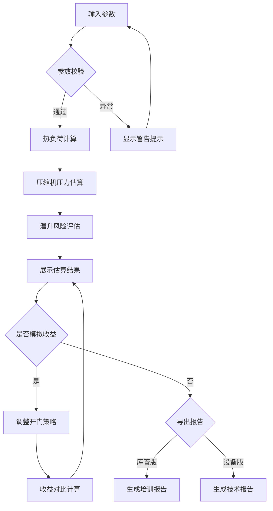

## 1. 产品概述

冷库开门热负荷估算工具——面向冷库库管与设备运维人员，输入库容、目标温度、外界温湿度、门洞尺寸、开门频次与时长、进货温度等参数，快速估算开门造成的额外热负荷及压缩机承压，并以两种报告形式输出：库管版聚焦减少开门的经济收益与温升风险培训，设备版保留完整计算假设与中间参数。

- 解决冷库白天频繁出入货导致温度上飘、但无法量化开门影响的痛点
- 目标用户：冷库库管、装卸班组、设备运维人员

## 2. 核心功能

### 2.1 用户角色

| 角色 | 使用场景 | 核心需求 |
|------|----------|----------|
| 库管 | 日常管理、班组培训 | 量化开门损失、培训装卸工减少开门 |
| 设备运维 | 设备选型、维护评估 | 获取完整计算假设与热负荷明细 |
| 装卸工（间接） | 培训引用 | 直观理解温升风险与开门影响 |

### 2.2 功能模块

1. **参数输入页**: 库容、目标温度、外界温湿度、门洞尺寸、开门次数与时长、进货温度输入，含单位智能换算与异常提示
2. **估算结果页**: 热负荷汇总、压缩机压力估算、温升风险等级、改善建议
3. **收益模拟页**: 调整开门次数/时长后的收益对比，支持"减少 N 次开门"的情景模拟
4. **报告导出页**: 库管版报告（普通话培训风格）与设备版报告（技术参数完整保留）

### 2.3 页面详情

| 页面名称 | 模块名称 | 功能描述 |
|----------|----------|----------|
| 参数输入 | 基础参数区 | 库容(m³)、目标温度(°C)、进货温度(°C)输入，支持立方米/升换算 |
| 参数输入 | 外界环境区 | 外界温度(°C)、外界湿度(%)输入，湿度>80%自动橙色预警 |
| 参数输入 | 门洞与开门区 | 门洞宽(m)×高(m)输入、开门次数(次/天)、平均开门时长输入(支持分:秒混输) |
| 参数输入 | 智能校验区 | 开门时长>5分钟红色警告、湿度>80%橙色提示、温度差异过大提示 |
| 估算结果 | 热负荷汇总 | 显热负荷、潜热负荷、总额外热负荷(kW)、日累计热量(kWh) |
| 估算结果 | 压缩机评估 | 估算压缩机运行压力(MPa)、负荷率(%)、是否超额定容量 |
| 估算结果 | 温升风险 | 预估库内温升幅度(°C)、风险等级(安全/注意/危险) |
| 估算结果 | 改善建议 | 基于当前参数的优化建议列表 |
| 收益模拟 | 情景对比 | 减少开门次数/缩短开门时长的收益对比，显示节能量与温升改善 |
| 收益模拟 | 收益量化 | 年度电费节省估算、设备寿命延长评估 |
| 报告导出 | 库管版报告 | 普通话描述温升风险，减少开门收益，适合培训装卸工 |
| 报告导出 | 设备版报告 | 保留完整计算假设、中间参数、公式引用 |

## 3. 核心流程

用户进入参数输入页，填写冷库基础参数、外界环境参数、门洞与开门参数，系统自动校验并给出警告提示；点击估算后进入结果页，查看热负荷与压缩机评估；可进一步进入收益模拟页，调整开门策略查看改善效果；最后选择导出库管版或设备版报告。

## 4. 用户界面设计

### 4.1 设计风格

- 主色调：冰蓝(#0EA5E9)搭配深灰(#1E293B)，辅以警示橙(#F97316)和危险红(#EF4444)
- 按钮风格：圆角矩形，微阴影，hover 时轻微上浮
- 字体：数字使用等宽字体(JetBrains Mono)，正文使用系统中文优先字体
- 布局：卡片式分区，左侧输入面板、右侧实时结果预览
- 图标风格：线性图标(Lucide)，配合温度/冷库/工业场景

### 4.2 页面设计概览

| 页面名称 | 模块名称 | UI 元素 |
|----------|----------|---------|
| 参数输入 | 基础参数区 | 卡片容器、数字输入框、单位切换标签、冰蓝色标题 |
| 参数输入 | 外界环境区 | 温度/湿度输入、湿度仪表盘指示器、橙色预警横幅 |
| 参数输入 | 门洞与开门区 | 宽高双输入、时分秒混合输入、红色超时警告 |
| 估算结果 | 热负荷汇总 | 大号数字卡片、热负荷分解环形图、kW/kWh 双单位 |
| 估算结果 | 压缩机评估 | 压力表盘可视化、负荷率进度条、超载红色闪烁 |
| 估算结果 | 温升风险 | 风险等级色带(绿→黄→红)、温升曲线小图 |
| 收益模拟 | 情景对比 | 双栏对比卡片、滑块调整开门次数/时长、柱状图对比 |
| 报告导出 | 库管版报告 | 打印友好排版、普通话风险说明、醒目收益数字 |
| 报告导出 | 设备版报告 | 表格化参数清单、公式引用、中间计算值 |

### 4.3 响应式设计

- 桌面优先：双栏布局(输入+结果)充分利用宽屏
- 平板适配：单栏堆叠，结果页使用标签页切换
- 手机适配：简化卡片间距，底部固定操作栏

## 5. 核心计算说明

### 5.1 开门热负荷估算方法

- **显热负荷**: Q_s = ρ × V × c_p × ΔT × (A_door / A_total) × t_open / t_total
  - ρ: 空气密度(kg/m³), V: 库容(m³), c_p: 空气比热容, ΔT: 内外温差
  - A_door: 门洞面积(m²), t_open: 日累计开门时间(s), t_total: 日运行时间(s)
- **潜热负荷**: Q_l = ρ × V_open × (h_out - h_in) × 开门频次修正系数
  - h_out/h_in: 外界/库内空气焓值(kJ/kg)，由温湿度查焓湿图计算
- **进货热负荷**: Q_g = m_g × c_g × (T_g - T_target) / t_total
  - m_g: 进货量(kg), c_g: 货物比热容, T_g: 进货温度
- **压缩机压力**: 基于冷凝温度与蒸发温度估算，P ≈ f(T_cond, T_evap, Q_total)

### 5.2 单位混用处理

- 时间：支持分钟/秒混输，内部统一换算为秒
- 面积：支持平方米输入，门洞可由宽×高自动计算
- 体积：支持立方米/升输入，内部统一为立方米
- 温度：统一摄氏度
