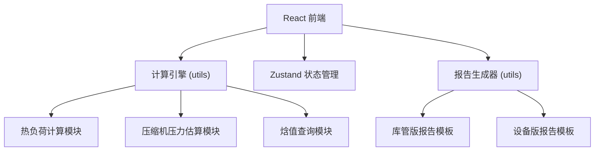

## 1. 架构设计



纯前端架构，所有计算在浏览器端完成，无需后端服务。

## 2. 技术说明

- 前端：React@18 + TypeScript + Tailwind CSS@3 + Vite
- 初始化工具：vite-init (react-ts 模板)
- 后端：无（纯前端计算）
- 数据库：无（使用 localStorage 缓存历史计算记录）
- 状态管理：Zustand

## 3. 路由定义

| 路由 | 用途 |
|------|------|
| / | 参数输入页：填写所有输入参数 |
| /result | 估算结果页：热负荷汇总、压缩机评估、温升风险 |
| /simulation | 收益模拟页：调整开门策略对比收益 |
| /report | 报告导出页：库管版与设备版报告预览与打印 |

## 4. 核心计算模块设计

### 4.1 热负荷计算 (heatLoadCalc.ts)

```typescript
interface HeatLoadInput {
  volume: number;           // 库容 m³
  targetTemp: number;       // 目标温度 °C
  ambientTemp: number;      // 外界温度 °C
  ambientHumidity: number;  // 外界湿度 %
  doorWidth: number;        // 门洞宽 m
  doorHeight: number;       // 门洞高 m
  openCount: number;        // 开门次数 次/天
  avgOpenDuration: number;  // 平均开门时长 s
  goodsTemp: number;        // 进货温度 °C
  goodsWeight: number;      // 进货量 kg/天
}

interface HeatLoadResult {
  sensibleHeat: number;     // 显热负荷 kW
  latentHeat: number;       // 潜热负荷 kW
  totalHeat: number;        // 总热负荷 kW
  dailyEnergy: number;      // 日累计热量 kWh
  compressorPressure: number; // 压缩机估算压力 MPa
  loadRate: number;         // 负荷率 %
  tempRise: number;         // 预估温升 °C
  riskLevel: 'safe' | 'caution' | 'danger';
}
```

### 4.2 焓值计算 (enthalpyCalc.ts)

基于 ASHRAE 简化模型，由温湿度计算空气焓值：
- h = 1.006 × T + (2501 + 1.86 × T) × W
- W: 含湿量(kg/kg)，由相对湿度和饱和蒸汽压计算

### 4.3 压缩机压力估算 (compressorCalc.ts)

基于简化的制冷循环热力学模型：
- 冷凝温度 = 外界温度 + 10~15°C
- 蒸发温度 = 目标温度 - 5~10°C
- 压力比 = P_cond / P_evap
- 考虑热负荷对压缩机负荷率的影响

### 4.4 单位换算 (unitConverter.ts)

- 时间：分→秒 (×60)，分:秒格式解析
- 体积：升→立方米 (÷1000)
- 面积：由宽×高自动计算 m²

### 4.5 报告生成 (reportGenerator.ts)

- 库管版：普通话描述，简化术语，突出经济收益与温升风险
- 设备版：完整参数表、计算假设、中间变量、公式引用

## 5. 数据模型

### 5.1 Zustand Store 定义

```typescript
interface CalculationStore {
  input: HeatLoadInput;
  result: HeatLoadResult | null;
  simulationResult: SimulationResult | null;
  setInput: (input: Partial<HeatLoadInput>) => void;
  calculate: () => void;
  simulate: (reducedCount: number, reducedDuration: number) => void;
}
```

### 5.2 历史记录 (localStorage)

```typescript
interface HistoryRecord {
  id: string;
  timestamp: number;
  input: HeatLoadInput;
  result: HeatLoadResult;
}
```

## 6. 项目结构

```
src/
  components/
    InputCard.tsx          # 参数输入卡片
    UnitInput.tsx          # 带单位切换的输入组件
    WarningBanner.tsx      # 警告提示横幅
    ResultCard.tsx         # 结果展示卡片
    GaugeChart.tsx         # 仪表盘图
    RiskIndicator.tsx      # 风险等级指示器
    ComparisonChart.tsx    # 对比柱状图
    ReportPreview.tsx      # 报告预览组件
  pages/
    InputPage.tsx          # 参数输入页
    ResultPage.tsx         # 估算结果页
    SimulationPage.tsx     # 收益模拟页
    ReportPage.tsx         # 报告导出页
  utils/
    heatLoadCalc.ts        # 热负荷计算
    enthalpyCalc.ts        # 焓值计算
    compressorCalc.ts      # 压缩机压力估算
    unitConverter.ts       # 单位换算
    reportGenerator.ts     # 报告生成
  store/
    calculationStore.ts    # Zustand 状态管理
  App.tsx
  main.tsx
```
