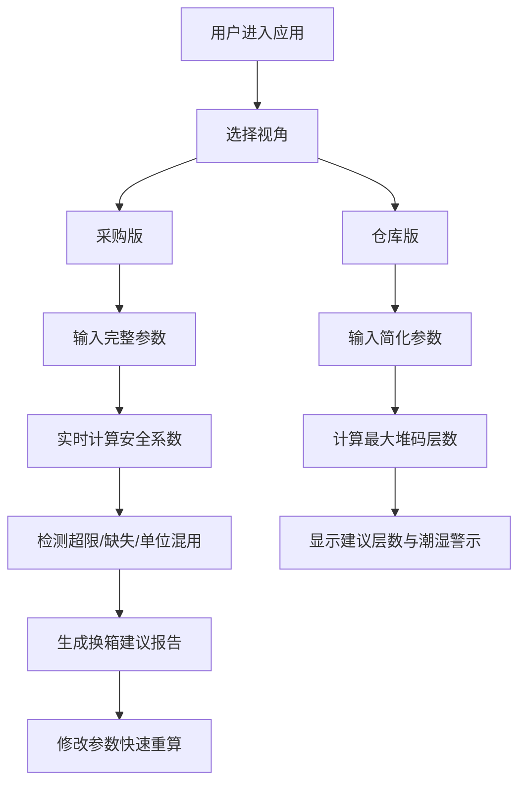

## 1. 产品概述

纸箱堆码抗压估算是一款面向包装工程师、采购人员和仓库管理人员的专业工程计算工具。通过输入单箱重量、纸箱抗压值、堆码层数、托盘方式、湿度条件和运输天数等参数，快速估算堆码安全系数，辅助纸箱选型和仓储堆码决策。

- 目标用户：包装工程师、采购专员、仓库主管
- 核心价值：解决仅凭单箱抗压值无法准确评估堆码安全性的问题，综合考虑湿度、运输、托盘方式等多因素影响

## 2. 核心功能

### 2.1 用户角色

| 角色 | 使用场景 | 核心需求 |
|------|----------|----------|
| 包装工程师 | 新产品纸箱选型 | 精确计算安全系数，验证方案可行性 |
| 采购人员 | 供应商纸箱方案评估 | 快速对比不同箱规，判断是否需要换箱 |
| 仓库管理员 | 日常堆码作业 | 知道最多能堆几层，哪些潮湿条件需要避开 |

### 2.2 功能模块

1. **采购版计算器**：完整参数输入，安全系数计算，换箱建议报告
2. **仓库版计算器**：简化参数输入，建议堆码层数，潮湿条件警示
3. **单位智能提示**：kgf/N/公斤混用检测与换算提示
4. **超限预警**：层数过高、底层受力超限、湿度修正缺失等提示
5. **运输路线备注**：记录运输路线信息，支持保存和调用

### 2.3 页面详情

| 页面名称 | 模块名称 | 功能描述 |
|-----------|-------------|---------------------|
| 主页面 | 视角切换 | 采购版/仓库版一键切换 |
| 主页面 | 采购版计算区 | 完整参数输入表单、实时计算结果、换箱建议 |
| 主页面 | 仓库版计算区 | 简化参数输入、建议堆码层数、潮湿条件警示 |
| 主页面 | 运输路线备注 | 路线名称、运输天数、备注信息记录 |
| 主页面 | 警示提示区 | 单位混用、超限、缺失参数等提示信息 |

## 3. 核心流程

### 3.1 采购版计算流程

用户打开应用 → 选择"采购版"视角 → 输入单箱重量、纸箱抗压值、堆码层数、托盘方式、湿度修正系数、运输天数 → 系统实时计算安全系数 → 显示底层受力、安全系数、是否超限 → 给出换箱建议报告 → 修改参数快速重算

### 3.2 仓库版计算流程

用户打开应用 → 选择"仓库版"视角 → 输入单箱重量、纸箱抗压值、湿度条件 → 系统自动计算最大安全堆码层数 → 显示建议层数、必须避开的潮湿条件 → 指导现场堆码作业

## 4. 用户界面设计

### 4.1 设计风格

- **设计方向**：工业专业风，简洁严谨，数据清晰易读
- **主色调**：深蓝(#1e3a5f) + 橙黄(#f59e0b)警示色，体现工业专业感
- **辅助色**：绿色(#10b981)表示安全，红色(#ef4444)表示超限
- **字体**：使用 JetBrains Mono 等宽字体展示数值，Inter 作为正文
- **布局**：卡片式布局，左右分栏（左侧输入、右侧结果）
- **视觉元素**：纸箱堆叠示意图、进度条式安全系数显示、警示图标

### 4.2 页面设计概述

| 页面名称 | 模块名称 | UI 元素 |
|-----------|-------------|----------|
| 主页面 | 视角切换标签 | 胶囊式切换按钮，选中态有下划线动画 |
| 主页面 | 输入表单区 | 带图标的输入框、下拉选择器、数值步进器 |
| 主页面 | 结果展示区 | 大号安全系数数字、彩色状态条、堆叠示意图 |
| 主页面 | 警示提示区 | 带图标的提示卡片，按严重程度着色 |
| 主页面 | 运输备注区 | 可折叠面板，文本输入框 |

### 4.3 响应式

- 桌面端优先，左右两栏布局
- 平板端：上下堆叠布局
- 移动端：单列布局，表单元素全宽，结果区突出显示
- 触摸优化：按钮最小高度44px，输入框间距充足

