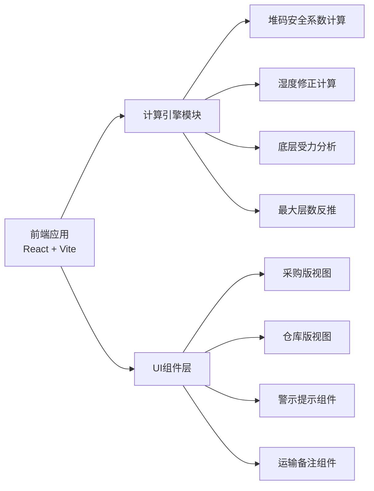

## 1. 架构设计



## 2. 技术描述

- **前端框架**：React@18 + TypeScript
- **构建工具**：Vite@5
- **样式方案**：TailwindCSS@3 + CSS 变量主题系统
- **图标方案**：Lucide React
- **状态管理**：React useState / useReducer（单页应用，无需复杂状态管理）
- **后端**：无后端，纯前端计算应用
- **数据持久化**：localStorage（保存运输路线备注和常用参数）

## 3. 核心计算逻辑

### 3.1 堆码安全系数公式

```
安全系数 = (纸箱抗压值 × 托盘修正系数 × 湿度修正系数) / 底层纸箱承重
底层纸箱承重 = 单箱重量 × (堆码层数 - 1)
```

### 3.2 湿度修正系数

| 湿度条件 | 修正系数 | 说明 |
|----------|----------|------|
| 干燥(<60%RH) | 1.0 | 标准状态 |
| 正常(60-75%RH) | 0.85 | 日常仓储 |
| 潮湿(75-85%RH) | 0.7 | 雨季/潮湿地区 |
| 高湿(>85%RH) | 0.55 | 海运/极端潮湿 |

### 3.3 托盘方式修正系数

| 托盘方式 | 修正系数 | 说明 |
|----------|----------|------|
| 木托盘(满铺) | 1.0 | 标准木托盘 |
| 塑料托盘 | 0.95 | 普通塑料托盘 |
| 纸托盘 | 0.85 | 纸栈板 |
| 直接堆码(无托盘) | 0.8 | 纸箱直接堆叠 |

### 3.4 运输天数修正

运输天数增加会导致纸箱吸湿，抗压强度下降：
- 1-3天：无额外修正
- 4-7天：系数 × 0.95
- 8-15天：系数 × 0.9
- 15天以上：系数 × 0.85

### 3.5 安全系数判定标准

| 安全系数 | 等级 | 建议 |
|----------|------|------|
| ≥ 3.0 | 优秀 | 非常安全，可考虑降低成本 |
| 2.5 - 3.0 | 良好 | 安全储备充足 |
| 2.0 - 2.5 | 合格 | 满足基本要求，建议留有余量 |
| 1.5 - 2.0 | 临界 | 存在风险，需谨慎使用 |
| < 1.5 | 不合格 | 存在塌箱风险，必须换箱 |

## 4. 数据模型

### 4.1 计算输入参数

```typescript
interface CalculationInput {
  boxWeight: number;           // 单箱重量 (kg)
  boxCompression: number;      // 纸箱抗压值 (kgf)
  compressionUnit: 'kgf' | 'N' | 'kg'; // 抗压值单位
  stackLayers: number;         // 堆码层数
  palletType: 'wood' | 'plastic' | 'paper' | 'none'; // 托盘方式
  humidityCondition: 'dry' | 'normal' | 'humid' | 'high'; // 湿度条件
  transportDays: number;       // 运输天数
  routeName?: string;          // 运输路线名称
  routeNotes?: string;         // 路线备注
}
```

### 4.2 计算结果

```typescript
interface CalculationResult {
  safetyFactor: number;          // 安全系数
  safetyLevel: 'excellent' | 'good' | 'pass' | 'critical' | 'fail';
  bottomLoad: number;            // 底层纸箱承重 (kg)
  bottomLoadRatio: number;       // 底层受力占抗压值比例
  effectiveCompression: number;  // 修正后有效抗压值
  maxSafeLayers: number;         // 最大安全堆码层数
  warnings: Warning[];           // 警示信息
  suggestions: string[];         // 建议
}

interface Warning {
  type: 'error' | 'warning' | 'info';
  message: string;
  code: string;
}
```

### 4.3 仓库版最大层数计算

已知单箱重量、纸箱抗压、修正系数，反推最大安全层数：
```
最大层数 = floor((纸箱抗压 × 修正系数 / 安全系数阈值) / 单箱重量) + 1
```
其中安全系数阈值取 2.5（建议值）或 2.0（最低值）

## 5. 页面与路由

| 路由 | 页面 | 说明 |
|------|------|------|
| / | 主页 | 计算器主界面，支持双视角切换 |

单页应用，无需路由跳转，通过状态切换视图模式。

