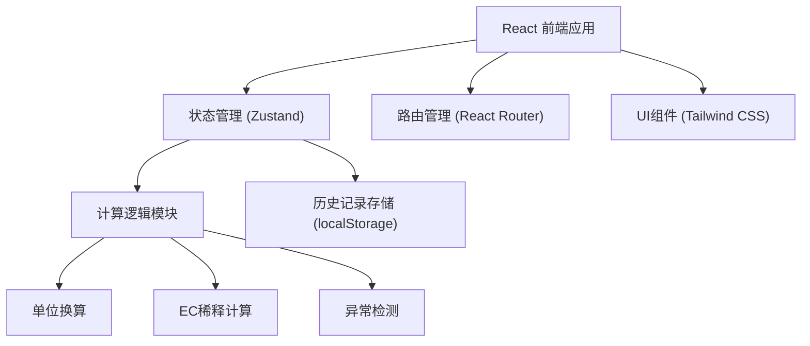

## 1. 架构设计



## 2. 技术描述

- **前端框架**：React@18 + TypeScript
- **构建工具**：Vite@5
- **样式方案**：Tailwind CSS@3
- **状态管理**：Zustand
- **路由方案**：React Router DOM@6
- **图标库**：Lucide React
- **数据存储**：localStorage（本地存储历史记录）
- **后端**：无（纯前端应用）

## 3. 路由定义

| 路由 | 用途 |
|-------|---------|
| / | 计算器主页（默认） |
| /history | 历史记录页 |

## 4. 数据模型

### 4.1 计算输入参数

```typescript
interface CalculationInput {
  currentEc: number;          // 当前EC值
  currentEcUnit: 'mS/cm' | 'μS/cm';  // 当前EC单位
  targetEc: number;           // 目标EC值
  targetEcUnit: 'mS/cm' | 'μS/cm';   // 目标EC单位
  tankVolume: number;         // 水箱体积
  tankVolumeUnit: 'L' | 'mL'; // 水箱体积单位
  stockEc: number;            // 母液EC值
  stockEcUnit: 'mS/cm' | 'μS/cm';    // 母液EC单位
  waterVolume: number;        // 补水量
  waterVolumeUnit: 'L' | 'mL'; // 补水量单位
  cropStage: string;          // 作物阶段
}
```

### 4.2 计算结果

```typescript
interface CalculationResult {
  stockAmount: number;         // 需加母液量
  stockAmountUnit: 'L' | 'mL'; // 母液量单位
  waterAmount: number;         // 需加清水量
  waterAmountUnit: 'L' | 'mL'; // 清水量单位
  actionType: 'add_stock' | 'add_water' | 'no_action'; // 操作类型
  warnings: Warning[];         // 警告信息
  calculationSteps: CalculationStep[]; // 计算步骤（技术员版）
}

interface Warning {
  type: 'target_lower' | 'stock_insufficient' | 'tank_insufficient' | 'input_invalid';
  message: string;
}

interface CalculationStep {
  description: string;
  formula: string;
  result: string;
}
```

### 4.3 历史记录

```typescript
interface HistoryRecord {
  id: string;
  date: string;              // 日期 YYYY-MM-DD
  timestamp: number;         // 时间戳
  input: CalculationInput;   // 输入参数
  result: CalculationResult; // 计算结果
  notes?: string;            // 备注
}
```

### 4.4 作物阶段参考值

```typescript
interface CropStageReference {
  stage: string;
  ecRange: [number, number]; // EC范围 (mS/cm)
  description: string;
}
```

## 5. 核心计算逻辑

### 5.1 EC稀释公式

**提高EC（加母液）：**
```
V_stock = (EC_target - EC_current) × V_tank / (EC_stock - EC_target)
```

**降低EC（加清水）：**
```
V_water = (EC_current - EC_target) × V_tank / EC_target
```

### 5.2 单位换算

- 1 mS/cm = 1000 μS/cm
- 1 L = 1000 mL

### 5.3 异常检测

1. **目标EC低于当前EC**：需要加清水稀释
2. **母液浓度不足**：母液EC ≤ 目标EC时无法提高浓度
3. **水箱余量异常**：添加量超过水箱容量
4. **输入无效**：数值为负或零

## 6. 项目结构

```
src/
├── components/          # 组件目录
│   ├── EcInput.tsx      # EC输入组件（带单位选择）
│   ├── VolumeInput.tsx  # 体积输入组件（带单位选择）
│   ├── ResultCard.tsx   # 结果展示卡片
│   ├── WarningList.tsx  # 警告列表
│   ├── ModeSwitch.tsx   # 模式切换
│   ├── CropStageSelect.tsx # 作物阶段选择
│   └── StepGuide.tsx    # 操作步骤指导（种植户版）
├── pages/               # 页面目录
│   ├── Calculator.tsx   # 计算器主页
│   └── History.tsx      # 历史记录页
├── store/               # 状态管理
│   └── useCalculatorStore.ts
├── utils/               # 工具函数
│   ├── calculations.ts  # 计算逻辑
│   ├── unitConverter.ts # 单位换算
│   └── storage.ts       # 本地存储
├── types/               # 类型定义
│   └── index.ts
├── data/                # 静态数据
│   └── cropStages.ts    # 作物阶段数据
├── App.tsx              # 应用入口
├── main.tsx             # 主入口
└── index.css            # 全局样式
```
