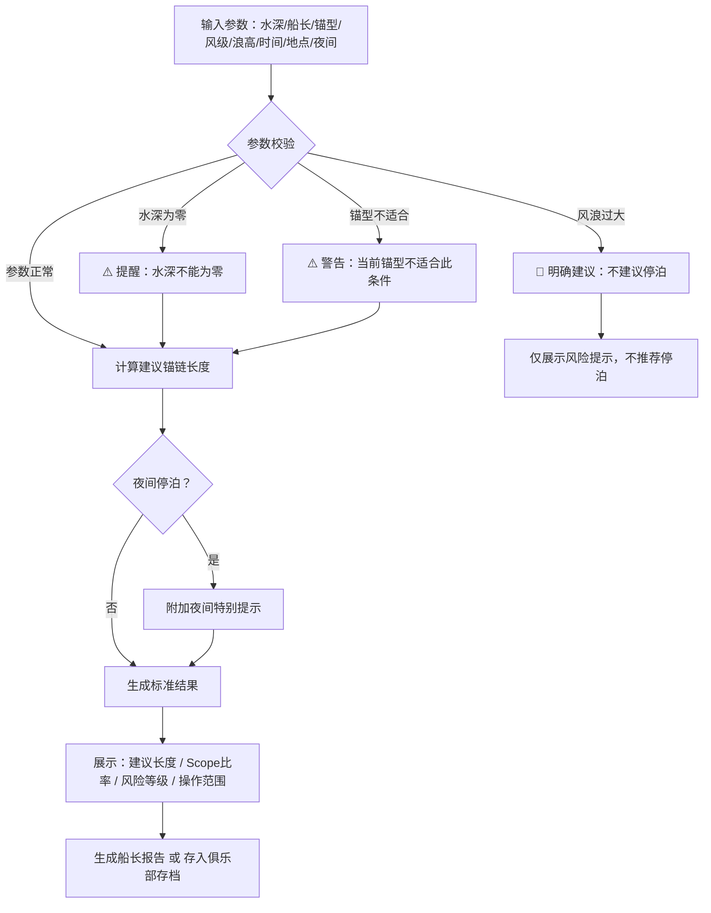

## 1. 产品概述

小船锚链长度估算工具——为游艇俱乐部新手船员提供科学、安全的锚链投放建议。输入水深、船长、锚型、风级、浪高、停泊时间及靠泊地点，即时输出建议锚链长度、风险等级和操作提示，避免凭经验放链导致的偏锚或碰撞事故。

- 目标用户：游艇俱乐部新手船员、船长、俱乐部安全员
- 核心价值：将锚链投放从"凭经验"转为"靠数据"，降低停泊事故率

## 2. 核心功能

### 2.1 用户角色

| 角色 | 使用场景 | 核心权限 |
|------|----------|----------|
| 船员/船长 | 现场输入参数，获取锚链建议和操作范围 | 使用估算、查看报告 |
| 俱乐部安全员 | 审核估算结果，写入出航提醒 | 查看存档、导出参数 |
| 俱乐部管理员 | 存档查阅，统计历史记录 | 查看全部存档记录 |

### 2.2 功能模块

1. **锚链估算主页**：参数输入表单 + 实时结果面板 + 风险提示
2. **船长报告页**：操作范围可视化 + 简洁可打印报告
3. **俱乐部存档页**：历史记录列表 + 参数详情 + 导出功能

### 2.3 页面详情

| 页面名称 | 模块名称 | 功能描述 |
|----------|----------|----------|
| 锚链估算主页 | 参数输入区 | 水深（米/英尺切换）、船长（米）、锚型选择、风级（蒲福/节切换）、浪高（米/英尺）、停泊时间（小时）、靠泊地点、夜间标记 |
| 锚链估算主页 | 结果展示区 | 建议锚链长度（米/英尺双显）、Scope比率、风险等级色标、操作范围上下限 |
| 锚链估算主页 | 风险提示区 | 水深为零提醒、风浪过大禁止停泊建议、锚型不适合警告、夜间特别提示 |
| 船长报告页 | 操作范围图 | 可视化锚链最小-最大投放范围、安全区间标注 |
| 船长报告页 | 报告摘要 | 关键参数汇总、风险评估结论、操作建议 |
| 俱乐部存档页 | 记录列表 | 按时间排列的历史估算记录，含地点、风险等级 |
| 俱乐部存档页 | 参数详情 | 点击记录展开完整计算参数和结果 |

## 3. 核心流程

用户在锚链估算主页输入参数后，系统实时计算建议锚链长度。根据风浪条件判断风险等级：风浪过大时明确建议"不建议停泊"；夜间停泊附加特别提示。计算结果可一键生成船长报告（含操作范围），也可存入俱乐部存档供安全员审阅。

## 4. 用户界面设计

### 4.1 设计风格

- **主题**：航海仪器台——深色仪表盘风格，模拟船上操控台的专业感
- **主色**：深海藏蓝 `#0a1628`，辅助海蓝 `#164e63`
- **强调色**：航海绿 `#10b981`（安全）、琥珀黄 `#f59e0b`（注意）、信号红 `#ef4444`（危险）、纯白高亮
- **字体**：标题使用 `DM Serif Display`（衬线航海感），正文使用 `DM Sans`（现代可读）
- **按钮**：圆角微凸（3D感），主操作用航海绿，危险操作用信号红
- **布局**：桌面端左右分栏（输入 | 结果），移动端上下堆叠
- **图标**：Lucide 图标库，搭配锚链/航海相关图标
- **动效**：结果面板数据变化时平滑过渡，风险等级切换时色标渐变

### 4.2 页面设计概览

| 页面名称 | 模块名称 | UI 元素 |
|----------|----------|---------|
| 锚链估算主页 | 参数输入区 | 深色卡片布局，输入框带单位切换按钮，锚型下拉选择，夜间开关，地点输入 |
| 锚链估算主页 | 结果展示区 | 大字号锚链长度数字，Scope比率仪表盘，风险等级色条，操作范围滑块 |
| 锚链估算主页 | 风险提示区 | 条件触发的警告横幅，图标+文字，按严重程度着色 |
| 船长报告页 | 操作范围图 | 水平条形图标注最小/建议/最大锚链长度，安全区间高亮 |
| 船长报告页 | 报告摘要 | 卡片式参数列表，可打印布局，底部签名栏 |
| 俱乐部存档页 | 记录列表 | 时间线布局，每条记录显示地点+风险色标，点击展开详情 |

### 4.3 响应式设计

- 桌面优先设计，1280px+ 最佳体验
- 平板端（768-1279px）：左右分栏收窄，卡片自适应
- 移动端（<768px）：上下堆叠，输入和结果各占全宽
- 触控优化：按钮和输入框最小 44px 触控区域

### 4.4 锚链计算逻辑说明

**Scope 比率基准**：
- 静水/微风（蒲福≤3）：Scope 3:1 ~ 5:1
- 中等风浪（蒲福4-5）：Scope 5:1 ~ 7:1
- 强风浪（蒲福6-7）：Scope 7:1 ~ 10:1
- 暴风（蒲福≥8）：**不建议停泊**

**修正系数**：
- 浪高修正：浪高>1m 时 Scope +0.5，>2m 时 Scope +1.0
- 夜间修正：夜间停泊 Scope +1.0（可视范围受限）
- 锚型修正：Danforth/Fluke ×1.0（基准），Plow ×0.9（抓地力强），Claw ×0.95，Mushroom ×1.2（临时用），Grapple ×1.3（不推荐长时间）
- 停泊时间修正：>12h Scope +0.5，>24h Scope +1.0（潮汐变化）
- 船长修正：>12m Scope +0.5（风阻面积大）

**建议锚链长度 = 水深 × Scope比率 × 锚型修正 × 其他修正**
