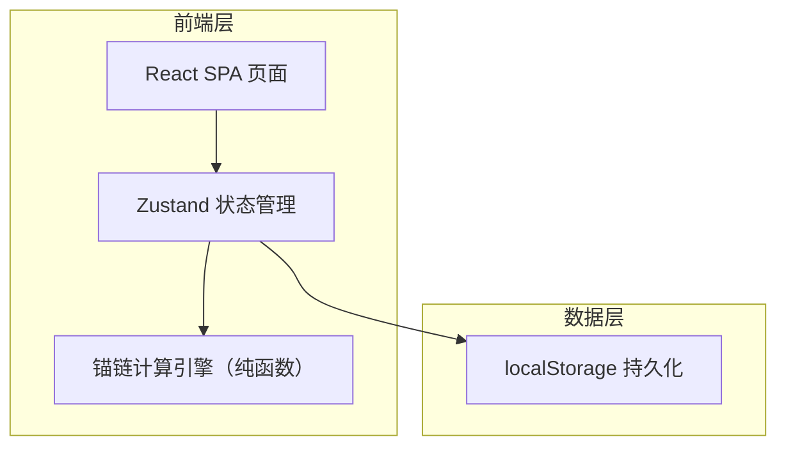
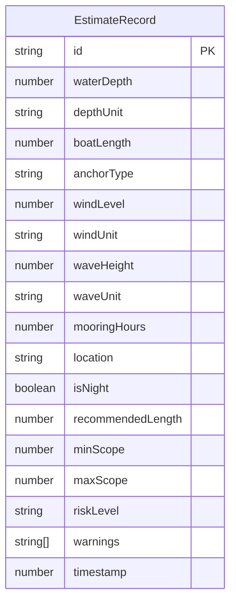

## 1. 架构设计



纯前端应用，无后端服务。估算逻辑以纯函数实现，状态通过 Zustand 管理，历史记录持久化至 localStorage。

## 2. 技术选型

- **前端框架**：React@18 + TypeScript
- **构建工具**：Vite
- **样式方案**：Tailwind CSS@3
- **状态管理**：Zustand（估算状态 + 历史记录）
- **路由**：react-router-dom v6
- **图标**：lucide-react
- **初始化工具**：vite-init（react-ts 模板）
- **后端**：无
- **数据持久化**：localStorage

## 3. 路由定义

| 路由 | 用途 |
|------|------|
| `/` | 锚链估算主页：参数输入 + 结果展示 + 风险提示 |
| `/report` | 船长报告页：操作范围可视化 + 可打印报告 |
| `/archive` | 俱乐部存档页：历史记录列表 + 参数详情 |

## 4. 数据模型

### 4.1 数据模型定义



### 4.2 核心类型定义

```typescript
type DepthUnit = 'm' | 'ft'
type WindUnit = 'beaufort' | 'knots'
type WaveUnit = 'm' | 'ft'
type AnchorType = 'danforth' | 'plow' | 'claw' | 'mushroom' | 'grapple'
type RiskLevel = 'safe' | 'caution' | 'danger' | 'no_anchor'

interface EstimateInput {
  waterDepth: number
  depthUnit: DepthUnit
  boatLength: number
  anchorType: AnchorType
  windLevel: number
  windUnit: WindUnit
  waveHeight: number
  waveUnit: WaveUnit
  mooringHours: number
  location: string
  isNight: boolean
}

interface EstimateResult {
  recommendedLength: number
  minLength: number
  maxLength: number
  scopeRatio: number
  riskLevel: RiskLevel
  warnings: string[]
}

interface EstimateRecord extends EstimateInput, EstimateResult {
  id: string
  timestamp: number
}
```

### 4.3 单位换算规则

| 源单位 | 目标单位 | 换算公式 |
|--------|----------|----------|
| 英尺 (ft) | 米 (m) | × 0.3048 |
| 米 (m) | 英尺 (ft) | × 3.2808 |
| 节 (knots) | 蒲福风级 | 查表换算 |
| 蒲福风级 | 节 (knots) | 查表换算 |

### 4.4 蒲福风级与节速对照

| 蒲福风级 | 风速范围（节） | 海况描述 |
|----------|----------------|----------|
| 0 | < 1 | 无风 |
| 1 | 1-3 | 软风 |
| 2 | 4-6 | 轻风 |
| 3 | 7-10 | 微风 |
| 4 | 11-16 | 和风 |
| 5 | 17-21 | 清风 |
| 6 | 22-27 | 强风 |
| 7 | 28-33 | 疾风 |
| 8 | 34-40 | 大风 |
| 9 | 41-47 | 烈风 |
| 10 | 48-55 | 狂风 |
| 11 | 56-63 | 暴风 |
| 12 | ≥ 64 | 飓风 |
