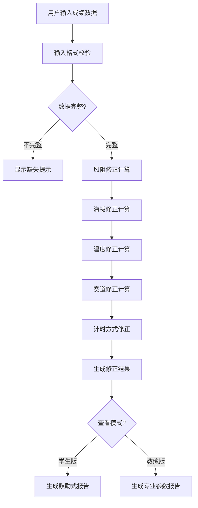
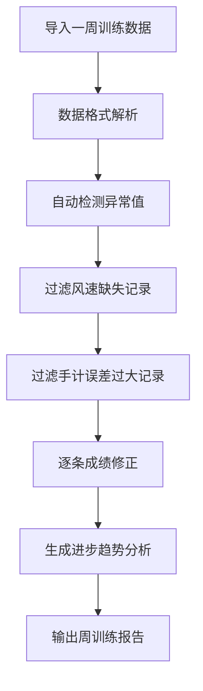

## 1. 产品概述

短跑配速风阻修正工具是一款面向田径体能教练和学生的专业成绩分析应用，通过风速、海拔、温度、赛道等环境因素对100米和200米短跑成绩进行科学修正，消除环境变量对成绩评判的干扰，帮助教练和学生更准确地评估训练效果和真实进步。

- **核心问题**：操场风大、海拔不同，直接比较成绩容易误判进步
- **目标用户**：田径体能教练、短跑运动员/学生
- **产品价值**：提供科学的环境修正算法，让成绩对比更公平、训练评估更精准

## 2. 核心功能

### 2.1 用户角色

| 角色 | 核心需求 | 主要功能 |
|------|----------|----------|
| 学生 | 了解自己的真实水平、获得鼓励反馈 | 学生版报告、成绩修正查询 |
| 教练 | 批量管理学生成绩、深入分析训练数据 | 教练版报告、批量导入、数据过滤、异常排除 |

### 2.2 功能模块

1. **单条成绩修正**：输入项目、成绩、风速、海拔、温度、赛道情况，计算修正成绩
2. **双版本报告**：学生版（鼓励式说明）、教练版（详细修正参数+不适合比较标注）
3. **批量导入分析**：导入一周训练成绩，自动过滤无效记录，分析真实进步趋势
4. **异常成绩管理**：自动检测+手动排除异常成绩记录
5. **输入智能提示**：顺风逆风符号、秒/毫秒格式、风速缺失、手计电计差异提示

### 2.3 页面详情

| 页面名称 | 模块名称 | 功能描述 |
|-----------|-------------|---------------------|
| 首页/修正计算器 | 输入表单 | 项目选择、成绩输入、风速输入、海拔温度、赛道情况、计时方式 |
| 首页/修正计算器 | 实时提示区 | 顺风逆风符号说明、秒毫秒格式提示、风速缺失警告、手计电计差异说明 |
| 首页/修正计算器 | 修正结果卡片 | 原始成绩、修正成绩、修正量、环境因素分析 |
| 学生版报告页 | 鼓励式结果展示 | 进步/退步的鼓励性描述、训练建议、成绩可视化对比 |
| 教练版报告页 | 详细参数展示 | 各修正因子数值、修正公式说明、不适合比较的标注、数据完整性评估 |
| 批量分析页 | 数据导入 | CSV/表格粘贴导入、一周训练数据管理 |
| 批量分析页 | 数据过滤 | 风速缺失过滤、手计误差过大过滤、异常值排除 |
| 批量分析页 | 进步趋势分析 | 修正后成绩趋势图、真实进步评估、周对比报告 |

## 3. 核心流程

### 3.1 单条成绩修正流程

### 3.2 批量分析流程

## 4. 用户界面设计

### 4.1 设计风格

- **设计方向**：运动科技风 + 专业数据感，采用深色调为主，配以荧光绿/活力橙作为运动感强调色
- **主色调**：深邃藏青 (#0F172A) 作为背景主色，营造专业运动科技氛围
- **强调色**：荧光绿 (#22C55E) 代表进步/正向，活力橙 (#F97316) 代表警告/注意
- **字体**：展示字体使用 Space Grotesk 打造运动科技感，正文字体使用 Noto Sans SC 保证中文可读性
- **布局风格**：卡片式布局，玻璃拟态效果增强层次感，数据可视化图表突出
- **交互风格**：输入即时反馈、结果渐入动画、数据切换平滑过渡

### 4.2 页面设计概览

| 页面名称 | 模块名称 | UI 元素 |
|-----------|-------------|-------------|
| 修正计算器 | 输入表单 | 深色卡片背景、荧光绿输入框聚焦态、图标+标签组合输入项、错误状态橙红色边框提示 |
| 修正计算器 | 结果展示 | 大字号修正成绩数字、渐变进度条显示修正幅度、环境因子标签云 |
| 学生版报告 | 结果展示 | 鼓励性大标题、emoji 点缀、前后成绩对比柱状图、温暖的鼓励文案 |
| 教练版报告 | 详细参数 | 数据表格、修正公式展示、各因子贡献度饼图、不适合比较的黄色警示条 |
| 批量分析 | 数据导入 | 拖拽上传区域、粘贴数据文本框、导入进度条 |
| 批量分析 | 趋势分析 | 折线图趋势展示、筛选标签组、数据统计卡片网格 |

### 4.3 响应式设计

- **桌面优先**：以 1440px 宽度为基准设计，多列布局展示完整功能
- **平板适配**：1024px 宽度下调整为两列布局，图表自适应缩放
- **手机适配**：768px 以下单列布局，输入表单项垂直排列，重点数据放大显示
- **触摸优化**：移动端按钮最小高度 44px，输入框增大点击区域

## 5. 核心修正算法说明

### 5.1 风速修正
- 顺风：风速 > 0 时成绩提升，修正后成绩变慢
- 逆风：风速 < 0 时成绩变慢，修正后成绩变快
- 风速阈值：超过 ±2.0m/s 标注为"不适合正式比较"

### 5.2 海拔修正
- 海拔越高空气越稀薄，风阻越小，成绩越好
- 基准海拔：0米海平面

### 5.3 温度修正
- 温度影响空气密度，温度高密度低，风阻小
- 基准温度：20°C

### 5.4 赛道修正
- 塑胶跑道、煤渣跑道、土跑道等不同材质有不同阻力系数

### 5.5 计时方式修正
- 手计时比电计时约慢 0.24 秒（100米）/ 0.14 秒（200米）
- 手计误差范围大的记录不适合精确比较
