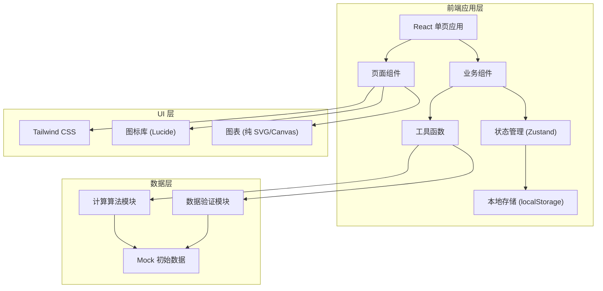

## 1. 架构设计



## 2. 技术选型

- **前端框架**：React 18 + TypeScript
- **构建工具**：Vite 5
- **样式方案**：Tailwind CSS 3
- **状态管理**：Zustand 4
- **图标库**：Lucide React
- **数据持久化**：localStorage
- **路由管理**：React Router DOM 6
- **图表方案**：原生 SVG 实现简单图表，避免引入重型图表库

## 3. 目录结构

```
src/
├── components/          # 可复用组件
│   ├── form/           # 表单组件
│   │   ├── Input.tsx
│   │   ├── Select.tsx
│   │   └── NumberInput.tsx
│   ├── cards/          # 卡片组件
│   │   ├── ResultCard.tsx
│   │   ├── FactorCard.tsx
│   │   └── WarningCard.tsx
│   ├── charts/         # 图表组件
│   │   ├── BarChart.tsx
│   │   ├── LineChart.tsx
│   │   └── ProgressBar.tsx
│   └── layout/         # 布局组件
│       ├── Header.tsx
│       ├── NavTabs.tsx
│       └── Container.tsx
├── pages/              # 页面组件
│   ├── Calculator.tsx  # 单条成绩修正页
│   ├── ReportStudent.tsx  # 学生版报告
│   ├── ReportCoach.tsx    # 教练版报告
│   └── BatchAnalysis.tsx  # 批量分析页
├── store/              # 状态管理
│   └── useRecordStore.ts
├── utils/              # 工具函数
│   ├── correction.ts   # 核心修正算法
│   ├── validation.ts   # 数据验证
│   ├── format.ts       # 格式化工具
│   └── analysis.ts     # 数据分析工具
├── types/              # TypeScript 类型定义
│   └── index.ts
├── data/               # 静态数据/Mock 数据
│   └── mockRecords.ts
├── App.tsx
├── main.tsx
└── index.css
```

## 4. 路由定义

| 路由路径 | 页面名称 | 功能说明 |
|----------|----------|----------|
| `/` | 修正计算器 | 单条成绩输入与修正计算，切换学生/教练视图 |
| `/batch` | 批量分析 | 批量导入数据、过滤、趋势分析 |
| `/report/student` | 学生版报告 | 鼓励式成绩报告展示 |
| `/report/coach` | 教练版报告 | 专业参数报告展示 |

## 5. 数据模型

### 5.1 成绩记录类型

```typescript
// 短跑项目类型
type EventType = '100m' | '200m';

// 计时方式
type TimingMethod = 'manual' | 'electronic';

// 赛道类型
type TrackType = 'synthetic' | 'cinder' | 'dirt' | 'tartan';

// 单条成绩记录
interface SprintRecord {
  id: string;
  date: string;
  event: EventType;
  rawTime: number;      // 原始成绩（秒）
  windSpeed?: number;   // 风速（m/s），正数顺风，负数逆风
  altitude: number;     // 海拔（米）
  temperature: number;  // 温度（摄氏度）
  trackType: TrackType; // 赛道类型
  timingMethod: TimingMethod; // 计时方式
  manualError?: number; // 手计误差估计（秒）
  isExcluded?: boolean; // 是否被排除
  note?: string;        // 备注
  studentName?: string; // 学生姓名
}

// 修正结果
interface CorrectionResult {
  originalTime: number;       // 原始成绩
  correctedTime: number;      // 修正后成绩
  totalCorrection: number;    // 总修正量（秒）
  breakdown: {
    wind: number;             // 风速修正量
    altitude: number;         // 海拔修正量
    temperature: number;      // 温度修正量
    track: number;            // 赛道修正量
    timing: number;           // 计时方式修正量
  };
  isComparable: boolean;      // 是否适合比较
  warnings: string[];         // 警告信息
  factors: string[];          // 影响因素描述
}

// 批量分析结果
interface BatchAnalysisResult {
  totalRecords: number;       // 总记录数
  validRecords: number;       // 有效记录数
  excludedRecords: number;    // 被排除记录数
  missingWind: number;        // 风速缺失数
  highErrorManual: number;    // 手计误差过大数
  trend: SprintRecord[];      // 修正后成绩趋势
  improvement: number;        // 进步幅度（秒）
  improvementPercent: number; // 进步百分比
}
```

### 5.2 状态管理

```typescript
interface RecordState {
  records: SprintRecord[];
  currentRecord: Partial<SprintRecord> | null;
  currentResult: CorrectionResult | null;
  filters: {
    excludeMissingWind: boolean;
    excludeHighError: boolean;
    excludeOutliers: boolean;
    eventType: EventType | 'all';
  };
  addRecord: (record: SprintRecord) => void;
  addRecords: (records: SprintRecord[]) => void;
  updateRecord: (id: string, updates: Partial<SprintRecord>) => void;
  deleteRecord: (id: string) => void;
  toggleExclude: (id: string) => void;
  setCurrentRecord: (record: Partial<SprintRecord> | null) => void;
  calculateCorrection: (record: Partial<SprintRecord>) => CorrectionResult | null;
  setFilter: (key: keyof RecordState['filters'], value: any) => void;
  getFilteredRecords: () => SprintRecord[];
  getBatchAnalysis: () => BatchAnalysisResult;
}
```

## 6. 核心算法

### 6.1 风速修正公式
基于短跑项目经验公式，风速对成绩的影响与风速的平方成正比。

```
wind_correction = -k * wind_speed * distance / velocity

其中 k 为风阻系数（约 0.0008-0.0012），顺风为正，修正后成绩减慢
```

### 6.2 海拔修正公式
基于空气密度随海拔变化的规律。

```
altitude_factor = exp(-altitude / 8500)
altitude_correction = raw_time * (1 - altitude_factor) * 0.5
```

### 6.3 温度修正公式
温度影响空气密度。

```
temp_factor = (20 + 273.15) / (temperature + 273.15)
temp_correction = raw_time * (1 - temp_factor) * 0.3
```

### 6.4 赛道修正系数
| 赛道类型 | 修正系数 |
|----------|----------|
| 塑胶跑道 (synthetic) | 1.00 (基准) |
| 聚氨酯跑道 (tartan) | 0.99 |
| 煤渣跑道 (cinder) | 1.03 |
| 土跑道 (dirt) | 1.05 |

### 6.5 计时方式修正
- 100米手计时 → 电计时：+0.24秒
- 200米手计时 → 电计时：+0.14秒

## 7. 数据验证规则

1. **成绩范围**：
   - 100米：8-20秒
   - 200米：18-40秒
   
2. **风速范围**：
   - 合理范围：-10 到 +10 m/s
   - 可比较范围：-2.0 到 +2.0 m/s
   - 缺失时标记为"不适合精确比较"

3. **海拔范围**：-500 到 5000 米

4. **温度范围**：-30 到 50 摄氏度

5. **手计误差**：
   - 误差 > 0.3 秒时标记为"不适合精确比较"
   - 默认手计误差 0.2 秒

6. **异常值检测**：
   - 与个人PB偏差 > 10% 标记为疑似异常
   - 与同组平均偏差 > 3σ 标记为疑似异常
