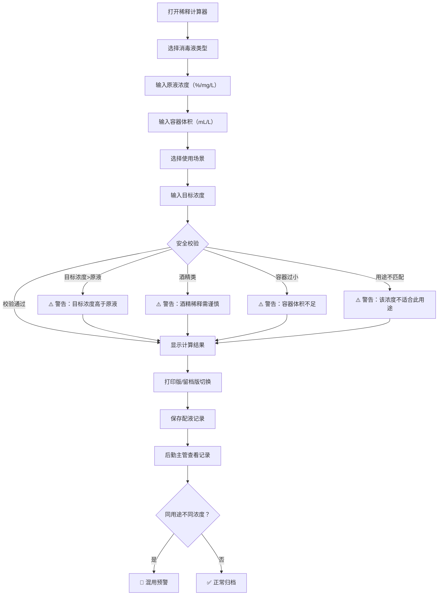

## 1. 产品概述

消毒液稀释复核器——面向学校后勤保洁人员的消毒液配比计算与记录工具。解决保洁阿姨看不懂百分比浓度、不知道加多少原液和水的痛点，同时为后勤主管提供按用途归档的配液记录，防止不同目标浓度的消毒液混用。

- 目标用户：学校后勤保洁人员（操作端）、后勤主管（管理端）
- 核心价值：将化学浓度换算为"倒多少原液、加多少水"的直觉指令，并自动留存配制档案

## 2. 核心功能

### 2.1 用户角色

| 角色 | 使用方式 | 核心权限 |
|------|----------|----------|
| 保洁人员 | 扫码/直接打开 | 输入参数、查看计算结果、打印配液单 |
| 后勤主管 | 同上 + 管理入口 | 查看所有配液记录、按用途筛选、导出留档 |

### 2.2 功能模块

1. **稀释计算器页面**：输入原液信息与目标参数，实时计算并给出安全提示
2. **配制记录页面**：按用途分类展示历史配液记录，支持筛选与导出
3. **用途预设管理页面**：管理不同消毒场景的推荐浓度预设

### 2.3 页面详情

| 页面名称 | 模块名称 | 功能描述 |
|----------|----------|----------|
| 稀释计算器 | 原液信息输入 | 选择消毒液类型（84/季铵盐/酒精），输入原液浓度（支持%/mg/L）、容器体积（支持mL/L） |
| 稀释计算器 | 目标参数输入 | 输入目标浓度、选择使用场景（地面/门把手/垃圾点位/其他） |
| 稀释计算器 | 计算结果展示 | 显示原液用量、加水量，自动换算为易读单位 |
| 稀释计算器 | 安全校验提示 | 目标浓度>原液浓度警告、酒精稀释警告、容器过小警告、用途不匹配警告 |
| 稀释计算器 | 打印版/留档版切换 | 打印版：大字简洁，适合保洁现场使用；留档版：完整记录含时间、操作人、用途 |
| 配制记录 | 记录列表 | 按日期展示所有配液记录，标记用途和浓度 |
| 配制记录 | 用途筛选 | 按地面/门把手/垃圾点位等用途分类筛选 |
| 配制记录 | 混用预警 | 当同一用途下出现不同目标浓度记录时高亮提醒 |
| 用途预设 | 预设列表 | 展示各场景推荐的消毒液类型和目标浓度 |
| 用途预设 | 用途编辑 | 添加/修改消毒场景及其推荐浓度 |

## 3. 核心流程

保洁人员打开稀释计算器 → 选择消毒液类型 → 输入原液浓度和容器体积 → 选择使用场景 → 输入目标浓度 → 系统自动计算原液和水的用量 → 安全校验通过后显示结果 → 切换打印版打印配液单 / 保存留档版记录 → 后勤主管按用途查看记录，发现混用预警

## 4. 用户界面设计

### 4.1 设计风格

- **主色调**：医疗洁净蓝 (#0EA5E9) + 安全警示橙 (#F97316) + 通过绿 (#22C55E)
- **辅助色**：浅灰背景 (#F8FAFC)、白色卡片、深灰文字 (#1E293B)
- **按钮风格**：圆角胶囊按钮，主要操作用实色填充，次要操作用描边
- **字体**：数字使用等宽字体 JetBrains Mono，正文使用 Noto Sans SC
- **布局风格**：单栏居中卡片式布局，顶部导航切换页面
- **图标风格**：线性图标，配合消毒/清洁主题

### 4.2 页面设计概览

| 页面名称 | 模块名称 | UI 元素 |
|----------|----------|---------|
| 稀释计算器 | 原液信息输入 | 消毒液类型选择卡片（3选1带图标），浓度输入框带单位切换，容器体积输入框带单位切换 |
| 稀释计算器 | 目标参数输入 | 场景选择标签组（地面/门把手/垃圾点位），目标浓度输入框，用途匹配指示灯 |
| 稀释计算器 | 计算结果 | 大号数字展示原液量和加水量，单位自动选择最适读法，安全状态指示灯 |
| 稀释计算器 | 警告横幅 | 红色/橙色/黄色横幅，图标+文字说明，可关闭 |
| 稀释计算器 | 打印/留档切换 | 底部固定操作栏，打印版按钮（打印机图标）、留档版按钮（存档图标） |
| 配制记录 | 记录卡片 | 日期+用途标签+浓度+操作人，颜色编码按用途区分 |
| 配制记录 | 混用预警横幅 | 红色醒目横幅，提示某用途下存在不同目标浓度记录 |

### 4.3 响应式设计

- 桌面优先设计，适配保洁阿姨在办公室电脑使用
- 平板适配：保洁现场使用平板查看配液单
- 手机适配：主管随时查看记录，打印版页面简化为纯数字大字展示

### 4.4 浓度换算规则

- 1% = 10000 mg/L
- 1 L = 1000 mL
- 稀释公式：原液用量 = (目标浓度 × 容器体积) / 原液浓度
- 加水量 = 容器体积 - 原液用量

### 4.5 安全校验规则

| 校验项 | 条件 | 提示级别 | 提示内容 |
|--------|------|----------|----------|
| 浓度溢出 | 目标浓度 > 原液浓度 | 🔴 阻断 | 目标浓度不能高于原液浓度，请检查输入 |
| 酒精稀释 | 消毒液类型为酒精且目标浓度<70% | 🟠 警告 | 酒精浓度低于70%杀菌效果显著下降，确认是否继续？ |
| 容器过小 | 原液用量 > 容器体积 | 🔴 阻断 | 原液用量超过容器体积，请增大容器或降低目标浓度 |
| 用途不匹配 | 目标浓度与场景推荐浓度偏差>50% | 🟡 提醒 | 当前浓度与该场景推荐浓度差异较大，请确认用途是否正确 |
| 混用预警 | 同一用途存在不同目标浓度记录 | 🔴 阻断 | 该用途已有不同浓度的配制记录，请确认是否继续 |

### 4.6 用途预设数据

| 使用场景 | 推荐消毒液 | 推荐目标浓度 |
|----------|------------|--------------|
| 地面 | 84消毒液 | 0.05% (500mg/L) |
| 门把手 | 75%酒精 | 75% |
| 垃圾点位 | 84消毒液 | 0.1% (1000mg/L) |
| 物表擦拭 | 季铵盐 | 0.1% (1000mg/L) |
