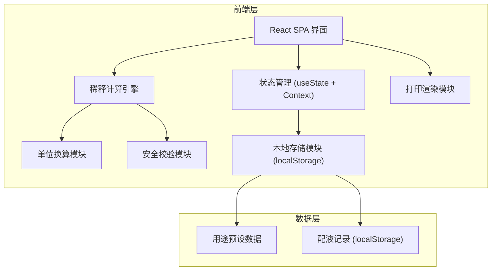
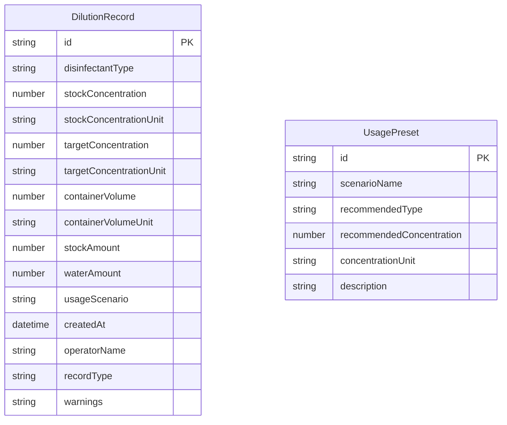

## 1. 架构设计



纯前端架构，无需后端服务。所有数据存储在浏览器 localStorage 中，支持导出 JSON 留档。

## 2. 技术说明

- **前端框架**：React@18 + TypeScript + Vite
- **样式方案**：Tailwind CSS@3
- **初始化工具**：Vite (react-ts 模板)
- **后端**：无（纯前端应用）
- **数据存储**：localStorage（配液记录、用途预设）
- **打印方案**：CSS @media print + window.print()
- **图标**：Lucide React
- **字体**：JetBrains Mono（数字）、Noto Sans SC（中文正文）

## 3. 路由定义

| 路由 | 用途 |
|------|------|
| / | 稀释计算器主页面 |
| /records | 配制记录查看页面 |
| /presets | 用途预设管理页面 |

## 4. 数据模型

### 4.1 数据模型定义



### 4.2 数据定义语言

```typescript
interface DilutionRecord {
  id: string
  disinfectantType: '84' | 'quaternary_ammonium' | 'alcohol'
  stockConcentration: number
  stockConcentrationUnit: '%' | 'mg/L'
  targetConcentration: number
  targetConcentrationUnit: '%' | 'mg/L'
  containerVolume: number
  containerVolumeUnit: 'mL' | 'L'
  stockAmount: number
  stockAmountUnit: 'mL' | 'L'
  waterAmount: number
  waterAmountUnit: 'mL' | 'L'
  usageScenario: string
  createdAt: string
  operatorName: string
  recordType: 'print' | 'archive'
  warnings: string[]
}

interface UsagePreset {
  id: string
  scenarioName: string
  recommendedType: '84' | 'quaternary_ammonium' | 'alcohol'
  recommendedConcentration: number
  concentrationUnit: '%' | 'mg/L'
  description: string
}

interface ValidationResult {
  level: 'block' | 'warn' | 'info'
  message: string
  code: 'CONCENTRATION_OVERFLOW' | 'ALCOHOL_DILUTION' | 'CONTAINER_TOO_SMALL' | 'SCENARIO_MISMATCH' | 'MIXED_CONCENTRATION'
}
```

## 5. 核心计算逻辑

### 5.1 单位换算

```
1% = 10000 mg/L
1 L = 1000 mL
```

### 5.2 稀释计算

所有计算统一换算为 % 和 L 进行：

```
stockConc_normalized = stockConcentration (换算为%)
targetConc_normalized = targetConcentration (换算为%)
containerVol_normalized = containerVolume (换算为L)

stockAmount_L = (targetConc_normalized × containerVol_normalized) / stockConc_normalized
waterAmount_L = containerVol_normalized - stockAmount_L
```

输出时自动选择最适单位：
- 量 < 1L → 显示 mL（保留1位小数）
- 量 ≥ 1L → 显示 L（保留2位小数）
