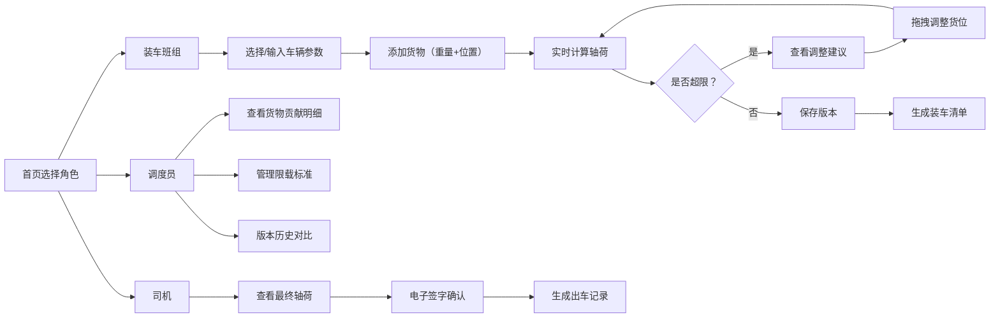

## 1. 产品概述

货车轴荷估算器是一款面向物流调度和装车班组的专业工具，通过输入车辆参数和货物摆放信息，实时估算前后轴荷分布，帮助避免单轴超载风险，保障运输安全。

- 解决问题：传统装车仅看总重，忽略轴荷分布，导致前轴/后轴超载被罚甚至引发事故
- 目标用户：装车班组、调度员、司机
- 核心价值：装车前预知轴荷、试算调整方案、留档可追溯

---

## 2. 核心功能

### 2.1 用户角色

| 角色 | 进入方式 | 核心权限 |
|------|----------|----------|
| 装车班组 | 首页角色选择 | 查看轴荷、调整货位、生成调整建议、保存新版本 |
| 调度员 | 首页角色选择 | 货物贡献明细、版本管理、限载标准配置、全量数据查看 |
| 司机 | 首页角色选择 / 二维码 | 查看最终轴荷、电子签字确认 |

### 2.2 功能模块

1. **首页/角色选择**：三种角色入口、最近任务列表
2. **轴荷计算引擎**：基于杠杆原理的前后轴荷计算、单位自动换算、超限判断
3. **装车班组版**：货物列表、可视化货位调整、实时轴荷预览、调整建议
4. **调度版**：每件货物轴荷贡献、版本历史对比、限载标准管理
5. **司机确认**：最终轴荷展示、电子签字、出车记录留档

### 2.3 页面详情

| 页面名称 | 模块名称 | 功能描述 |
|----------|----------|----------|
| 首页 | 角色选择卡片 | 三个角色大卡片，点击进入对应视图 |
| 首页 | 最近任务 | 最近5条装车任务快速入口 |
| 装车班组页 | 车辆参数区 | 轴距、空车前/后轴荷、车厢长度、限载标准选择 |
| 装车班组页 | 货物列表 | 添加/编辑/删除货物，支持吨/公斤切换 |
| 装车班组页 | 货位可视化 | 侧视图展示车厢和货物位置，可拖拽调整 |
| 装车班组页 | 轴荷实时面板 | 前后轴荷数值、安全余量、超限警告 |
| 装车班组页 | 调整建议 | 智能提示哪件货该往哪移 |
| 装车班组页 | 版本操作 | 保存当前版本、生成新版清单 |
| 调度页 | 货物贡献明细 | 每件货物对前/后轴的贡献占比 |
| 调度页 | 版本历史 | 所有试算版本对比，可回滚 |
| 调度页 | 限载标准管理 | 增删改查限载标准，按车型分类 |
| 司机确认页 | 最终轴荷展示 | 大字号显示前后轴荷和总重 |
| 司机确认页 | 电子签字 | Canvas手写签字，保存为图片 |
| 司机确认页 | 出车记录 | 签字时间、司机姓名、轴荷数据留档 |

---

## 3. 核心流程

---

## 4. 用户界面设计

### 4.1 设计风格

- **主色调**：工业蓝（#1e40af）作为主色，警示橙（#f97316）用于超限提示，安全绿（#10b981）用于合格状态
- **辅助色**：深灰背景 + 浅色卡片，营造专业工业感
- **按钮风格**：圆角 8px，实体按钮有轻微阴影，主按钮渐变
- **字体**：标题使用 Roboto 粗体，数据展示使用等宽字体（JetBrains Mono），正文使用系统无衬线
- **布局风格**：卡片式布局，左侧参数区 + 右侧可视化区的左右分栏
- **图标风格**：线性图标，统一 24px 尺寸

### 4.2 页面设计概述

| 页面名称 | 模块名称 | UI 元素 |
|----------|----------|---------|
| 首页 | 角色卡片 | 三大卡片并排，图标+标题+描述，hover 上浮效果 |
| 装车班组页 | 轴荷仪表盘 | 半圆形进度条展示轴荷使用率，颜色随状态变化 |
| 装车班组页 | 车厢侧视图 | 长方形代表车厢，货物块堆叠，标注重心位置 |
| 装车班组页 | 货物列表 | 表格形式，可编辑重量和位置，行内操作按钮 |
| 调度页 | 贡献条形图 | 横向条形图，每件货物的轴荷贡献占比 |
| 司机页 | 大字轴荷 | 超大字号数字，状态色背景 |
| 司机页 | 签字板 | 白色画布，支持触摸和鼠标 |

### 4.3 响应式

- 桌面端为主（调度员、装车班组在办公室/仓库使用）
- 平板端适配（司机可能用平板签字）
- 移动端简化视图（司机手机查看）
- 触摸优化：拖拽区域放大，按钮最小 44px

### 4.4 动效设计

- 轴荷数值变化时数字滚动动画
- 超限警告脉冲闪烁
- 货位拖拽时的幽灵效果和吸附对齐
- 页面切换淡入淡出
- 保存成功后顶部出现的消失式提示条
