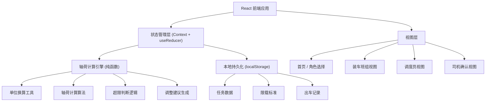
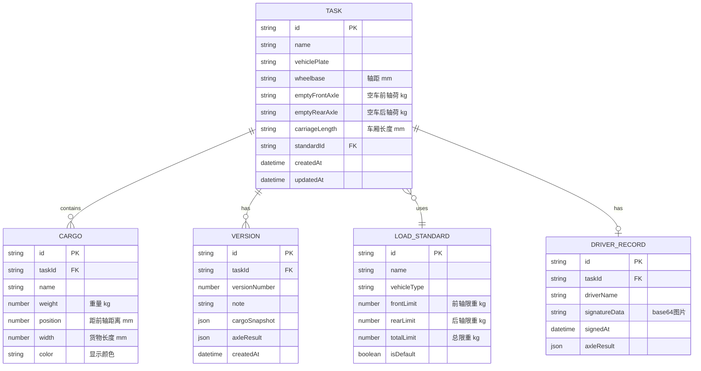

## 1. 架构设计



---

## 2. 技术描述

- **前端框架**：React@18 + TypeScript
- **构建工具**：Vite@5
- **样式方案**：TailwindCSS@3
- **状态管理**：React Context + useReducer（轻量场景，无需 Redux）
- **路由**：React Router DOM@6
- **图表可视化**：纯 CSS + SVG 实现（避免引入重型图表库）
- **签字功能**：原生 Canvas API
- **数据持久化**：localStorage（前端纯应用，无后端）
- **图标**：Lucide React（轻量线性图标库）

---

## 3. 目录结构

```
src/
├── types/              # 类型定义
│   └── index.ts
├── utils/              # 工具函数
│   ├── calculator.ts   # 轴荷计算核心
│   ├── units.ts        # 单位换算
│   └── storage.ts      # 本地存储
├── context/            # 状态管理
│   └── AppContext.tsx
├── components/         # 通用组件
│   ├── Layout.tsx
│   ├── AxleGauge.tsx       # 轴荷仪表盘
│   ├── CargoVisual.tsx     # 货位可视化
│   ├── CargoList.tsx       # 货物列表
│   ├── VehicleForm.tsx     # 车辆参数表单
│   └── SignaturePad.tsx    # 签字板
├── pages/              # 页面
│   ├── Home.tsx
│   ├── LoadingTeam.tsx
│   ├── Dispatcher.tsx
│   └── Driver.tsx
├── data/               # 初始数据 / Mock
│   └── mockData.ts
├── App.tsx
├── main.tsx
└── index.css
```

---

## 4. 路由定义

| 路由 | 页面 | 用途 |
|------|------|------|
| `/` | 首页 | 角色选择、最近任务 |
| `/loading` | 装车班组页 | 货位调整、轴荷实时计算 |
| `/dispatcher` | 调度页 | 货物贡献、版本管理、限载标准 |
| `/driver/:taskId` | 司机确认页 | 最终轴荷、电子签字 |

---

## 5. 数据模型

### 5.1 数据模型定义



### 5.2 核心计算原理

**轴荷计算（杠杆原理）**：

以前轴为支点，货物产生的力矩由后轴承担：
- 后轴荷增加 = 货物重量 × 货物距前轴距离 / 轴距
- 前轴荷增加 = 货物重量 - 后轴荷增加

总轴荷 = 空车轴荷 + 货物产生的附加轴荷

---

## 6. 核心算法说明

### 6.1 单货物轴荷贡献

```
输入：货物重量W(kg)，货物重心距前轴距离d(mm)，轴距L(mm)
输出：前轴附加荷重 Ff，后轴附加荷重 Fr

力矩平衡：W × d = Fr × L
→ Fr = W × d / L
→ Ff = W - Fr = W × (L - d) / L
```

### 6.2 多货物累加

每件货物分别计算对前后轴的贡献，然后累加，加上空车轴荷。

### 6.3 调整建议生成

- 如果前轴超载：找出最靠前的重货，建议向后移动
- 如果后轴超载：找出最靠后的重货，建议向前移动
- 计算建议移动距离：超载量 / 货物重量 × 轴距

---

## 7. 性能与质量

- 计算逻辑为纯函数，O(n) 复杂度，实时计算无压力
- 组件按需渲染，避免不必要的重绘
- 使用 TypeScript 保证类型安全
- 本地存储有大小限制（~5MB），定期清理旧数据
