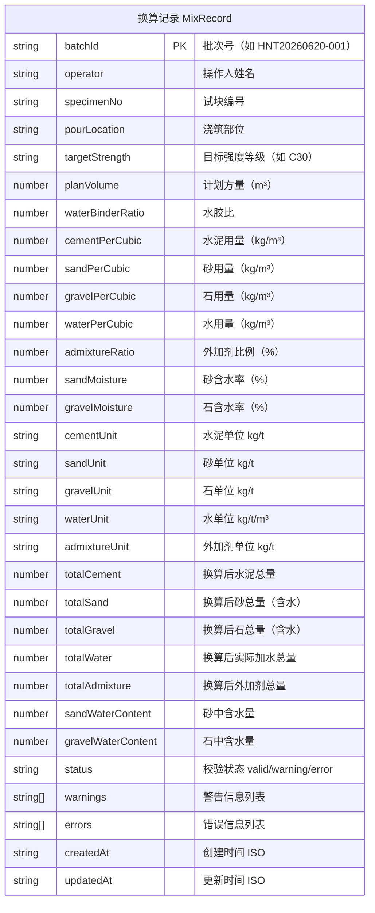

## 1. 架构设计

```mermaid
graph TD
    "浏览器前端 (React)" --> "localStorage (持久化存储)"
    "浏览器前端 (React)" --> "window.print() (打印输出)"
    "浏览器前端 (React)" --> "换算算法模块"
    "换算算法模块" --> "单位换算"
    "换算算法模块" --> "含水率修正"
    "换算算法模块" --> "参数校验"
    "换算算法模块" --> "追溯数据生成"
```

纯前端单页应用，所有数据存储于浏览器 localStorage，无需后端服务。

## 2. 技术说明

- **前端框架**：React@18 + TypeScript
- **构建工具**：Vite@5
- **样式方案**：Tailwind CSS@3 + CSS 变量
- **状态管理**：React useState + useReducer（轻量级，无需 Redux）
- **数据持久化**：localStorage（JSON 序列化）
- **打印方案**：原生 window.print() + @media print 专用样式
- **图标**：Lucide React（线性工程图标）
- **日期处理**：dayjs（批次号生成、日期筛选）

## 3. 路由定义

| 路由 | 用途 |
|------|------|
| / | 配合比换算页（主页，默认路由） |
| /history | 历史记录查询页 |
| /print/site-order/:batchId | 现场配料单打印页 |
| /print/review-sheet/:batchId | 技术复核表打印页 |

## 4. 数据模型

### 4.1 数据模型定义



### 4.2 localStorage 存储键

| 键名 | 内容 |
|------|------|
| mix_records | 所有换算记录的 JSON 数组 |
| current_operator | 最近使用的操作人姓名 |
| batch_counter | 当日批次计数器 |

## 5. 核心算法模块

### 5.1 单位换算
- kg ↔ t：除以/乘以 1000
- 水 kg ↔ m³：1m³ 水 = 1000kg

### 5.2 含水率修正公式
```
砂石实际用量 = 实验室用量 × (1 + 含水率)
砂石中含水量 = 实验室用量 × 含水率
实际加水量 = 实验室用水量 - 砂中含水量 - 石中含水量
```

### 5.3 参数校验规则
| 参数 | 正常范围 | 异常处理 |
|------|----------|----------|
| 计划方量 | > 0 | 错误：方量必须大于零 |
| 砂含水率 | 0% ~ 15% | 警告：超出常规范围 |
| 石含水率 | 0% ~ 5% | 警告：超出常规范围 |
| 水胶比 | 0.2 ~ 0.8 | 警告：水胶比异常 |
| 实际加水量 | ≥ 0 | 错误：扣水后水量为负 |

### 5.4 批次号生成规则
`HNT` + `YYYYMMDD` + `-` + `3位序号`，如：HNT20260620-001
