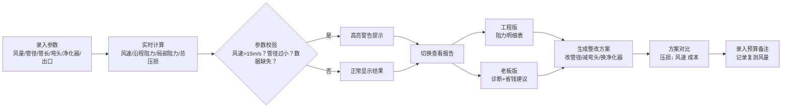

## 1. 产品概述
餐馆厨房排烟管压损复核计算工具，帮助工程师和餐馆老板快速诊断排烟系统吸力不足问题，定位瓶颈（弯头过多、管径过小、净化器阻力大等），并给出量化整改建议和成本对比。
- 目标用户：暖通工程师、餐馆老板/经营者、厨房设备安装人员
- 核心价值：把复杂的流体力学计算变成简单易懂的输入输出，让非专业人士也能看懂"改哪里最省钱"

## 2. 核心功能

### 2.1 用户角色
| 角色 | 核心使用场景 | 关注点 |
|------|-------------|--------|
| 工程师 | 现场勘测后录入参数、对比整改方案、出具工程明细报告 | 每段阻力明细、风速校核、技术合理性 |
| 餐馆老板 | 查看问题诊断结论、对比不同整改方案的成本和效果、记录预算和复测数据 | 哪种改法最省钱有效、投入产出比 |

### 2.2 功能模块
1. **参数输入面板**：目标风量（m³/h/CFM）、管径（mm/英寸）、管长、弯头数量及角度、净化器阻力、出口形式
2. **实时计算引擎**：自动计算风速、沿程阻力、局部阻力、总压损、风机所需余压
3. **风险提示系统**：风速过高（>15m/s 报警）、管径过小、关键参数缺失警告
4. **双模式报告**：
   - 工程版：每段管道阻力明细表、计算公式引用、风速/雷诺数等技术参数
   - 老板版：问题诊断（哪段最堵）、整改建议优先级、省钱方案对比
5. **整改方案对比**：支持修改管径/减少弯头/换净化器后与原方案的压损对比
6. **预算与记录**：每项整改的预算备注、整改后复测风量记录

### 2.3 页面详情
| 页面名称 | 模块名称 | 功能描述 |
|---------|---------|---------|
| 主页面 | 输入表单区 | 分组录入风量、管道、弯头、净化器、出口参数，支持单位切换 |
| 主页面 | 实时诊断区 | 显示风速、总压损、风机余量，异常参数高亮警告 |
| 主页面 | 工程版报告 | 可折叠的阻力计算明细表，含沿程/局部/设备/出口分项 |
| 主页面 | 老板版报告 | 可视化"堵塞点"排名、Top3 整改建议、预估成本与效果 |
| 主页面 | 方案对比器 | 左右对比原方案 vs 整改方案的压损、风速、成本变化 |
| 主页面 | 记录管理 | 预算备注输入框、复测风量历史记录时间线 |

## 3. 核心流程
用户录入排烟系统参数 → 系统实时计算风速与各项阻力 → 异常参数触发警告提示 → 切换工程版/老板版查看报告 → 生成整改方案并与原方案对比 → 录入预算和复测数据。

## 4. 用户界面设计
### 4.1 设计风格
- 主色调：工业橙 `#F97316`（暖通/工程感）+ 深蓝灰 `#1E293B`（专业稳重）
- 辅助色：警示红 `#EF4444`（异常）、成功绿 `#10B981`（合格）
- 按钮风格：圆角 6px，主按钮实心工业橙，悬停加深
- 字体：标题用 `Oswald`（工业感无衬线），正文用 `Noto Sans SC`（中文可读性）
- 布局：左右分栏（左输入、右报告），桌面端优先
- 视觉风格：卡片式分区，细边框 + 微阴影，数据用大号数字突出

### 4.2 页面设计概览
| 页面名称 | 模块名称 | UI 元素 |
|---------|---------|---------|
| 主页面 | 输入表单 | 分组卡片，数值输入框带单位切换下拉，焦点态高亮 |
| 主页面 | 实时诊断 | 仪表盘式风速/压损显示，异常时数字变红 + 警告图标 |
| 主页面 | 工程报告 | 表格展示，斑马纹行，可展开显示计算公式 |
| 主页面 | 老板报告 | 进度条式"阻力占比排名"，成本对比条形图 |
| 主页面 | 方案对比 | 左右双栏，差值用绿/红色标注变化方向 |

### 4.3 响应式
桌面端（≥1024px）左右分栏布局；平板/移动端（<1024px）改为上下堆叠，输入区折叠为可展开面板；所有输入控件支持触屏点击。
