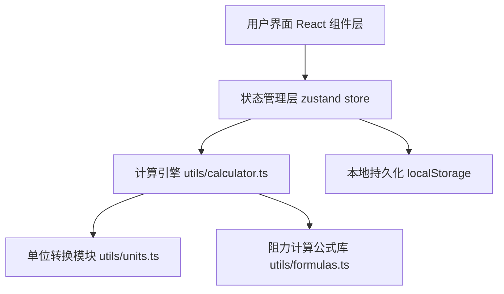

## 1. 架构设计
纯前端单页应用，所有计算在浏览器端完成，无需后端服务。状态管理使用 zustand，数据持久化到 localStorage。



## 2. 技术说明
- 前端：React@18 + TypeScript + Vite
- 样式：TailwindCSS@3
- 状态管理：zustand
- 图标：lucide-react
- 后端：无（纯前端计算）
- 数据库：无（localStorage 存储方案记录）

## 3. 路由定义
| 路由 | 用途 |
|-----|-----|
| / | 主应用页面（参数输入 + 报告展示 + 方案对比 + 记录管理） |

## 4. 数据模型
### 4.1 输入参数类型
```typescript
interface DuctInput {
  // 风量
  airflow: number;
  airflowUnit: 'm3h' | 'cfm';
  // 管道
  ductDiameter: number;
  ductDiameterUnit: 'mm' | 'inch';
  ductLength: number;
  ductLengthUnit: 'm' | 'ft';
  ductMaterial: 'galvanized' | 'stainless' | 'pvc';
  // 弯头
  elbows: Array<{
    id: string;
    angle: 45 | 90 | 180;
    radiusType: 'short' | 'long';
    count: number;
  }>;
  // 净化器
  purifierResistance: number | null; // Pa
  purifierResistanceProvided: boolean;
  // 出口
  outletType: 'open' | 'grille' | 'rainCap' | 'ductEnd';
  // 备注
  budgetNote?: string;
}
```

### 4.2 计算结果类型
```typescript
interface CalculationResult {
  // 流速
  velocity: number; // m/s
  velocityTooHigh: boolean;
  ductTooSmall: boolean;
  // 阻力分项 Pa
  frictionLoss: number;      // 沿程阻力
  localLoss: number;         // 局部阻力（弯头）
  purifierLoss: number;      // 净化器阻力
  outletLoss: number;        // 出口阻力
  totalLoss: number;         // 总压损
  fanMargin: number;         // 建议风机余量 (15%)
  requiredFanPressure: number; // 所需风机全压
  // 明细
  breakdown: LossBreakdownItem[];
  // 诊断
  warnings: WarningItem[];
}

interface LossBreakdownItem {
  id: string;
  category: 'friction' | 'elbow' | 'purifier' | 'outlet';
  name: string;
  resistance: number; // Pa
  percentage: number; // 占总压损百分比
  formula?: string;
}

interface WarningItem {
  level: 'error' | 'warning' | 'info';
  field: string;
  message: string;
}
```

### 4.3 方案对比记录
```typescript
interface ComparisonRecord {
  id: string;
  name: string;
  timestamp: number;
  input: DuctInput;
  result: CalculationResult;
  estimatedCost?: number;
}

interface RetestRecord {
  id: string;
  timestamp: number;
  measuredAirflow: number;
  measuredAirflowUnit: 'm3h' | 'cfm';
  notes?: string;
}
```

## 5. 核心计算逻辑
### 5.1 沿程阻力（Darcy-Weisbach 方程简化）
- 风管摩擦阻力系数 λ：采用 Swamee-Jain 近似公式
- 沿程阻力 ΔP_friction = λ × (L/D) × (ρv²/2)
- 空气密度 ρ = 1.2 kg/m³，厨房油烟取 1.25 kg/m³

### 5.2 弯头局部阻力
- 90° 长半径弯头：ξ = 0.3
- 90° 短半径弯头：ξ = 0.6
- 45° 长半径弯头：ξ = 0.15
- 45° 短半径弯头：ξ = 0.3
- 180° 弯头：ξ = 1.2
- 局部阻力 ΔP = Σ(ξ_i × n_i) × (ρv²/2)

### 5.3 出口阻力系数
- 风管末端开口：ξ = 1.0
- 格栅风口：ξ = 2.0
- 防雨帽：ξ = 1.5
- 风管出口（无收口）：ξ = 0.5

### 5.4 风速校核
- 厨房排烟推荐风速：8 ~ 12 m/s
- > 15 m/s：警告（风速过高，噪声大、阻力飙升）
- < 5 m/s：提示（风速过低，油烟易沉积）
- 管径过小判断：在目标风量下，若需风速 > 15 m/s 才能通过，判定管径不足。
