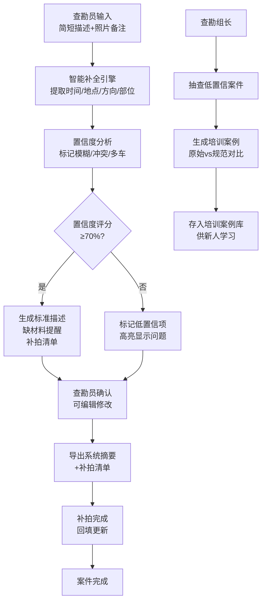

# 车险查勘描述补全系统 PRD

## 1. 产品概述

车险查勘员现场常只记录简短描述如"右前剐蹭，对方全责"，回到系统需补全事故时间、地点、方向和损失部位，漏项会被退回。本系统通过智能补全引擎，自动整理标准事故经过、车辆部位、责任线索和缺材料提醒，帮助查勘员高效完成规范化描述。

- 解决问题：现场口语化描述转系统规范描述效率低，漏项易被退回
- 目标用户：车险查勘员、查勘组长
- 市场价值：提升查勘效率30%以上，降低退单率，新人培训周期缩短50%

## 2. 核心功能

### 2.1 用户角色

| 角色 | 登录方式 | 核心权限 |
|------|----------|----------|
| 查勘员 | 账号密码/工号 | 创建案件、描述补全、确认导出、补拍回填 |
| 查勘组长 | 账号密码/工号 | 查看所有案件、低置信抽查、培训案例管理、数据统计 |

### 2.2 功能模块

1. **查勘员首页**：案件列表、新建案件入口、待办提醒
2. **案件创建**：输入简短描述、照片备注、上下文信息
3. **智能补全**：自动生成标准事故经过、损失部位、责任判断、置信度分析
4. **案件确认**：编辑确认补全结果、标记损失部位、补充说明
5. **导出功能**：生成系统可粘贴摘要、导出补拍清单
6. **补拍回填**：补拍项状态更新、照片上传、完成确认
7. **组长首页**：数据概览、低置信案件列表、查勘员排行
8. **培训中心**：低置信案例分析、原始vs规范对比、培训笔记
9. **培训案例库**：已整理案例列表、案例详情、搜索筛选

### 2.3 页面详情

| 页面名称 | 模块名称 | 功能描述 |
|----------|----------|----------|
| 登录页 | 角色选择 | 选择查勘员/组长角色登录 |
| 查勘员首页 | 案件列表 | 按状态筛选、搜索、查看详情 |
| 查勘员首页 | 新建案件 | 跳转案件创建页 |
| 查勘员首页 | 待办提醒 | 显示待确认、待补拍案件数量 |
| 案件创建页 | 描述输入 | 输入现场简短描述 |
| 案件创建页 | 照片备注 | 多条照片备注输入、增删操作 |
| 案件创建页 | 上下文补充 | 车牌号、日期、时间、地点、方向补充 |
| 案件创建页 | 智能补全 | 点击补全按钮，显示补全结果 |
| 补全结果页 | 标准描述 | 可编辑的标准事故经过 |
| 补全结果页 | 损失部位 | 可视化车辆图，标记受损部位 |
| 补全结果页 | 置信度分析 | 显示置信度评分、低置信标记详情 |
| 补全结果页 | 缺材料提醒 | 列出缺少的材料及原因 |
| 补全结果页 | 补拍清单 | 列出需要补拍的照片及要求 |
| 案件详情页 | 确认操作 | 确认案件、生成导出内容 |
| 案件详情页 | 补拍管理 | 标记补拍完成、回填照片 |
| 组长首页 | 数据概览 | 总案件数、置信度分布、趋势图 |
| 组长首页 | 低置信列表 | 按置信度排序、快速查看详情 |
| 组长首页 | 查勘员排行 | 按平均置信度排名 |
| 培训中心页 | 案例分析 | 原始描述vs规范描述对比 |
| 培训中心页 | 问题标注 | 标注存在的问题、改进建议 |
| 培训中心页 | 加入案例库 | 将案例存入培训案例库 |
| 培训案例库 | 案例列表 | 搜索、筛选、查看详情 |

## 3. 核心流程

**查勘员流程：**
1. 查勘员现场记录简短描述（如"右前剐蹭，对方全责"）
2. 登录系统，输入描述和照片备注
3. 系统自动补全事故时间、地点、方向、损失部位、责任判断
4. 系统分析置信度，标记方位模糊、多车、文字照片冲突等问题
5. 查勘员确认或编辑补全结果
6. 一键导出系统可粘贴摘要和补拍清单
7. 补拍完成后回填更新案件状态

**组长流程：**
1. 查看低置信度案件列表
2. 抽查案件详情，分析问题原因
3. 将典型案例转为培训案例，标注问题和改进建议
4. 新人通过培训案例库学习规范写法
5. 查看团队数据统计和查勘员排行

## 4. 用户界面设计

### 4.1 设计风格

- **主色调**：深蓝色 #1e3a8a（专业、信任），辅以橙色 #f97316（警示、提醒）
- **辅助色**：绿色 #10b981（成功、高置信），黄色 #eab308（中等置信），红色 #ef4444（低置信、冲突）
- **按钮风格**：圆角8px，悬停有轻微阴影和缩放效果
- **字体**：标题使用 "Noto Sans SC"，正文使用 "PingFang SC"
- **布局**：卡片式布局，顶部导航 + 侧边功能区 + 主内容区
- **图标风格**：使用 Lucide 图标库，统一线性风格

### 4.2 页面设计概览

| 页面名称 | 模块名称 | UI 元素 |
|----------|----------|----------|
| 登录页 | 登录卡片 | 渐变背景、毛玻璃效果、角色切换动画 |
| 查勘员首页 | 数据概览卡片 | 彩色数字、状态标签、悬浮动效 |
| 查勘员首页 | 案件列表 | 斑马纹表格、置信度进度条、状态徽标 |
| 案件创建页 | 输入区域 | 大文本框、标签自动添加、动态高度 |
| 补全结果页 | 置信度仪表盘 | 环形进度条、颜色渐变、动画计数 |
| 补全结果页 | 问题标记卡片 | 红/黄/绿三色区分、展开/收起动画 |
| 补全结果页 | 车辆部位图 | SVG 车辆俯视图、可点击部位、高亮标记 |
| 补拍清单 | 列表项 | 复选框、拍照要求、完成标记 |
| 组长首页 | 统计图表 | 柱状图/折线图、动画加载、数据提示 |
| 培训中心 | 对比视图 | 左右分栏、差异高亮、标注连线 |

### 4.3 响应式设计

- **桌面端**：1280px 以上，完整布局，侧边栏常驻
- **平板端**：768px-1279px，侧边栏可收起，表格响应式换行
- **移动端**：768px 以下，底部导航，卡片堆叠布局，触控优化

### 4.4 交互动效

- 页面加载：元素依次淡入，延迟 100ms 错开
- 置信度计算：数字滚动动画，0 到实际值
- 低置信标记：红色脉冲动画，吸引注意
- 按钮点击：缩放 0.95 → 1.0，配合阴影变化
- 补拍勾选：对勾绘制动画，背景色渐变
- 培训对比：差异部分闪烁提示，鼠标悬停显示改进说明

