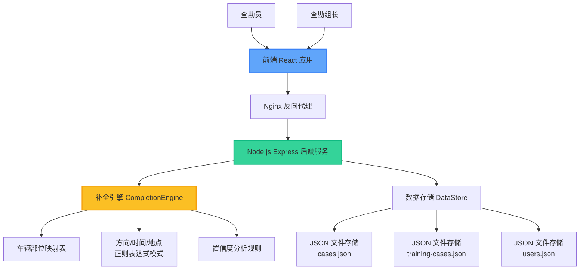
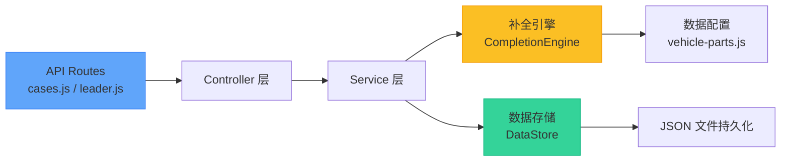
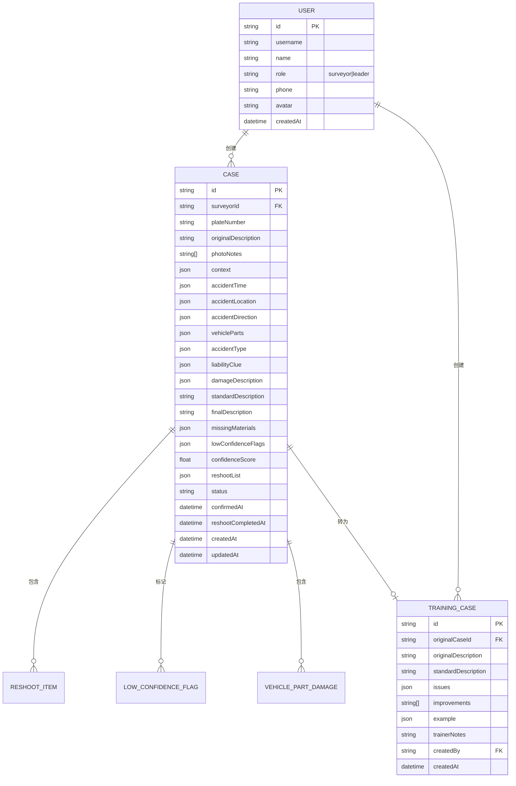

# 车险查勘描述补全系统 技术架构

## 1. 架构设计



## 2. 技术描述

- **前端**：React@18 + TypeScript + TailwindCSS@3 + Vite + React Router@6
- **初始化工具**：Vite 5.x
- **后端**：Node.js@18 + Express@4
- **数据存储**：JSON 文件（本地存储，轻量级）
- **UI 组件库**：自定义 Tailwind 组件 + Lucide React 图标
- **图表**：Recharts 数据可视化
- **状态管理**：React Context + useReducer（轻量级，无需 Redux）
- **HTTP 客户端**：Axios
- **动画**：Framer Motion（交互动效）

## 3. 路由定义

| 路由路径 | 页面名称 | 权限 | 说明 |
|----------|----------|------|------|
| `/login` | 登录页 | 公开 | 角色选择、账号登录 |
| `/surveyor` | 查勘员首页 | 查勘员 | 案件列表、数据概览、新建入口 |
| `/surveyor/case/new` | 新建案件 | 查勘员 | 输入描述、照片备注、上下文 |
| `/surveyor/case/:id` | 案件详情 | 查勘员 | 补全结果、确认、导出、补拍 |
| `/surveyor/case/:id/reshoot` | 补拍回填 | 查勘员 | 补拍项管理、状态更新 |
| `/leader` | 组长首页 | 组长 | 数据统计、低置信列表、排行 |
| `/leader/case/:id` | 案件分析 | 组长 | 案件详情、问题分析 |
| `/leader/training` | 培训中心 | 组长 | 案例分析、转为培训案例 |
| `/leader/training/library` | 培训案例库 | 组长/查勘员 | 案例列表、搜索、详情 |

## 4. API 定义

### 4.1 案件相关接口

```typescript
// 补全请求
interface CompleteRequest {
  description: string;
  photoNotes: string[];
  context: {
    plateNumber?: string;
    accidentDate?: string;
    accidentTime?: string;
    accidentLocation?: string;
    ourDirection?: string;
    otherDirection?: string;
  };
}

// 补全响应
interface CompleteResponse {
  success: boolean;
  data: {
    originalDescription: string;
    photoNotes: string[];
    accidentTime: {
      date: string | null;
      time: string | null;
      period: string | null;
      isComplete: boolean;
      isVague: boolean;
    };
    accidentLocation: {
      road: string | null;
      intersection: string | null;
      details: string | null;
      isComplete: boolean;
      isVague: boolean;
    };
    accidentDirection: {
      ourDirection: string | null;
      otherDirection: string | null;
      isComplete: boolean;
      isVague: boolean;
      hasVagueWords: string[];
    };
    vehicleParts: Array<{
      id: string;
      name: string;
      zone: string;
      zoneName: string;
      isEstimated: boolean;
      source: string;
    }>;
    accidentType: {
      type: string;
      description: string;
    };
    liabilityClue: {
      liability: string;
      clue: string;
      evidence: string[];
    };
    damageDescription: Array<{
      type: string;
      severity: string;
    }>;
    standardDescription: string;
    missingMaterials: Array<{
      id: string;
      name: string;
      description: string;
      reason: string;
    }>;
    lowConfidenceFlags: Array<{
      type: string;
      severity: 'low' | 'medium' | 'high';
      message: string;
      suggestion: string;
      details?: any;
    }>;
    confidenceScore: number;
    reshootList: Array<{
      id: string;
      type: string;
      partName?: string;
      shotName?: string;
      reason: string;
      description?: string;
      angle?: string;
      isCompleted: boolean;
    }>;
    trainingNotes: any[];
  };
}

// 创建案件请求
interface CreateCaseRequest {
  surveyorId: string;
  plateNumber: string;
  description: string;
  photoNotes: string[];
  context: any;
  completionResult: CompleteResponse['data'];
}

// 案件列表响应
interface CaseListResponse {
  success: boolean;
  data: Array<{
    id: string;
    plateNumber: string;
    originalDescription: string;
    status: 'draft' | 'confirmed' | 'reshoot-pending' | 'reshoot-completed';
    confidenceScore: number;
    createdAt: string;
    updatedAt: string;
  }>;
  count: number;
}

// 确认案件请求
interface ConfirmCaseRequest {
  finalDescription: string;
  confirmedParts: Array<{
    id: string;
    name: string;
    damage: string;
  }>;
  confirmedLiability: string;
  notes: string;
  additionalPhotos: string[];
}

// 导出响应
interface ExportResponse {
  success: boolean;
  data: {
    caseId: string;
    summaryText: string;
    reshootList: any[];
    missingMaterials: any[];
    exportTime: string;
  };
}
```

### 4.2 组长相关接口

```typescript
// 统计数据响应
interface StatsResponse {
  success: boolean;
  data: {
    totalCases: number;
    statusCounts: Record<string, number>;
    lowConfidenceCount: number;
    highConfidenceCount: number;
    avgConfidence: number;
    trainingCasesCount: number;
  };
}

// 查勘员排行响应
interface LeaderboardResponse {
  success: boolean;
  data: Array<{
    userId: string;
    userName: string;
    avatar: string;
    totalCases: number;
    highConfidenceCases: number;
    avgConfidence: number;
  }>;
}

// 培训案例创建请求
interface CreateTrainingCaseRequest {
  originalCaseId: string;
  originalDescription: string;
  standardDescription: string;
  issues: any[];
  improvements: string[];
  trainerNotes: string;
  createdBy: string;
}
```

## 5. 后端架构



**后端模块说明：**

| 模块 | 文件路径 | 职责 |
|------|----------|------|
| 主服务 | `server/server.js` | Express 服务启动、中间件配置、路由挂载 |
| 案件路由 | `server/routes/cases.js` | 案件 CRUD、补全、确认、导出、补拍接口 |
| 组长路由 | `server/routes/leader.js` | 统计、低置信案件、排行、培训案例接口 |
| 补全引擎 | `server/engine/completionEngine.js` | 描述补全核心算法、置信度分析 |
| 数据存储 | `server/store/dataStore.js` | 数据持久化、查询、统计计算 |
| 数据配置 | `server/data/vehicle-parts.js` | 车辆部位映射、正则模式、规则配置 |

## 6. 数据模型

### 6.1 ER 图



### 6.2 JSON 数据结构示例

**cases.json:**
```json
[
  {
    "id": "CASE-1718500000000",
    "surveyorId": "user-001",
    "plateNumber": "京A12345",
    "originalDescription": "右前剐蹭，对方全责",
    "photoNotes": ["右前保险杠刮花", "对方车辆左后刮擦"],
    "confidenceScore": 0.35,
    "status": "confirmed",
    "createdAt": "2024-06-20T10:00:00.000Z",
    "updatedAt": "2024-06-20T10:30:00.000Z"
  }
]
```

**users.json:**
```json
[
  {
    "id": "user-001",
    "username": "surveyor1",
    "name": "张查勘",
    "role": "surveyor",
    "phone": "13800138001",
    "avatar": "👨‍🔧",
    "createdAt": "2024-01-01"
  }
]
```

**training-cases.json:**
```json
[
  {
    "id": "TRAIN-1718500000000",
    "originalCaseId": "CASE-1718500000000",
    "originalDescription": "右前剐蹭，对方全责",
    "standardDescription": "2024年1月15日14时30分，在中关村大街与知春路交叉口处...",
    "trainerNotes": "该案例缺少时间、地点、方向等关键信息...",
    "createdBy": "user-003",
    "createdAt": "2024-06-20T11:00:00.000Z"
  }
]
```

