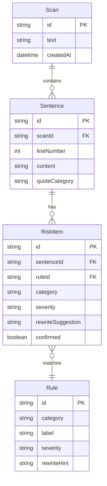

## 1. 架构设计

```mermaid
flowchart TB
    "Frontend" --> "Scanner Engine"
    "Scanner Engine" --> "Rule Engine"
    "Scanner Engine" --> "Classifier"
    "Rule Engine" --> "Absolute Expression Rules"
    "Rule Engine" --> "Political Sensitivity Rules"
    "Rule Engine" --> "Data Source Rules"
    "Rule Engine" --> "Exaggeration Rules"
    "Classifier" --> "Quote Classifier"
    "Classifier" --> "Testimonial Classifier"
    "Classifier" --> "Honor Classifier"
    "Frontend" --> "State Manager"
    "State Manager" --> "Confirmed Store"
    "State Manager" --> "Risk Store"
    "Frontend" --> "Export Module"
```

纯前端应用，所有敏感检测逻辑在浏览器端执行，无需后端服务。

## 2. 技术说明

- 前端：React@18 + tailwindcss@3 + vite
- 初始化工具：vite-init
- 后端：无（纯前端）
- 数据存储：localStorage（保存人工确认状态、历史扫描记录）
- 核心引擎：自研规则引擎 + 模式匹配

## 3. 路由定义

| 路由 | 用途 |
|------|------|
| / | 稿件导入页，粘贴或上传文本 |
| /scan/:id | 风险扫描结果页，双栏展示原文与风险 |
| /export/:id | 修订导出页，修订建议表格与导出 |

## 4. 核心引擎设计

### 4.1 规则引擎

```typescript
interface Rule {
  id: string
  category: 'absolute' | 'political' | 'data_source' | 'exaggeration'
  pattern: RegExp | ((sentence: string) => boolean)
  label: string
  severity: 'high' | 'medium' | 'low'
  rewriteHint: string
}
```

### 4.2 绝对化表述规则

- 匹配模式：第一、唯一、首个、独家、最（大/强/优/好/低/高）、全面领先、绝对、独一无二、无与伦比、首屈一指、遥遥领先、没有对手、无人能及
- 严重等级：high
- 改写提示：建议用"领先之一""位居前列""处于行业前列"等相对化表述

### 4.3 涉政敏感规则

- 匹配模式：涉及国家领导人姓名+非官方表述、敏感政治术语、涉军/涉密表述
- 严重等级：high
- 改写提示：建议删除或使用官方标准表述，请法务人工确认

### 4.4 数据口径缺来源规则

- 匹配模式：含数字+增长率/占比/规模等量词但缺少"根据XX报告""XX数据显示""据统计"等来源引用
- 严重等级：medium
- 改写提示：建议补充数据来源，如"根据XX机构发布的《XX报告》"

### 4.5 夸大表述规则

- 匹配模式：颠覆、革命性、突破性、划时代、史无前例、开创性、里程碑式（用于非公认里程碑场景）
- 严重等级：medium
- 改写提示：建议用"创新性""显著提升""重要进展"等保守表述

### 4.6 引用分类器

```typescript
type QuoteCategory = 'leadership_quote' | 'customer_testimonial' | 'historical_honor' | 'general'

function classifyQuote(sentence: string): QuoteCategory {
  // 领导讲话：含"XX表示""XX指出""XX强调"+ 职位/姓名
  // 客户评价：含"XX认为""客户反馈""用户评价"
  // 历史荣誉：含"荣获""获得""被评为"+ 奖项/称号
}
```

## 5. 数据模型

### 5.1 数据模型定义



### 5.2 核心类型定义

```typescript
interface Scan {
  id: string
  text: string
  sentences: Sentence[]
  createdAt: number
}

interface Sentence {
  id: string
  lineNumber: number
  content: string
  quoteCategory: QuoteCategory
  risks: RiskItem[]
}

interface RiskItem {
  id: string
  ruleId: string
  category: RiskCategory
  severity: 'high' | 'medium' | 'low'
  rewriteSuggestion: string
  confirmed: boolean
}

type RiskCategory = 'absolute' | 'political' | 'data_source' | 'exaggeration'
type QuoteCategory = 'leadership_quote' | 'customer_testimonial' | 'historical_honor' | 'general'

interface ExportItem {
  lineNumber: number
  originalSentence: string
  riskCategory: string
  severity: string
  rewriteSuggestion: string
  confirmed: boolean
  quoteCategory: string
}
```
