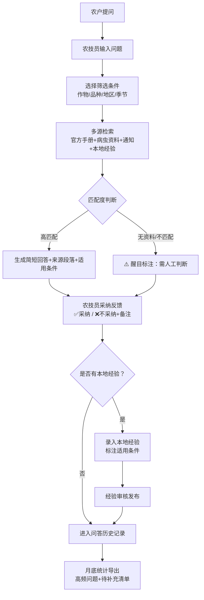

## 1. 产品概述

面向基层农技员的智能问答工具，整合种植手册、病虫资料、县域通知及本地经验，为农户问题提供精准回答与来源追溯，辅助农技员高效开展下乡服务。

- 目标用户：县乡农技推广人员、驻村农技员
- 核心价值：解决农技资料分散、查询效率低、经验难沉淀的痛点，实现"一问多源、有据可依、经验传承"

## 2. 核心功能

### 2.1 用户角色

| 角色 | 注册方式 | 核心权限 |
|------|---------|---------|
| 农技员 | 账号登录 | 问答查询、资料导入、本地经验录入、采纳标记、统计导出 |
| 管理员 | 管理员账号 | 用户管理、官方资料审核、系统配置 |

### 2.2 功能模块

1. **问答主页**：问题输入区、条件筛选（作物/品种/地区/季节）、回答展示区、来源段落引用、采纳反馈
2. **资料管理**：手册导入、病虫资料管理、通知文件上传、分类标签维护
3. **本地经验库**：经验条目录入、适用条件标注、来源标记、审核发布
4. **统计导出**：高频问题排行、未覆盖问题清单、采纳率统计、月度报表导出
5. **系统设置**：地区配置、作物品种库、角色权限管理

### 2.3 页面详情

| 页面名称 | 模块名称 | 功能描述 |
|---------|---------|---------|
| 问答主页 | 问题输入区 | 支持自然语言提问，下拉展示历史问题建议 |
| 问答主页 | 条件筛选器 | 作物类型、品种、地区、季节/月份多维度筛选 |
| 问答主页 | 回答卡片 | 简短回答正文、适用条件标签、置信度指示 |
| 问答主页 | 来源引用区 | 折叠展示来源段落，区分官方手册/通知/本地经验，附页码/文件链接 |
| 问答主页 | 边界提示 | 无资料、品种不匹配、地区季节不适用时醒目标注"需人工判断" |
| 问答主页 | 采纳反馈 | ✅采纳/❌不采纳按钮，可选补充备注 |
| 资料管理 | 导入中心 | 支持PDF/Word/Markdown上传，自动提取段落、标注适用范围 |
| 资料管理 | 分类浏览 | 按作物/病虫害/政策通知分类树浏览 |
| 资料管理 | 条目编辑 | 手动修正自动提取的内容，补充元数据 |
| 本地经验库 | 经验录入表单 | 标题、正文、适用作物/品种/地区/季节、关联问题关键词 |
| 本地经验库 | 经验列表 | 按时间/作物/采纳数排序，支持搜索和筛选 |
| 统计导出 | 问题分析仪表盘 | 柱状图展示TOP10高频问题，饼图展示问题类别分布 |
| 统计导出 | 待补充清单 | 列出"无资料回答"和"未采纳"的问题，附备注 |
| 统计导出 | 导出功能 | 支持Excel/CSV导出月报，含高频问题、采纳率、待补充清单 |
| 系统设置 | 品种地区库 | 维护本地作物品种清单和行政区划 |

## 3. 核心流程

农技员下乡遇到农户提问，在系统中输入问题并选择作物品种、地区、季节等条件；系统从官方手册、病虫资料、本地通知和本地经验库中多源检索，生成简短回答并标注来源和适用条件；若资料缺失或条件不匹配，系统提示需人工判断；农技员可标记回答是否采纳，采纳的问答对会进入高频统计；农技员可将现场有效经验录入本地经验库，供后续检索；月底导出高频问题和待补充资料清单，用于资料完善。

## 4. 用户界面设计

### 4.1 设计风格

- **主色**：自然绿 `#2E7D32`（代表农业、生长），辅以麦田金 `#F9A825`（代表丰收）
- **辅色**：土壤棕 `#6D4C41`、叶片青 `#81C784`、警示红 `#E53935`
- **背景**：米白 `#FFFBEB` 配淡绿色纹理，营造清新自然的田园氛围
- **按钮风格**：圆角矩形（8px），主按钮绿色渐变填充，悬停微上浮阴影
- **字体**：标题用"思源宋体"体现专业感，正文用"思源黑体"保证可读性
- **布局**：顶部导航 + 左侧条件面板 + 中央问答区的三栏结构
- **图标**：线性图标配农业元素（🌱麦穗、🍃叶片、📋手册、🐛虫害标识）

### 4.2 页面设计概述

| 页面名称 | 模块名称 | UI元素 |
|---------|---------|--------|
| 问答主页 | 顶部导航 | 绿色渐变背景，左侧Logo配麦穗图标，右侧用户头像+导出入口 |
| 问答主页 | 条件筛选面板 | 卡片式分组，作物下拉、品种标签、地区级联选择、季节滑块 |
| 问答主页 | 问题输入框 | 大号输入框配🍃图标，底部历史问题气泡标签 |
| 问答主页 | 回答卡片 | 白色卡片+浅绿左边框，回答正文加粗，适用条件为胶囊标签 |
| 问答主页 | 来源引用区 | 可折叠面板，不同来源用不同色条（手册蓝、通知橙、经验紫） |
| 问答主页 | 边界提示 | 红底白字圆角横幅，⚠️图标+建议话术 |
| 问答主页 | 反馈区 | 并排大按钮，采纳后变灰禁用，附文本输入框 |
| 统计页面 | 仪表盘 | 卡片式指标（总问答/采纳率/高频数），图表区阴影卡片 |
| 经验录入 | 表单页 | 双栏布局，左侧正文富文本，右侧元数据分组表单 |

### 4.3 响应式设计

- 桌面端（≥1280px）：三栏布局（条件面板240px + 问答主区 + 右侧历史300px）
- 平板端（768-1279px）：条件面板可折叠为抽屉，主内容自适应
- 移动端（<768px）：单栏堆叠，条件筛选为顶部折叠区域，问答卡片全宽

### 4.4 动画与交互细节

- 页面加载：元素渐入+轻微上移，问答卡片逐个浮现
- 回答生成：打字机效果展示回答，来源卡片滑入展开
- 采纳反馈：按钮点击后轻微缩放+勾选动画
- 筛选条件变化：回答卡片过渡淡出淡入
- 悬停效果：卡片上浮1px+阴影加深
