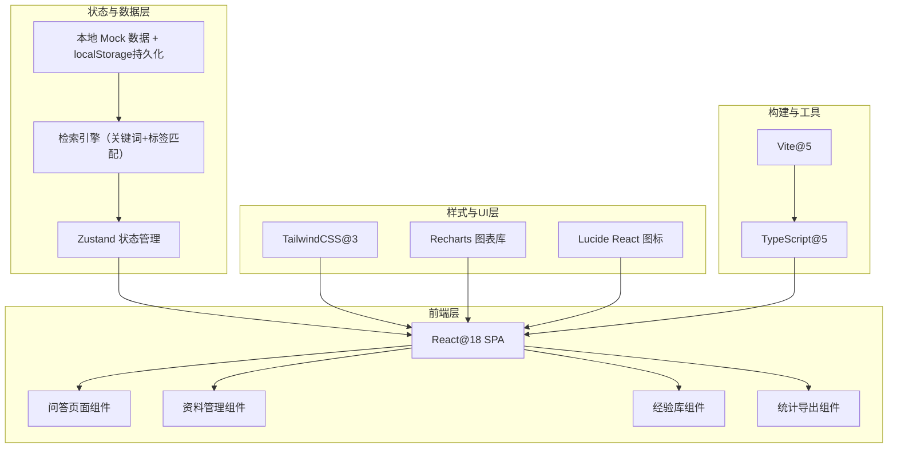
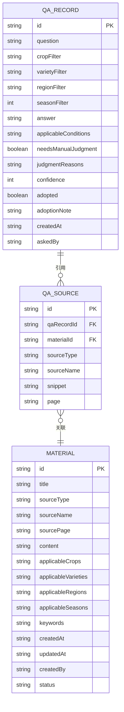

## 1. 架构设计



## 2. 技术说明

- **前端框架**：React@18 + TypeScript@5 + Vite@5
- **初始化工具**：`npm create vite@latest`
- **样式方案**：TailwindCSS@3（PostCSS + Autoprefixer）
- **状态管理**：Zustand（轻量级，适合中小规模应用）
- **路由**：React Router DOM@6
- **图表**：Recharts（高频问题柱状图、分类饼图）
- **图标**：Lucide React
- **后端**：无，采用 Mock 数据 + localStorage 持久化模拟后端
- **数据存储**：localStorage 存储问答历史、采纳记录、本地经验条目；Mock 数据模拟官方手册、病虫资料、通知

## 3. 路由定义

| 路由 | 页面用途 |
|------|---------|
| `/` | 问答主页（默认路由，核心问答功能） |
| `/materials` | 资料管理中心（手册/病虫/通知浏览与导入） |
| `/experience` | 本地经验库（列表浏览 + 录入表单） |
| `/statistics` | 统计与导出（仪表盘 + 待补充清单 + 导出功能） |
| `/settings` | 系统设置（品种地区配置） |

## 4. API 定义（Mock 层接口类型）

```typescript
// 资料条目类型
interface MaterialItem {
  id: string;
  title: string;
  sourceType: 'manual' | 'pest' | 'notice' | 'experience';
  sourceName: string;       // 来源名称，如"水稻种植手册2024版"
  sourcePage?: string;      // 页码或章节
  content: string;          // 正文内容
  applicableCrops: string[];     // 适用作物
  applicableVarieties?: string[]; // 适用品种
  applicableRegions: string[];    // 适用地区
  applicableSeasons: number[];    // 适用月份 1-12
  keywords: string[];       // 关键词
  createdAt: string;
  updatedAt: string;
  createdBy?: string;       // 经验类条目的录入人
  status?: 'pending' | 'approved'; // 经验审核状态
}

// 问答记录类型
interface QARecord {
  id: string;
  question: string;
  filters: {
    crop?: string;
    variety?: string;
    region?: string;
    season?: number;
  };
  answer: string;
  sources: Array<{
    materialId: string;
    sourceType: MaterialItem['sourceType'];
    sourceName: string;
    snippet: string;
    page?: string;
  }>;
  applicableConditions: string[];
  needsManualJudgment: boolean;   // 是否需要人工判断
  judgmentReasons?: string[];     // 人工判断原因
  confidence: number;             // 置信度 0-100
  adopted: boolean | null;        // 采纳状态
  adoptionNote?: string;          // 采纳备注
  createdAt: string;
  askedBy: string;
}

// 统计数据类型
interface StatisticsData {
  totalQA: number;
  adoptionRate: number;
  manualJudgmentCount: number;
  topQuestions: Array<{ question: string; count: number }>;
  categoryDistribution: Array<{ category: string; count: number }>;
  uncoveredQuestions: Array<{ question: string; note?: string; count: number }>;
}

// Mock 服务接口
interface QAService {
  query(question: string, filters: QARecord['filters']): Promise<QARecord>;
  markAdoption(recordId: string, adopted: boolean, note?: string): Promise<void>;
  getHistory(): Promise<QARecord[]>;
}

interface MaterialService {
  list(type?: MaterialItem['sourceType']): Promise<MaterialItem[]>;
  search(keyword: string, filters?: Partial<QARecord['filters']>): Promise<MaterialItem[]>;
  import(file: File): Promise<MaterialItem[]>;
  update(id: string, data: Partial<MaterialItem>): Promise<void>;
  delete(id: string): Promise<void>;
}

interface ExperienceService {
  list(status?: 'pending' | 'approved'): Promise<MaterialItem[]>;
  create(data: Omit<MaterialItem, 'id' | 'createdAt' | 'updatedAt'>): Promise<MaterialItem>;
  approve(id: string): Promise<void>;
}

interface StatisticsService {
  getMonthlyData(year: number, month: number): Promise<StatisticsData>;
  exportReport(year: number, month: number): Promise<Blob>;  // CSV/Excel Blob
}
```

## 5. 前端模块划分（无后端，服务层为Mock）

```mermaid
graph TD
    subgraph "页面组件层 (pages)"
        P1["QAHomePage 问答主页"]
        P2["MaterialsPage 资料管理"]
        P3["ExperiencePage 经验库"]
        P4["StatisticsPage 统计导出"]
        P5["SettingsPage 系统设置"]
    end
    
    subgraph "业务组件层 (components)"
        C1["QuestionInput 问题输入"]
        C2["FilterPanel 筛选面板"]
        C3["AnswerCard 回答卡片"]
        C4["SourceReference 来源引用"]
        C5["WarningBanner 边界提示"]
        C6["FeedbackButtons 采纳反馈"]
        C7["MaterialUploader 资料上传"]
        C8["ExperienceForm 经验表单"]
        C9["StatsDashboard 统计仪表盘"]
        C10["ExportPanel 导出面板"]
    end
    
    subgraph "数据服务层 (services)"
        S1["QAService 问答检索服务"]
        S2["MaterialService 资料管理服务"]
        S3["ExperienceService 经验库服务"]
        S4["StatisticsService 统计服务"]
    end
    
    subgraph "状态管理层 (stores)"
        Z1["useQAStore 问答状态"]
        Z2["useMaterialStore 资料状态"]
        Z3["useExperienceStore 经验状态"]
        Z4["useStatsStore 统计状态"]
    end
    
    subgraph "数据层 (data)"
        M1["mockMaterials 官方资料Mock"]
        M2["mockQAHistory 问答历史Mock"]
        L1["localStorage 持久化工具"]
    end
    
    P1 & P2 & P3 & P4 & P5 --> C1 & C2 & C3 & C4 & C5 & C6 & C7 & C8 & C9 & C10
    C1-C10 --> Z1 & Z2 & Z3 & Z4
    Z1-Z4 --> S1 & S2 & S3 & S4
    S1-S4 --> M1 & M2 & L1
```



## 6. 数据模型（Mock 数据结构）

### 6.1 实体关系图



### 6.2 Mock 初始化数据

```typescript
// 作物品种库
const CROP_LIBRARY = [
  {
    name: '水稻',
    varieties: ['籼稻', '粳稻', '杂交稻', '甬优15', '深两优5814'],
    regions: ['南方稻区', '长江流域', '黄淮海'],
  },
  {
    name: '小麦',
    varieties: ['冬小麦', '春小麦', '济麦22', '百农207'],
    regions: ['黄淮海', '长江中下游', '东北'],
  },
  {
    name: '玉米',
    varieties: ['郑单958', '登海605', '先玉335', '糯玉米', '甜玉米'],
    regions: ['东北', '黄淮海', '西南'],
  },
];

// 地区库（县级示例）
const REGION_LIBRARY = [
  { province: '浙江省', city: '杭州市', counties: ['余杭区', '萧山区', '富阳区', '临安区'] },
  { province: '浙江省', city: '宁波市', counties: ['鄞州区', '余姚市', '慈溪市'] },
  { province: '江苏省', city: '苏州市', counties: ['吴中区', '昆山市', '常熟市'] },
];

// 初始Mock资料（30+条，覆盖主要场景）
const INITIAL_MATERIALS: MaterialItem[] = [
  // 水稻种植手册条目
  {
    id: 'm-rice-001',
    title: '水稻叶片发黄原因及防治',
    sourceType: 'manual',
    sourceName: '水稻高产栽培技术手册（2024版）',
    sourcePage: '第3章 第12页',
    content: '水稻叶片发黄常见原因：1）缺氮：整株均匀黄化，下部叶先黄，需追施尿素5-8公斤/亩；2）缺钾：叶尖焦枯，有褐色斑点，追施氯化钾8-10公斤/亩；3）淹水过深：根系缺氧发黑，排水晒田2-3天；4）稻瘟病：叶部有梭形病斑，需喷施三环唑或稻瘟灵。',
    applicableCrops: ['水稻'],
    applicableVarieties: ['籼稻', '粳稻', '杂交稻'],
    applicableRegions: ['南方稻区', '长江流域', '余杭区', '萧山区'],
    applicableSeasons: [5, 6, 7, 8, 9],
    keywords: ['黄叶', '发黄', '叶黄', '缺氮', '缺钾', '稻瘟病'],
    createdAt: '2024-01-15',
    updatedAt: '2024-01-15',
  },
  {
    id: 'm-rice-002',
    title: '水稻播种期与晚播指导',
    sourceType: 'manual',
    sourceName: '水稻高产栽培技术手册（2024版）',
    sourcePage: '第2章 第5页',
    content: '早稻播种期：3月中下旬，日均温稳定通过12℃；中稻：4月中下旬至5月上旬；晚稻：6月中下旬。晚播补救：若晚播15天以内，可加大播种量至每亩5-6公斤，增加基本苗；晚播超过20天，建议改种生育期短的品种，注意后期防寒，喷施磷酸二氢钾促早熟。',
    applicableCrops: ['水稻'],
    applicableVarieties: ['籼稻', '粳稻', '杂交稻', '甬优15', '深两优5814'],
    applicableRegions: ['长江流域', '余杭区', '萧山区', '富阳区'],
    applicableSeasons: [3, 4, 5, 6],
    keywords: ['播种', '晚播', '播种期', '种植时间', '改种'],
    createdAt: '2024-01-15',
    updatedAt: '2024-01-15',
  },
  // 病虫资料条目
  {
    id: 'm-pest-001',
    title: '稻纵卷叶螟防治时间与药剂',
    sourceType: 'pest',
    sourceName: '农作物主要病虫害防治图谱（2024版）',
    sourcePage: '第15-16页',
    content: '稻纵卷叶螟：幼虫吐丝纵卷叶片取食，造成白叶。防治适期：卵孵盛期至低龄幼虫期（1-2龄），一般在成虫高峰后7-10天。推荐药剂：氯虫苯甲酰胺10-15毫升/亩，或茚虫威10克/亩，兑水45公斤喷雾，田间保持浅水层。',
    applicableCrops: ['水稻'],
    applicableVarieties: [],
    applicableRegions: ['南方稻区', '长江流域'],
    applicableSeasons: [6, 7, 8, 9],
    keywords: ['稻纵卷叶螟', '卷叶虫', '打药', '防治', '白叶', '药剂'],
    createdAt: '2024-02-10',
    updatedAt: '2024-02-10',
  },
  {
    id: 'm-pest-002',
    title: '小麦赤霉病防治关键期',
    sourceType: 'pest',
    sourceName: '农作物主要病虫害防治图谱（2024版）',
    sourcePage: '第42页',
    content: '小麦赤霉病以扬花期侵染为主，防治关键期为齐穗至初花期（扬花5-10%），如遇阴雨天气，需在第一次用药后5-7天再次防治。推荐药剂：氰烯·戊唑醇40-50毫升/亩，或咪鲜胺40毫升/亩。注意避开花时用药。',
    applicableCrops: ['小麦'],
    applicableVarieties: ['冬小麦', '春小麦', '济麦22', '百农207'],
    applicableRegions: ['黄淮海', '长江中下游'],
    applicableSeasons: [4, 5],
    keywords: ['赤霉病', '小麦', '打药', '扬花期', '防治时间'],
    createdAt: '2024-02-10',
    updatedAt: '2024-02-10',
  },
  {
    id: 'm-pest-003',
    title: '玉米螟防治技术规范',
    sourceType: 'pest',
    sourceName: '农作物主要病虫害防治图谱（2024版）',
    sourcePage: '第58页',
    content: '玉米螟主要蛀食茎秆和果穗。防治时期：心叶末期（大喇叭口期，抽雄前7-10天）。防治方法：1）颗粒剂丢心：氯虫苯甲酰胺颗粒剂0.5公斤/亩丢心；2）喷雾：氯虫苯甲酰胺10毫升/亩，对准心叶喷雾。穗期防治在抽丝后5-7天。',
    applicableCrops: ['玉米'],
    applicableVarieties: ['郑单958', '登海605', '先玉335'],
    applicableRegions: ['东北', '黄淮海', '西南'],
    applicableSeasons: [6, 7, 8],
    keywords: ['玉米螟', '钻心虫', '打药', '防治', '大喇叭口期'],
    createdAt: '2024-02-10',
    updatedAt: '2024-02-10',
  },
  // 县级通知条目
  {
    id: 'm-notice-001',
    title: '余杭区2024年晚稻播种技术指导意见',
    sourceType: 'notice',
    sourceName: '余杭区农业农村局〔2024〕12号',
    sourcePage: '全文',
    content: '我区2024年晚稻适宜播种期为6月10日-20日，品种以甬优15、深两优5814为主。6月25日之后播种视为晚播，需注意：1）播种量增至5公斤/亩；2）秧龄控制在20天以内，7月15日前必须移栽；3）9月上旬抽穗期遇低温风险较大，建议灌深水保温。',
    applicableCrops: ['水稻'],
    applicableVarieties: ['甬优15', '深两优5814', '杂交稻'],
    applicableRegions: ['余杭区'],
    applicableSeasons: [6, 7, 9],
    keywords: ['晚稻', '播种', '晚播', '余杭区', '移栽期'],
    createdAt: '2024-05-20',
    updatedAt: '2024-05-20',
  },
  {
    id: 'm-notice-002',
    title: '萧山区2024年稻飞虱预警通知',
    sourceType: 'notice',
    sourceName: '萧山区植保站病虫情报第7期',
    sourcePage: '全文',
    content: '根据测报灯数据，我区稻飞虱迁入量较常年偏多30%，预计7月下旬将出现若虫高峰。要求各镇街于7月20-25日开展统一防治，推荐药剂：吡蚜酮20克/亩+烯啶虫胺10克/亩，重点喷稻丛基部，保水3-5厘米。',
    applicableCrops: ['水稻'],
    applicableVarieties: [],
    applicableRegions: ['萧山区'],
    applicableSeasons: [7, 8],
    keywords: ['稻飞虱', '防治时间', '打药', '萧山区', '预警'],
    createdAt: '2024-07-10',
    updatedAt: '2024-07-10',
  },
  {
    id: 'm-notice-003',
    title: '富阳区小麦冬播技术要求',
    sourceType: 'notice',
    sourceName: '富阳区农技推广中心2024秋播指导',
    sourcePage: '全文',
    content: '我区小麦最佳播种期为11月5日-15日，品种以扬麦20、宁麦13为主。11月20日之后为晚播，晚播麦田需：1）加大播量至15-18公斤/亩；2）增施种肥磷酸二铵10公斤/亩；3）冬前镇压保墒。',
    applicableCrops: ['小麦'],
    applicableVarieties: ['冬小麦'],
    applicableRegions: ['富阳区'],
    applicableSeasons: [10, 11, 12],
    keywords: ['小麦', '播种', '晚播', '冬播', '富阳区'],
    createdAt: '2024-10-08',
    updatedAt: '2024-10-08',
  },
  // 更多Mock资料补充
  {
    id: 'm-rice-003',
    title: '水稻施肥方案（基追比）',
    sourceType: 'manual',
    sourceName: '水稻高产栽培技术手册（2024版）',
    sourcePage: '第4章 第18页',
    content: '目标亩产600公斤施肥方案：基肥（40%）：复合肥（15-15-15）30公斤/亩+尿素5公斤/亩；分蘖肥（30%）：移栽后5-7天追尿素10公斤/亩；穗肥（30%）：倒4叶期（抽穗前30天左右）追尿素7公斤/亩+氯化钾7公斤/亩。沙质田少量多次，粘质田可一次足量。',
    applicableCrops: ['水稻'],
    applicableVarieties: [],
    applicableRegions: ['长江流域', '余杭区', '萧山区'],
    applicableSeasons: [5, 6, 7, 8],
    keywords: ['施肥', '基肥', '追肥', '尿素', '复合肥', '产量'],
    createdAt: '2024-01-15',
    updatedAt: '2024-01-15',
  },
  {
    id: 'm-pest-004',
    title: '纹枯病综合防治',
    sourceType: 'pest',
    sourceName: '农作物主要病虫害防治图谱（2024版）',
    sourcePage: '第20页',
    content: '纹枯病主要危害叶鞘和茎秆，高温高湿条件下流行。防治：1）打捞菌核减少菌源；2）分蘖末期晒田控湿；3）药剂防治：病丛率达15%时用药，噻呋酰胺20毫升/亩，或井冈霉素50克/亩，重点喷植株中下部，间隔10天再防一次。',
    applicableCrops: ['水稻', '小麦'],
    applicableVarieties: [],
    applicableRegions: ['南方稻区', '长江流域'],
    applicableSeasons: [6, 7, 8],
    keywords: ['纹枯病', '烂秆', '打药', '噻呋酰胺', '井冈霉素'],
    createdAt: '2024-02-10',
    updatedAt: '2024-02-10',
  },
  {
    id: 'm-rice-004',
    title: '水稻晒田技术要点',
    sourceType: 'manual',
    sourceName: '水稻高产栽培技术手册（2024版）',
    sourcePage: '第4章 第25页',
    content: '晒田（搁田）作用：控分蘖、促根系、防倒伏。晒田时机：当田间苗数达预期穗数的80%时（常规稻约25万苗/亩，杂交稻约20万苗/亩），一般在分蘖末期至拔节前。晒田程度：轻晒至田面开细裂，白根外露；冷浸田重晒，沙质田轻晒多次。',
    applicableCrops: ['水稻'],
    applicableVarieties: [],
    applicableRegions: ['长江流域'],
    applicableSeasons: [6, 7],
    keywords: ['晒田', '搁田', '排水', '分蘖', '倒伏'],
    createdAt: '2024-01-15',
    updatedAt: '2024-01-15',
  },
  {
    id: 'm-wheat-001',
    title: '小麦冬前苗期管理',
    sourceType: 'manual',
    sourceName: '小麦高产栽培技术指南',
    sourcePage: '第6-7页',
    content: '冬前管理目标：苗齐、苗匀、苗壮，总茎数60-80万/亩。措施：1）三叶期追施分蘖肥尿素5公斤/亩；2）土壤干旱时浇冬水（日均温3-5℃）；3）旺长田镇压或喷施多效唑；4）查苗补种，疏苗移栽。',
    applicableCrops: ['小麦'],
    applicableVarieties: ['冬小麦', '济麦22', '百农207'],
    applicableRegions: ['黄淮海', '长江中下游'],
    applicableSeasons: [10, 11, 12, 1],
    keywords: ['苗期', '冬前', '分蘖', '追肥', '冬水'],
    createdAt: '2024-01-20',
    updatedAt: '2024-01-20',
  },
  {
    id: 'm-wheat-002',
    title: '小麦春季管理要点',
    sourceType: 'manual',
    sourceName: '小麦高产栽培技术指南',
    sourcePage: '第12-14页',
    content: '春季（返青-抽穗）管理：1）返青期弱苗追尿素10公斤/亩，旺苗不追；2）拔节期（基部第一节间定长）重施穗肥，尿素12-15公斤/亩；3）3月上中旬防治纹枯病、红蜘蛛；4）孕穗期遇旱浇水，防小花退化。',
    applicableCrops: ['小麦'],
    applicableVarieties: ['冬小麦'],
    applicableRegions: ['黄淮海'],
    applicableSeasons: [2, 3, 4],
    keywords: ['春季', '返青', '拔节', '追肥', '穗肥'],
    createdAt: '2024-01-20',
    updatedAt: '2024-01-20',
  },
  {
    id: 'm-pest-005',
    title: '蚜虫防治技术',
    sourceType: 'pest',
    sourceName: '农作物主要病虫害防治图谱（2024版）',
    sourcePage: '第48页',
    content: '麦蚜（小麦蚜虫）：吸食汁液，传播病毒。防治指标：百株蚜量达500头以上。防治时期：抽穗至灌浆初期。药剂：吡虫啉20克/亩，或噻虫嗪8克/亩，或苦参碱100毫升/亩（有机）。小麦中后期结合一喷三防。',
    applicableCrops: ['小麦', '玉米'],
    applicableVarieties: [],
    applicableRegions: ['黄淮海', '长江中下游', '东北'],
    applicableSeasons: [3, 4, 5, 6, 7],
    keywords: ['蚜虫', '蜜虫', '打药', '吡虫啉', '一喷三防'],
    createdAt: '2024-02-10',
    updatedAt: '2024-02-10',
  },
  {
    id: 'm-pest-006',
    title: '小麦一喷三防技术',
    sourceType: 'pest',
    sourceName: '农作物主要病虫害防治图谱（2024版）',
    sourcePage: '第50页',
    content: '"一喷三防"：一次喷雾兼防病、防虫、防早衰。时期：扬花末期至灌浆初期。配方示例：氰烯·戊唑醇（防赤霉）+吡虫啉（防蚜虫）+磷酸二氢钾150克/亩+尿素500克/亩。需根据当地病虫实际调整药剂，现配现用。',
    applicableCrops: ['小麦'],
    applicableVarieties: [],
    applicableRegions: ['黄淮海', '长江中下游'],
    applicableSeasons: [4, 5],
    keywords: ['一喷三防', '灌浆', '赤霉病', '蚜虫', '叶面肥'],
    createdAt: '2024-02-10',
    updatedAt: '2024-02-10',
  },
  {
    id: 'm-corn-001',
    title: '玉米播种与密度管理',
    sourceType: 'manual',
    sourceName: '玉米高产栽培技术手册',
    sourcePage: '第3-5页',
    content: '夏玉米播种期：小麦收获后抢茬早播，6月上中旬为宜，最迟不晚于6月25日。播种密度：郑单958每亩4500-5000株，登海605每亩4000-4500株，先玉335每亩4000株左右。行距60厘米，株距根据密度调整，播种深度3-5厘米。',
    applicableCrops: ['玉米'],
    applicableVarieties: ['郑单958', '登海605', '先玉335'],
    applicableRegions: ['黄淮海'],
    applicableSeasons: [5, 6],
    keywords: ['播种', '密度', '株距', '行距', '夏玉米'],
    createdAt: '2024-01-25',
    updatedAt: '2024-01-25',
  },
  {
    id: 'm-corn-002',
    title: '玉米施肥方案',
    sourceType: 'manual',
    sourceName: '玉米高产栽培技术手册',
    sourcePage: '第8页',
    content: '亩产600公斤夏玉米施肥：种肥：磷酸二铵5公斤/亩（与种子间隔8厘米）。追肥分两次：1）拔节肥（7-8叶展）：尿素15公斤/亩；2）穗肥（大喇叭口期，12-13叶展）：尿素20公斤/亩+氯化钾10公斤/亩。或采用缓释肥一次性基施50公斤/亩。',
    applicableCrops: ['玉米'],
    applicableVarieties: [],
    applicableRegions: ['黄淮海'],
    applicableSeasons: [6, 7, 8],
    keywords: ['施肥', '追肥', '拔节肥', '穗肥', '缓释肥'],
    createdAt: '2024-01-25',
    updatedAt: '2024-01-25',
  },
  {
    id: 'm-pest-007',
    title: '玉米锈病防治',
    sourceType: 'pest',
    sourceName: '农作物主要病虫害防治图谱（2024版）',
    sourcePage: '第62页',
    content: '玉米锈病：叶片上产生黄褐色疱状夏孢子堆，后期变黑。高温高湿、偏施氮肥易发病。防治：发病初期（病叶率5%）立即用药，三唑酮60克/亩，或戊唑醇20毫升/亩，间隔7-10天再防一次。注意叶片正反面均匀喷雾。',
    applicableCrops: ['玉米'],
    applicableVarieties: [],
    applicableRegions: ['黄淮海', '西南'],
    applicableSeasons: [7, 8, 9],
    keywords: ['锈病', '黄叶', '斑点', '打药', '三唑酮'],
    createdAt: '2024-02-10',
    updatedAt: '2024-02-10',
  },
  {
    id: 'm-notice-004',
    title: '余姚市玉米草地贪夜蛾监测防控通知',
    sourceType: 'notice',
    sourceName: '余姚市植保站〔2024〕第5期',
    sourcePage: '全文',
    content: '草地贪夜蛾已迁入我市玉米产区，各主体需密切监测。防控措施：1）性诱剂诱杀成虫；2）低龄幼虫期（心叶危害）喷施乙基多杀菌素15毫升/亩，或甲维·茚虫威15毫升/亩；3）发现连片发生立即上报，组织统防统治。',
    applicableCrops: ['玉米'],
    applicableVarieties: [],
    applicableRegions: ['余姚市'],
    applicableSeasons: [6, 7, 8, 9],
    keywords: ['草地贪夜蛾', '虫害', '打药', '防控', '余姚'],
    createdAt: '2024-06-15',
    updatedAt: '2024-06-15',
  },
  {
    id: 'm-rice-005',
    title: '水稻除草剂使用要点',
    sourceType: 'manual',
    sourceName: '水稻高产栽培技术手册（2024版）',
    sourcePage: '第5章 第30页',
    content: '移栽田封闭除草：移栽后5-7天，结合分蘖肥撒施苄嘧·苯噻酰60克/亩，保水3-5厘米，持续5-7天。茎叶除草：稗草2-3叶期，五氟磺草胺60毫升/亩；千金子2-4叶期，氰氟草酯80毫升/亩。忌孕穗期用药，避免高温时段。',
    applicableCrops: ['水稻'],
    applicableVarieties: [],
    applicableRegions: ['长江流域'],
    applicableSeasons: [5, 6, 7],
    keywords: ['除草', '除草剂', '稗草', '千金子', '封闭'],
    createdAt: '2024-01-15',
    updatedAt: '2024-01-15',
  },
  {
    id: 'm-pest-008',
    title: '稻曲病防治',
    sourceType: 'pest',
    sourceName: '农作物主要病虫害防治图谱（2024版）',
    sourcePage: '第25页',
    content: '稻曲病：水稻穗期病害，谷粒上形成黄绿色霉球，影响产量和品质。防治关键期：破口前7-10天（剑叶叶枕距倒2叶枕5-8厘米），若遇多雨天气，始穗期再防一次。药剂：戊唑醇20毫升/亩，或苯甲·丙环唑20毫升/亩。',
    applicableCrops: ['水稻'],
    applicableVarieties: ['甬优15', '杂交稻'],
    applicableRegions: ['长江流域'],
    applicableSeasons: [8, 9],
    keywords: ['稻曲病', '黑穗', '打药', '破口期', '穗期'],
    createdAt: '2024-02-10',
    updatedAt: '2024-02-10',
  },
  {
    id: 'm-notice-005',
    title: '慈溪市2024年小麦春管技术通知',
    sourceType: 'notice',
    sourceName: '慈溪市农技推广中心〔2024〕3号',
    sourcePage: '全文',
    content: '针对我市今年小麦旺长苗比例偏高情况，要求：1）3月初喷施多效唑60克/亩化控防倒；2）3月中旬防治纹枯病；3）倒春寒来临前灌水防冻；4）严格按植保情报开展赤霉病防控，齐穗扬花5%首次用药。',
    applicableCrops: ['小麦'],
    applicableVarieties: ['冬小麦', '扬麦20'],
    applicableRegions: ['慈溪市'],
    applicableSeasons: [2, 3, 4],
    keywords: ['旺长', '化控', '倒春寒', '赤霉病', '慈溪'],
    createdAt: '2024-02-20',
    updatedAt: '2024-02-20',
  },
];
```
