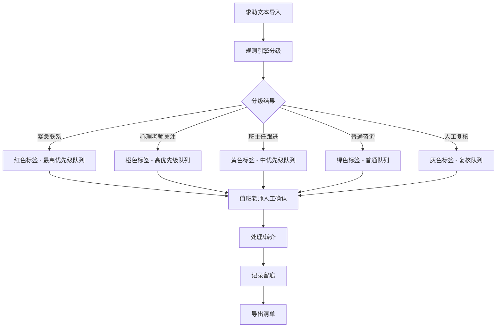
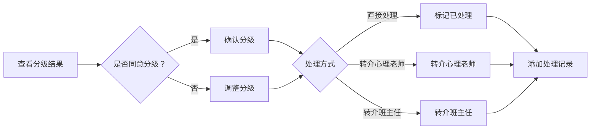

## 1. 产品概述

校园求助文本分级系统是一款面向学校值班老师的智能辅助工具，通过关键词与规则引擎对匿名信箱中的求助文本进行自动分级排序，帮助值班老师快速识别高风险内容，避免遗漏紧急求助。系统强调"机器辅助、人工确认"原则，分级结果仅作为排队提示，最终处理必须经人工确认。

- **核心问题**：值班老师面对大量匿名求助文本，难以快速识别高风险紧急内容，存在漏判风险
- **目标用户**：学校值班老师、心理老师、班主任
- **产品价值**：提升求助响应效率，降低高风险内容漏判率，规范处理流程留痕

## 2. 核心功能

### 2.1 用户角色

| 角色 | 使用方式 | 核心权限 |
|------|----------|----------|
| 值班老师 | 登录系统 | 导入文本、查看分级、人工确认、转介处理、导出清单 |
| 心理老师 | 登录系统 | 查看转介记录、处理心理相关求助 |
| 班主任 | 登录系统 | 查看本班转介的求助 |

### 2.2 功能模块

1. **求助导入页面**：文本批量导入、单条录入、求助列表展示
2. **分级详情页面**：分级结果展示、触发原句标注、风险等级说明
3. **值班处理页面**：待处理清单、人工确认、转介操作、处理备注
4. **转介记录页面**：转介历史、处理状态追踪
5. **导出功能**：脱敏导出、值班清单、处理记录导出

### 2.3 页面详情

| 页面名称 | 模块名称 | 功能描述 |
|---------|---------|---------|
| 求助导入页 | 文本导入区 | 支持批量粘贴、文件导入、单条录入三种方式 |
| 求助导入页 | 求助列表 | 展示所有求助文本，按分级优先级排序，显示分级标签 |
| 分级详情页 | 分级结果卡 | 展示最终分级、置信度、触发规则说明 |
| 分级详情页 | 触发原句 | 高亮标注触发分级判断的关键句子 |
| 分级详情页 | 人工复核区 | 值班老师可调整分级、添加备注、确认处理 |
| 值班处理页 | 待处理队列 | 按紧急程度排序的待处理求助清单 |
| 值班处理页 | 处理操作区 | 确认分级、转介心理老师/班主任、标记已处理 |
| 转介记录页 | 转介列表 | 所有转介记录，含转介人、接收人、状态 |
| 转介记录页 | 状态筛选 | 按转介类型、状态、时间筛选 |
| 导出功能 | 导出配置 | 选择导出范围、脱敏选项 |
| 导出功能 | 导出预览 | 预览导出内容，确认后下载 |

## 3. 核心流程

### 3.1 求助分级流程

求助文本导入后，系统通过规则引擎进行自动分级：

1. **紧急联系（最高优先级）**：检测到自伤、自杀、严重躯体症状等关键词
2. **需要心理老师关注**：检测到抑郁、焦虑、失眠、情绪低落等心理困扰关键词
3. **需要班主任跟进**：检测到宿舍矛盾、学业压力、人际关系等问题
4. **普通咨询**：一般性问题、咨询类求助
5. **人工复核**：玩笑调侃、转述他人情况、信息过少、疑似重复提交

### 3.2 人工确认流程

## 4. 用户界面设计

### 4.1 设计风格

- **主色调**：深蓝（#1e3a5f）作为主色，代表专业、可信
- **辅助色**：红色（#e74c3c）紧急、橙色（#f39c12）心理关注、黄色（#f1c40f）班主任跟进、绿色（#27ae60）普通、灰色（#95a5a6）复核
- **按钮风格**：圆角矩形按钮，悬停有微动效
- **字体**：思源黑体（Source Han Sans）作为主要字体，标题使用思源宋体增强层级感
- **布局风格**：卡片式布局，左侧导航栏，右侧内容区
- **图标风格**：线性图标，简洁明了

### 4.2 页面设计概览

| 页面名称 | 模块名称 | UI元素 |
|---------|---------|--------|
| 求助导入页 | 顶部操作栏 | 导入按钮、搜索框、筛选标签 |
| 求助导入页 | 求助卡片列表 | 分级标签、摘要、提交时间、状态标记 |
| 分级详情页 | 分级结果横幅 | 大字号分级、颜色标识、置信度 |
| 分级详情页 | 原文展示区 | 高亮触发原句、悬浮提示规则 |
| 分级详情页 | 操作区 | 确认按钮、调整分级下拉、备注输入、转介按钮 |
| 值班处理页 | 优先级队列 | 按颜色区分的列表卡片、紧急度排序 |
| 转介记录页 | 时间线 | 转介记录时间线、状态流转 |

### 4.3 响应式

- 桌面端优先设计，平板适配
- 左侧导航可折叠
- 卡片列表在小屏幕转为单列布局
- 触摸操作优化

### 4.4 交互细节

- 分级标签有呼吸动效，紧急级别有脉冲提示
- 触发原句高亮显示，悬浮显示规则说明
- 转介操作有确认弹窗
- 列表项有悬停效果
- 页面切换有平滑过渡
