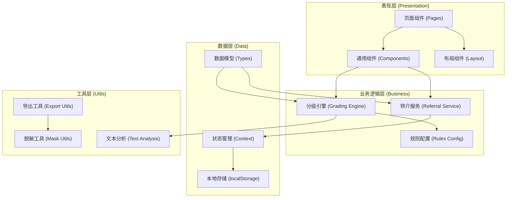
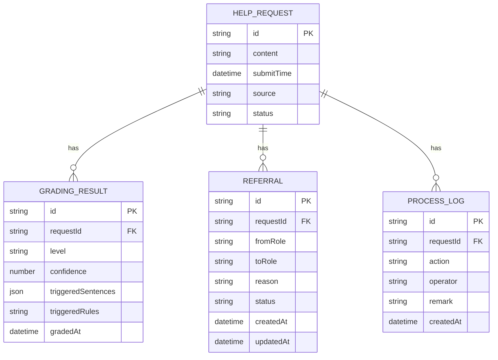

## 1. 架构设计

本系统为纯前端单页应用，数据存储使用浏览器本地存储（localStorage），无需后端服务。系统采用分层架构设计，确保代码可维护性和可扩展性。



## 2. 技术描述

- **前端框架**：React 18 + TypeScript
- **构建工具**：Vite 5
- **样式方案**：TailwindCSS 3
- **路由管理**：React Router v6
- **状态管理**：React Context + useReducer
- **图标库**：Lucide React
- **数据存储**：浏览器 localStorage
- **日期处理**：date-fns

### 技术选型理由

1. **React + TypeScript**：提供类型安全，降低维护成本，适合复杂业务逻辑
2. **Vite**：开发体验好，构建速度快
3. **TailwindCSS**：快速实现UI，统一设计规范
4. **React Router**：单页应用路由管理
5. **Lucide React**：轻量级图标库，风格统一
6. **localStorage**：无需后端部署，数据本地持久化，适合单机使用场景

## 3. 路由定义

| 路由 | 页面名称 | 功能描述 |
|------|---------|---------|
| / | 值班总览 | 待处理求助统计、快速入口 |
| /intake | 求助导入 | 文本导入、求助列表、分级概览 |
| /intake/:id | 分级详情 | 分级结果、触发原句、人工确认 |
| /duty | 值班处理 | 待处理队列、处理操作 |
| /referrals | 转介记录 | 转介历史、状态追踪 |
| /export | 导出中心 | 导出配置、预览下载 |
| /rules | 规则管理 | 分级规则配置（可选高级功能） |

## 4. 数据模型

### 4.1 数据模型定义



### 4.2 数据类型定义

```typescript
// 求助分级等级
type GradingLevel = 'emergency' | 'psychology' | 'headteacher' | 'general' | 'review';

// 求助状态
type RequestStatus = 'pending' | 'grading' | 'graded' | 'confirmed' | 'referred' | 'closed';

// 转介类型
type ReferralType = 'psychology' | 'headteacher' | 'other';

// 转介状态
type ReferralStatus = 'pending' | 'accepted' | 'completed' | 'rejected';

// 触发的句子
interface TriggeredSentence {
  text: string;
  startIndex: number;
  endIndex: number;
  ruleId: string;
  ruleName: string;
}

// 求助文本
interface HelpRequest {
  id: string;
  content: string;
  submitTime: string;
  source: 'manual' | 'batch' | 'file';
  status: RequestStatus;
  gradingResult?: GradingResult;
  confirmedLevel?: GradingLevel;
  confirmedBy?: string;
  confirmedAt?: string;
  processRemark?: string;
  createdAt: string;
  updatedAt: string;
}

// 分级结果
interface GradingResult {
  level: GradingLevel;
  confidence: number;
  triggeredSentences: TriggeredSentence[];
  triggeredRules: string[];
  gradedAt: string;
  gradingEngine: string;
}

// 转介记录
interface ReferralRecord {
  id: string;
  requestId: string;
  fromRole: string;
  toRole: string;
  referralType: ReferralType;
  reason: string;
  status: ReferralStatus;
  createdAt: string;
  updatedAt: string;
  handledBy?: string;
  handledAt?: string;
  handleRemark?: string;
}

// 处理日志
interface ProcessLog {
  id: string;
  requestId: string;
  action: string;
  operator: string;
  remark?: string;
  createdAt: string;
}

// 分级规则
interface GradingRule {
  id: string;
  name: string;
  level: GradingLevel;
  keywords: string[];
  patterns: string[];
  weight: number;
  enabled: boolean;
}
```

## 5. 核心模块设计

### 5.1 分级引擎模块

分级引擎是系统核心，采用基于规则的专家系统实现：

```
分级流程：
1. 文本预处理（分句、清洗）
2. 规则匹配（关键词匹配、正则匹配）
3. 权重计算（根据匹配规则的权重计算置信度）
4. 等级判定（取最高权重的等级）
5. 特殊情况检测（玩笑、转述、信息过少、重复）
6. 输出分级结果和触发原句
```

### 5.2 脱敏模块

导出数据时对敏感信息进行脱敏处理：
- 姓名：替换为"同学A"、"同学B"等
- 班级：部分隐藏（如"高一*班"）
- 联系方式：中间字符替换为"*"
- 具体住址：模糊处理

### 5.3 导出模块

支持两种导出格式：
1. **Excel格式**：使用 SheetJS (xlsx) 库
2. **CSV格式**：纯文本格式，兼容性好

## 6. 项目目录结构

```
src/
├── components/         # 通用组件
│   ├── common/        # 基础组件（按钮、卡片、标签等）
│   ├── layout/        # 布局组件
│   └── features/      # 业务组件
├── pages/             # 页面组件
│   ├── Dashboard/
│   ├── Intake/
│   ├── GradingDetail/
│   ├── Duty/
│   ├── Referrals/
│   └── Export/
├── hooks/             # 自定义 Hooks
├── services/          # 业务逻辑服务
│   ├── grading.ts     # 分级引擎
│   ├── storage.ts     # 本地存储
│   └── referral.ts    # 转介服务
├── types/             # TypeScript 类型定义
├── utils/             # 工具函数
│   ├── text.ts        # 文本处理
│   ├── mask.ts        # 脱敏工具
│   └── export.ts      # 导出工具
├── config/            # 配置文件
│   └── rules.ts       # 分级规则配置
├── context/           # React Context
├── assets/            # 静态资源
└── App.tsx            # 应用入口
```
