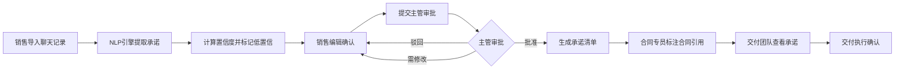

## 1. 产品概述

客户聊天承诺提取系统，用于从销售与客户的聊天记录中自动提取各类口头承诺（报价折扣、赠品、交付时间、售后承诺、待确认条件），经主管审批后形成标准化承诺清单，供合同和交付团队使用，避免口头承诺带来的法律风险和交付偏差。

- 核心价值：解决销售口头承诺无记录、难追溯、合同漏项的风险管控问题
- 目标用户：销售人员、销售主管、合同专员、交付团队
- 目标市场：B2B销售型企业，尤其是复杂销售周期的行业

## 2. 核心功能

### 2.1 用户角色

| 角色 | 核心权限 |
|------|----------|
| 销售 | 导入聊天记录、查看自己的承诺、编辑待确认内容 |
| 销售主管 | 审批承诺、批量操作、按客户/机会汇总查看、导出清单 |
| 合同专员 | 查看已批准承诺、标注合同引用位置、导出合同附件 |
| 交付团队 | 查看已批准承诺、交付对接视图、确认承诺执行 |

### 2.2 功能模块

1. **聊天导入页**：聊天记录粘贴/上传、关联机会、自动提取预览
2. **承诺列表页**：承诺分类展示、置信度标记、筛选搜索、批量审批
3. **承诺详情页**：承诺内容、原句上下文、版本历史、审批记录、合同引用标注
4. **审批工作台**：待审批承诺列表、单个/批量审批、审批意见
5. **汇总视图**：按客户维度汇总、按机会维度汇总、承诺类型统计
6. **交付对接页**：按项目展示已批准承诺、分类查看、交付确认

### 2.3 页面详情

| 页面名称 | 模块名称 | 功能描述 |
|---------|----------|----------|
| 聊天导入页 | 聊天内容输入 | 支持文本粘贴和文件上传，自动识别发送人、时间戳 |
| 聊天导入页 | 机会关联 | 选择已有客户/机会或新建，填写销售和来源信息 |
| 聊天导入页 | 提取预览 | 导入后即时展示提取结果，显示置信度和低置信原因 |
| 承诺列表页 | 筛选过滤 | 按机会、类型、状态、置信度、时间范围筛选 |
| 承诺列表页 | 承诺卡片 | 显示类型标签、置信度、状态、内容摘要、原句预览 |
| 承诺列表页 | 批量操作 | 全选/多选、批量批准、批量驳回、批量导出 |
| 承诺详情页 | 承诺信息 | 承诺内容、类型、置信度、原句、发送人、时间 |
| 承诺详情页 | 版本历史 | 显示所有修改版本、修改人、修改时间、修改原因 |
| 承诺详情页 | 审批记录 | 审批人、审批动作、审批意见、审批时间 |
| 承诺详情页 | 合同引用 | 标注合同条款位置、添加引用备注 |
| 审批工作台 | 待审批列表 | 按机会分组显示待审批承诺，支持快速审批 |
| 汇总视图 | 客户汇总 | 按客户展示机会数、承诺总数、各类型数量、审批状态 |
| 汇总视图 | 机会汇总 | 按机会展示承诺详情、审批进度、导出功能 |
| 交付对接页 | 项目卡片 | 客户信息、机会信息、承诺分类统计 |
| 交付对接页 | 承诺分类 | 按报价、赠品、交付、售后、待确认分类展示 |

## 3. 核心流程

销售导入聊天记录 → 系统自动提取承诺并计算置信度 → 标记低置信内容（不确定表述/表情/语音转写/客户复述）→ 销售可编辑修正 → 提交主管审批 → 主管批准/驳回/要求修改 → 批准后生成承诺清单 → 合同专员标注合同引用 → 交付团队查看已确认承诺 → 交付执行确认

## 4. 用户界面设计

### 4.1 设计风格

- **主色调**：深邃蓝 #1e3a5f（专业、信任、企业级）
- **辅助色**：警示橙 #ff6b35（低置信标记）、成功绿 #10b981（已批准）、警告黄 #f59e0b（待审批）、危险红 #ef4444（已驳回）
- **背景**：浅灰渐变 #f8fafc 到 #f1f5f9，内容区纯白卡片
- **字体**：标题使用 "Noto Sans SC"（清晰现代），正文使用系统字体，代码使用等宽字体
- **按钮风格**：圆角8px，悬停微动画，主要按钮使用渐变填充
- **图标风格**：线性图标，统一使用 Heroicons 系列，保持简约专业
- **布局风格**：左侧导航 + 顶部操作栏 + 主内容区三栏布局，卡片式内容区

### 4.2 置信度可视化

- 高置信（≥0.8）：绿色边框、绿色标签、正常文字
- 中置信（0.5-0.8）：黄色边框、黄色标签
- 低置信（<0.5）：橙色边框、橙色标签、⚠️ 图标警示，显示置信度原因

### 4.3 页面设计概述

| 页面名称 | 模块名称 | UI元素 |
|---------|----------|--------|
| 聊天导入页 | 输入区域 | 大尺寸文本框带占位示例，拖拽上传区，卡片式布局，柔和阴影 |
| 聊天导入页 | 提取结果 | 承诺卡片按类型分栏，置信度徽章，悬停显示原句，渐入动画 |
| 承诺列表页 | 列表视图 | 表格+卡片混合布局，类型颜色标签，状态进度条，行悬停高亮 |
| 承诺详情页 | 时间线 | 版本历史和审批记录用垂直时间线展示，清晰标记修改轨迹 |
| 汇总视图 | 统计卡片 | 数字大号展示，迷你趋势图，点击下钻，渐变色背景 |
| 交付对接页 | 项目视图 | 项目卡片网格布局，承诺分类折叠面板，清晰的信息层级 |

### 4.4 响应式设计

- 桌面端（≥1280px）：三栏布局完整展示
- 平板端（768-1279px）：导航折叠为图标，内容区自适应
- 移动端（<768px）：底部导航，单栏布局，卡片堆叠
- 触摸优化：按钮最小高度44px，列表项点击区域扩大

### 4.5 动效设计

- 页面加载：内容区渐入+轻微上移，分区块延迟加载
- 承诺提取：逐条淡入显示，带滑入动画
- 状态变更：状态标签颜色切换动画，数字变化滚动效果
- 悬停效果：卡片轻微上浮，阴影加深，背景色微变
