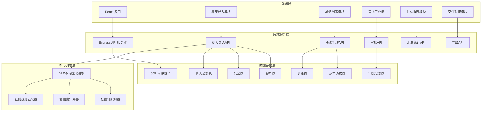
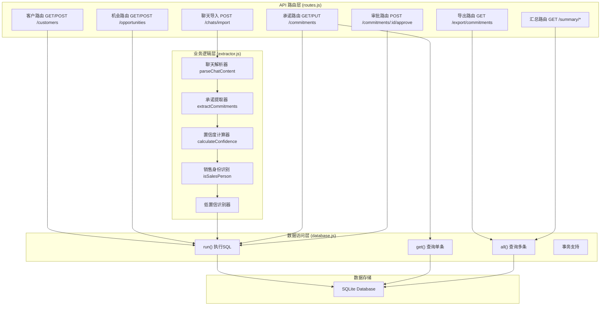
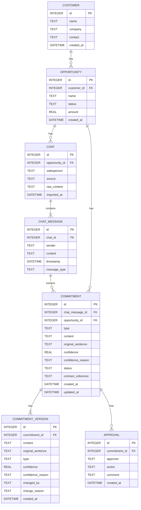

## 1. 架构设计



## 2. 技术说明

### 2.1 技术栈

- **前端**：React@18 + TypeScript@5 + TailwindCSS@3 + Vite@5
- **状态管理**：React Hooks + Context API
- **路由**：React Router@6
- **HTTP客户端**：Axios
- **图标**：Heroicons
- **后端**：Node.js + Express@4
- **数据库**：SQLite3（纯JS版本，无需编译）
- **文件处理**：支持TXT/CSV导入，CSV/JSON导出

### 2.2 核心依赖

| 包名 | 版本 | 用途 |
|------|------|------|
| react | ^18.2.0 | 前端框架 |
| react-dom | ^18.2.0 | React DOM渲染 |
| react-router-dom | ^6.20.0 | 路由管理 |
| axios | ^1.6.0 | HTTP请求 |
| @heroicons/react | ^2.1.0 | 图标库 |
| express | ^4.18.2 | 后端框架 |
| cors | ^2.8.5 | 跨域支持 |
| sqlite3 | ^5.1.7 | 数据库（纯JS版本） |

## 3. 路由定义

| 路由 | 页面 | 说明 |
|------|------|------|
| `/` | 首页仪表盘 | 快速入口、待办提醒、承诺统计概览 |
| `/import` | 聊天导入页 | 导入聊天记录、关联机会、提取预览 |
| `/commitments` | 承诺列表页 | 所有承诺列表、筛选、批量操作 |
| `/commitments/:id` | 承诺详情页 | 单个承诺详情、编辑、历史、审批 |
| `/approvals` | 审批工作台 | 待审批承诺、批量审批 |
| `/summary/customers` | 客户汇总页 | 按客户维度汇总承诺 |
| `/summary/opportunities` | 机会汇总页 | 按机会维度汇总承诺 |
| `/delivery` | 交付对接页 | 已批准承诺、交付视图 |

## 4. API 定义

### 4.1 TypeScript 类型定义

```typescript
interface Customer {
  id: number;
  name: string;
  company: string;
  contact: string;
  created_at: string;
  opportunity_count?: number;
  commitment_count?: number;
}

interface Opportunity {
  id: number;
  customer_id: number;
  name: string;
  status: string;
  amount: number;
  created_at: string;
  customer_name?: string;
  customer_company?: string;
  chat_count?: number;
  commitment_count?: number;
  approved_count?: number;
}

interface ChatMessage {
  id: number;
  chat_id: number;
  sender: string;
  content: string;
  timestamp: string;
  message_type: 'text' | 'voice' | 'media';
}

interface Commitment {
  id: number;
  chat_message_id: number;
  opportunity_id: number;
  type: 'price' | 'gift' | 'delivery' | 'aftersales' | 'condition';
  typeName: string;
  content: string;
  original_sentence: string;
  confidence: number;
  confidence_reason: string | null;
  status: 'pending' | 'approved' | 'rejected' | 'needs_revision';
  contract_reference: string | null;
  created_at: string;
  updated_at: string;
  sender?: string;
  message_content?: string;
  timestamp?: string;
  salesperson?: string;
  opportunity_name?: string;
  customer_name?: string;
  version_count?: number;
}

interface CommitmentVersion {
  id: number;
  commitment_id: number;
  content: string;
  original_sentence: string;
  type: string;
  confidence: number;
  confidence_reason: string | null;
  changed_by: string;
  change_reason: string;
  created_at: string;
}

interface Approval {
  id: number;
  commitment_id: number;
  approver: string;
  action: 'approve' | 'reject' | 'revise';
  comment: string | null;
  created_at: string;
}

interface CommitmentType {
  [key: string]: string;
}
```

### 4.2 API 端点

| 方法 | 路径 | 说明 | 请求参数 | 返回 |
|------|------|------|----------|------|
| GET | `/api/health` | 健康检查 | - | `{ status: 'ok' }` |
| GET | `/api/customers` | 获取客户列表 | - | Customer[] |
| POST | `/api/customers` | 创建客户 | `{ name, company, contact }` | Customer |
| GET | `/api/opportunities` | 获取机会列表 | - | Opportunity[] |
| POST | `/api/opportunities` | 创建机会 | `{ customer_id, name, status, amount }` | Opportunity |
| GET | `/api/opportunities/:id` | 获取机会详情 | - | Opportunity with commitments |
| POST | `/api/chats/import` | 导入聊天记录 | `{ opportunity_id, salesperson, source, content }` | `{ chatId, commitments, messages }` |
| GET | `/api/chats/:id` | 获取聊天详情 | - | Chat with messages |
| GET | `/api/commitments` | 获取承诺列表 | `opportunity_id?, status?, type?, min_confidence?` | Commitment[] |
| GET | `/api/commitments/:id` | 获取承诺详情 | - | Commitment with versions & approvals |
| PUT | `/api/commitments/:id` | 更新承诺 | `{ content, type, confidence, contract_reference, changed_by }` | Commitment |
| POST | `/api/commitments/:id/approve` | 审批承诺 | `{ approver, action, comment }` | Commitment |
| POST | `/api/commitments/bulk-approve` | 批量审批 | `{ ids, approver, action }` | Commitment[] |
| GET | `/api/commitments/:id/history` | 获取历史记录 | - | `{ versions, approvals }` |
| GET | `/api/export/commitments` | 导出承诺 | `opportunity_id?, format=json|csv` | JSON或CSV文件 |
| GET | `/api/summary/by-customer` | 客户维度汇总 | - | Summary[] |
| GET | `/api/summary/by-opportunity` | 机会维度汇总 | - | Summary[] |
| GET | `/api/delivery/handover` | 交付对接视图 | - | GroupedCommitments[] |
| GET | `/api/commitment-types` | 获取承诺类型 | - | CommitmentType |

## 5. 服务端架构



## 6. 数据模型

### 6.1 ER 图



### 6.2 数据定义语言 (DDL)

```sql
-- 客户表
CREATE TABLE customers (
  id INTEGER PRIMARY KEY AUTOINCREMENT,
  name TEXT NOT NULL,
  company TEXT,
  contact TEXT,
  created_at DATETIME DEFAULT CURRENT_TIMESTAMP
);

-- 销售机会表
CREATE TABLE opportunities (
  id INTEGER PRIMARY KEY AUTOINCREMENT,
  customer_id INTEGER,
  name TEXT NOT NULL,
  status TEXT DEFAULT 'active',
  amount REAL,
  created_at DATETIME DEFAULT CURRENT_TIMESTAMP,
  FOREIGN KEY (customer_id) REFERENCES customers(id)
);

-- 聊天记录表
CREATE TABLE chats (
  id INTEGER PRIMARY KEY AUTOINCREMENT,
  opportunity_id INTEGER,
  salesperson TEXT,
  source TEXT,
  raw_content TEXT NOT NULL,
  imported_at DATETIME DEFAULT CURRENT_TIMESTAMP,
  FOREIGN KEY (opportunity_id) REFERENCES opportunities(id)
);

-- 聊天消息表
CREATE TABLE chat_messages (
  id INTEGER PRIMARY KEY AUTOINCREMENT,
  chat_id INTEGER,
  sender TEXT NOT NULL,
  content TEXT NOT NULL,
  timestamp DATETIME,
  message_type TEXT DEFAULT 'text',
  FOREIGN KEY (chat_id) REFERENCES chats(id)
);

-- 承诺表
CREATE TABLE commitments (
  id INTEGER PRIMARY KEY AUTOINCREMENT,
  chat_message_id INTEGER,
  opportunity_id INTEGER,
  type TEXT NOT NULL,
  content TEXT NOT NULL,
  original_sentence TEXT NOT NULL,
  confidence REAL NOT NULL DEFAULT 1.0,
  confidence_reason TEXT,
  status TEXT DEFAULT 'pending',
  contract_reference TEXT,
  created_at DATETIME DEFAULT CURRENT_TIMESTAMP,
  updated_at DATETIME DEFAULT CURRENT_TIMESTAMP,
  FOREIGN KEY (chat_message_id) REFERENCES chat_messages(id),
  FOREIGN KEY (opportunity_id) REFERENCES opportunities(id)
);

-- 承诺版本历史表
CREATE TABLE commitment_versions (
  id INTEGER PRIMARY KEY AUTOINCREMENT,
  commitment_id INTEGER,
  content TEXT NOT NULL,
  original_sentence TEXT,
  type TEXT,
  confidence REAL,
  confidence_reason TEXT,
  changed_by TEXT,
  change_reason TEXT,
  created_at DATETIME DEFAULT CURRENT_TIMESTAMP,
  FOREIGN KEY (commitment_id) REFERENCES commitments(id)
);

-- 审批记录表
CREATE TABLE approvals (
  id INTEGER PRIMARY KEY AUTOINCREMENT,
  commitment_id INTEGER,
  approver TEXT NOT NULL,
  action TEXT NOT NULL,
  comment TEXT,
  created_at DATETIME DEFAULT CURRENT_TIMESTAMP,
  FOREIGN KEY (commitment_id) REFERENCES commitments(id)
);

-- 索引
CREATE INDEX idx_commitments_opportunity ON commitments(opportunity_id);
CREATE INDEX idx_commitments_status ON commitments(status);
CREATE INDEX idx_commitments_type ON commitments(type);
CREATE INDEX idx_commitments_confidence ON commitments(confidence);
CREATE INDEX idx_commitment_versions_commitment ON commitment_versions(commitment_id);
CREATE INDEX idx_approvals_commitment ON approvals(commitment_id);
```

### 6.3 NLP 提取规则说明

承诺类型及提取规则：

| 类型 | 关键词/模式 | 说明 |
|------|------------|------|
| 报价折扣 (price) | 价格、报价、单价、￥、元、万、折、优惠、% | 提取数字+单位+折扣信息 |
| 赠品 (gift) | 赠送、送、免费、赠、大礼包、礼品 | 提取赠送的物品或服务 |
| 交付时间 (delivery) | 交付、交货、发货、天、周、月、工作日、之前、以内 | 提取时间信息 |
| 售后承诺 (aftersales) | 保修、质保、售后、维修、免费、终身、7天无理由 | 提取售后服务内容 |
| 待确认条件 (condition) | 需要确认、如果、前提是、待定、不含、除非 | 提取需确认的条件 |

低置信识别规则：

| 类型 | 模式 | 置信度惩罚 |
|------|------|------------|
| 不确定表述 | 可能、也许、大概、应该、估计、尽量 | ×0.5 |
| 客户复述 | 您是说、您刚才说、您提到、您的意思是 | ×0.6 |
| 表情符号 | Emoji、😊、👍 等 | ×0.8 |
| 语音转写 | [语音]、[语音转文字] | ×0.6 |
| 疑问句式 | 问号、吗、吧? | ×0.5 |
| 非销售发言 | 客户、您、对方说的话 | ×0.5 |
