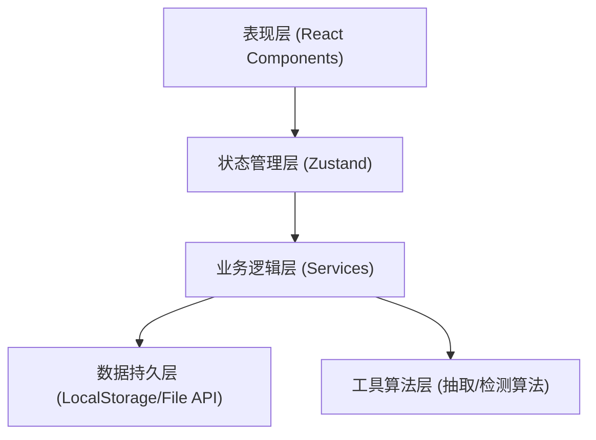
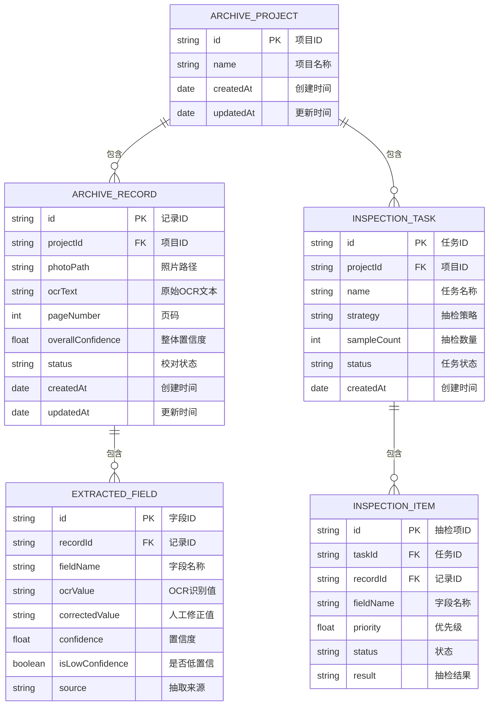

## 1. 架构设计

本系统采用纯前端单页应用架构，所有数据处理均在浏览器本地完成，确保档案数据不离开用户设备，保障档案数据安全。使用 React 状态管理采用 Zustand，数据持久化到 LocalStorage。



## 2. 技术描述

- **前端框架**: React@18 + TypeScript
- **构建工具**: Vite@5
- **样式方案**: TailwindCSS@3
- **状态管理**: Zustand@4
- **路由**: React Router@6
- **图标**: Lucide React
- **文件处理**: Papa Parse (CSV), SheetJS (Excel)
- **图表**: Recharts

### 核心算法
- 信息抽取：正则表达式 + 规则引擎
- 置信度评估：多维度评分算法
- 缺页检测：页码连续性分析
- 抽检策略：加权随机抽样算法

## 3. 路由定义

| 路由 | 页面名称 | 功能说明 |
|------|----------|----------|
| / | 导入页 | 数据导入和项目列表 |
| /workspace | 校对工作台 | 档案列表和详情校对 |
| /quality | 质量检测 | 低置信概览和缺页检测 |
| /inspection | 抽检管理 | 抽检清单生成和执行 |
| /export | 目录导出 | 导出配置和下载 |

## 4. 数据模型

### 4.1 数据模型定义



### 4.2 字段类型说明

| 字段类型 | 说明 |
|----------|------|
| name | 姓名 |
| date | 日期 |
| documentNumber | 编号 |
| pageNumber | 页码 |
| materialType | 材料类型 |

## 5. 核心算法

### 5.1 信息抽取引擎

- **姓名抽取**：中文姓名正则匹配 (2-4字)、繁简体转换、印章文字识别
- **日期抽取**：多种日期格式 (民国纪年、干支纪年、公历)、汉字数字识别
- **编号抽取**：多种编号格式 (字母数字组合、纯数字、带分隔符)
- **页码抽取**：页码位置特征 (第X页、共X页、页码数字)
- **材料类型**：关键词匹配 + 分类规则

### 5.2 置信度评估

- OCR识别置信度 (来自OCR引擎或基于字符特征估算)
- 格式匹配度 (是否符合该字段的格式规范)
- 上下文一致性 (与其他字段的逻辑关系)
- 历史数据比对 (与同批次其他记录比对)

### 5.3 缺页检测

- 页码连续性分析
- 编号连续性分析
- 照片文件命名规律检测

### 5.4 抽检策略

- 低置信优先：按置信度从低到高排序
- 分层抽样：按材料类型分层
- 随机抽样：基础随机抽样
- 加权混合：综合策略组合

## 6. 项目结构

```
src/
├── components/          # 通用组件
│   ├── layout/         # 布局组件
│   ├── ui/           # UI基础组件
│   └── ...
├── pages/             # 页面组件
│   ├── ImportPage/
│   ├── WorkspacePage/
│   ├── QualityPage/
│   ├── InspectionPage/
│   └── ExportPage/
├── store/             # 状态管理
│   └── useArchiveStore.ts
├── services/        # 业务逻辑服务
│   ├── extractor/       # 信息抽取
│   ├── confidence/  # 置信度评估
│   ├── inspection/  # 抽检算法
│   └── export/       # 导出服务
├── types/             # TypeScript类型定义
├── utils/             # 工具函数
├── hooks/           # 自定义Hooks
├── assets/          # 静态资源
└── App.tsx
```
