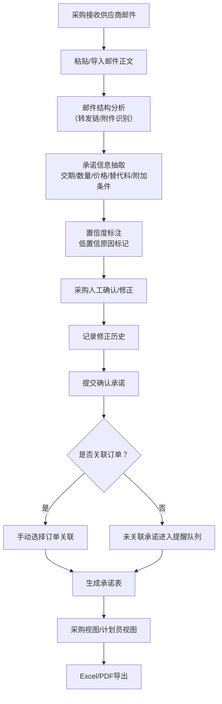

## 1. 产品概述

供应商邮件承诺抽取系统，帮助采购团队从供应商邮件中快速提取交期、数量、价格、替代料、附加条件等关键承诺信息，减少手工整理时间，提高采购与计划协同效率。

- **目标用户**：采购专员、采购主管、计划员
- **解决问题**：供应商邮件承诺信息分散、人工整理慢、承诺与订单脱节、替代料/付款条件遗漏
- **核心价值**：抽取效率提升80%，承诺信息可追溯，订单关联零遗漏

## 2. 核心功能

### 2.1 用户角色

| 角色 | 注册方式 | 核心权限 |
|------|----------|----------|
| 采购专员 | 系统账号 | 导入邮件、确认承诺、关联订单、导出承诺表 |
| 计划员 | 系统账号 | 查看承诺表、导出数据 |
| 采购主管 | 系统账号 | 全部权限、统计查看 |

### 2.2 功能模块

1. **工作台首页**：待确认承诺、未关联订单提醒、今日数据统计
2. **邮件导入与解析**：粘贴/导入邮件正文、邮件结构分析、转发链识别
3. **承诺抽取面板**：交期/数量/价格/替代料/附加条件抽取、证据句高亮、置信度标注
4. **人工确认与修正**：字段级编辑、修正历史记录、确认提交
5. **订单关联管理**：手动选择订单关联、未关联承诺提醒、关联状态追踪
6. **承诺表导出**：采购确认视图、计划员视图、Excel导出
7. **附件报价管理**：附件识别、报价单截图提示、OCR转写标记

### 2.3 页面详情

| 页面名称 | 模块名称 | 功能描述 |
|----------|----------|----------|
| 工作台首页 | 数据概览卡片 | 待确认数、未关联数、本周导入量、7日趋势图 |
| 工作台首页 | 待处理列表 | 待确认承诺卡片、未关联订单提醒列表 |
| 邮件导入页 | 导入区 | 文本粘贴框、邮件文件上传、供应商选择 |
| 邮件导入页 | 邮件预览 | 邮件原文展示、转发链折叠标记、附件列表 |
| 承诺抽取页 | 抽取结果卡片 | 交期/数量/价格/替代料/附加条件五组卡片，每组显示值、置信度、证据句 |
| 承诺抽取页 | 置信度标签 | 高置信（绿）/中置信（黄）/低置信（红）三级标记及原因提示 |
| 承诺抽取页 | 人工编辑器 | 字段级编辑弹窗、证据句手动选择 |
| 承诺抽取页 | 修正历史侧边栏 | 时间线展示每次修改的字段、旧值、新值、操作人 |
| 订单关联页 | 关联选择器 | 订单表格选择、搜索筛选、批量关联 |
| 订单关联页 | 关联状态看板 | 已关联/未关联/关联异常三类分区展示 |
| 承诺表导出页 | 数据表格 | 采购确认后承诺列表，支持多维筛选 |
| 承诺表导出页 | 视图切换 | 采购视图/计划员视图切换、列自定义 |
| 承诺表导出页 | 导出按钮 | Excel导出、PDF导出 |

## 3. 核心流程

采购专员收到供应商邮件后，将邮件正文粘贴或导入系统，系统自动识别邮件结构（转发链、附件等）并抽取关键承诺信息。每个抽取字段标注置信度（转发链/模糊时间/截图转写/反悔上下文标低置信），采购专员确认或修正字段内容（系统记录修正历史），确认后手动关联对应订单，未关联承诺持续提醒跟进，最终导出计划员可查看的承诺表。

## 4. 用户界面设计

### 4.1 设计风格

- **主色调**：深钢蓝（#1E3A5F）作为主色，表达专业信任；琥珀橙（#F59E0B）作为强调色，突出待处理项
- **辅助色**：置信度三色体系 - 高置信翠绿（#10B981）、中置信琥珀（#F59E0B）、低置信朱红（#EF4444）
- **按钮风格**：圆角8px，主按钮深钢蓝填充+白字，次要按钮描边+悬停填充，操作按钮带有微阴影
- **字体方案**：中文使用思源宋体（Noto Serif SC）用于标题营造专业感，思源黑体（Noto Sans SC）用于正文保证可读性；数字和英文使用 JetBrains Mono 等宽字体
- **布局风格**：卡片式栅格布局，左侧导航栏+顶部状态栏，内容区采用双栏结构（左操作区+右预览/历史侧栏）
- **视觉质感**：卡片采用微渐变边框+半透明毛玻璃背景，分隔线使用细微虚线，营造企业级精致感
- **图标风格**：统一使用线性图标，颜色跟随语义（确认用绿、警告用黄、错误用红）

### 4.2 页面设计概览

| 页面名称 | 模块名称 | UI元素 |
|----------|----------|----------|
| 工作台首页 | 数据概览卡片 | 四张统计卡片，数字使用大号等宽字体，带7日迷你折线图，悬停时卡片轻微上浮 |
| 工作台首页 | 待处理列表 | 承诺卡片堆叠，每张卡片左上角置信度色条，右上角时间标签，悬停展开预览 |
| 邮件导入页 | 导入区 | 大型文本框带虚线边框，拖拽高亮，供应商下拉搜索带自动补全 |
| 邮件导入页 | 邮件预览 | 原文展示区带行号，转发链灰色折叠块带"展开转发链"按钮，附件图标+名称列表 |
| 承诺抽取页 | 抽取结果卡片 | 五组卡片横向排列，每组卡片顶部字段名标签，中间大值显示，底部证据句高亮+置信度徽章 |
| 承诺抽取页 | 证据句高亮 | 邮件原文中对应句子用对应色背景高亮，点击证据句可跳转编辑 |
| 承诺抽取页 | 修正历史侧边栏 | 右侧抽屉式面板，时间线节点带操作人头像，修改内容diff高亮对比 |
| 订单关联页 | 关联选择器 | 订单表格带复选框列，顶部搜索筛选栏，选中行背景变浅蓝 |
| 订单关联页 | 关联状态看板 | 三栏看板布局，卡片可拖拽切换状态，每栏顶部数字计数徽章 |
| 承诺表导出页 | 数据表格 | 冻结表头，斑马纹行，筛选列头带下拉图标，行悬停深一色色阶 |
| 承诺表导出页 | 视图切换 | Segmented Control 分段控件，当前选中项带下划线滑块动画 |

### 4.3 响应式

- 桌面端优先设计（1440px基准）
- 1200px以上保持双栏操作+侧栏布局
- 768-1200px折叠侧栏为可展开抽屉
- 768px以下转为单栏堆叠，操作按钮固定底部

### 4.4 动效设计

- 页面加载：卡片从下到上依次淡入+位移，间隔60ms
- 置信度标签：低置信标签带柔和脉冲动画（每3秒一次）
- 编辑弹窗：Modal背景模糊渐变，弹窗缩放+淡入
- 确认提交：按钮旋转对勾动画，成功后卡片绿色边框闪光
- 时间线滚动：修正历史滚动到新记录时自动定位并高亮
