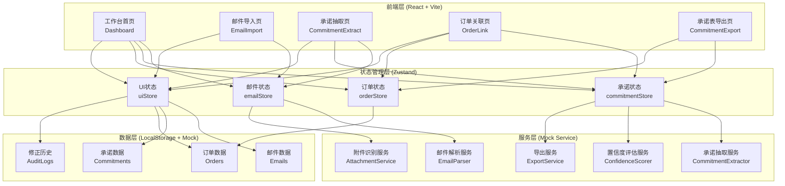
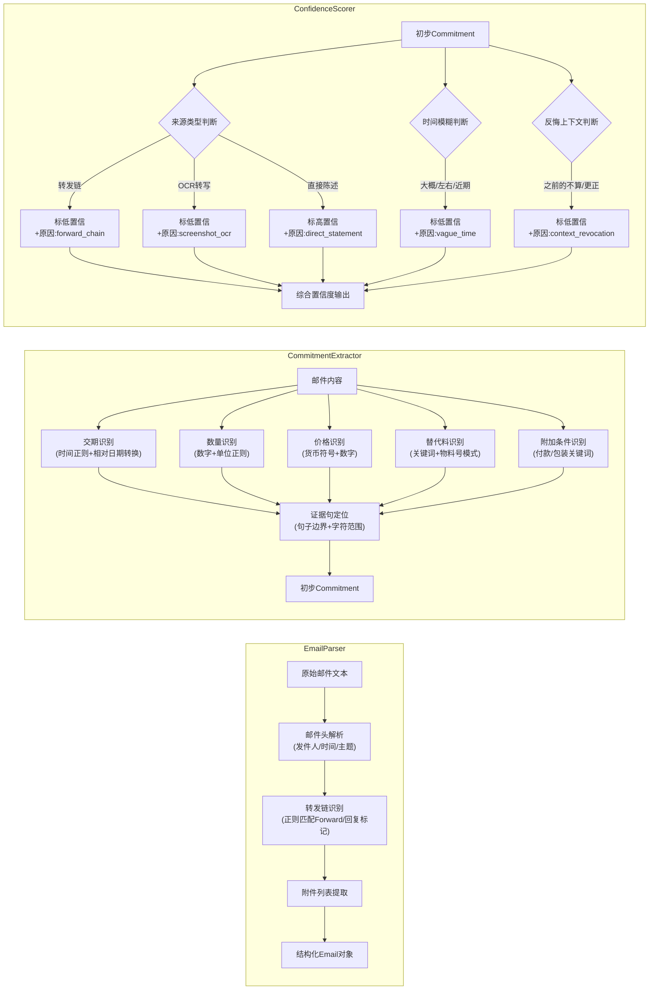
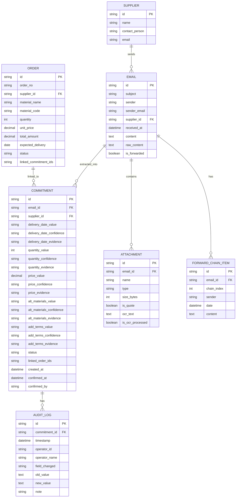

## 1. 架构设计



## 2. 技术描述

- **前端框架**：React@18 + TypeScript@5
- **构建工具**：Vite@5
- **样式方案**：TailwindCSS@3 + PostCSS
- **状态管理**：Zustand@4（轻量、无需Provider包裹、原生支持TS）
- **路由方案**：React Router DOM@6
- **UI组件库**：Lucide React@0.344（图标）+ Headless UI（无样式组件）
- **图表库**：Recharts@2（迷你折线图/趋势图）
- **导出工具**：xlsx（Excel导出）+ jspdf（PDF导出）
- **动画库**：Framer Motion@11
- **拖拽库**：@dnd-kit/core（看板拖拽）
- **Mock数据**：内置JSON模拟数据 + LocalStorage持久化
- **代码规范**：ESLint + Prettier

## 3. 路由定义

| 路由路径 | 页面名称 | 页面组件 | 权限 |
|----------|----------|----------|------|
| `/` | 工作台首页 | Dashboard | 全部用户 |
| `/email/import` | 邮件导入页 | EmailImport | 采购专员/主管 |
| `/email/:id` | 邮件详情+承诺抽取页 | CommitmentExtract | 采购专员/主管 |
| `/orders/link` | 订单关联页 | OrderLink | 采购专员/主管 |
| `/commitments/export` | 承诺表导出页 | CommitmentExport | 全部用户 |

## 4. API定义（Mock服务层接口）

```typescript
// 邮件相关
interface Email {
  id: string;
  subject: string;
  sender: string;
  senderEmail: string;
  supplierId: string;
  supplierName: string;
  receivedAt: string;
  content: string;
  rawContent: string;
  forwardChain: ForwardChainItem[];
  attachments: Attachment[];
  isForwarded: boolean;
}

interface ForwardChainItem {
  index: number;
  sender: string;
  date: string;
  content: string;
}

interface Attachment {
  id: string;
  name: string;
  type: 'image' | 'pdf' | 'excel' | 'other';
  size: number;
  isQuote: boolean;
  ocrText?: string;
  isOcrProcessed: boolean;
}

// 承诺抽取相关
type ConfidenceLevel = 'high' | 'medium' | 'low';
type ConfidenceReason = 
  | 'direct_statement'
  | 'forward_chain' 
  | 'screenshot_ocr'
  | 'vague_time'
  | 'context_revocation'
  | 'manual_override';

interface ExtractedField<T> {
  value: T | null;
  confidence: ConfidenceLevel;
  reasons: ConfidenceReason[];
  evidenceSentence: string;
  evidenceRange: [number, number];
  isEdited: boolean;
}

interface Commitment {
  id: string;
  emailId: string;
  supplierId: string;
  supplierName: string;
  deliveryDate: ExtractedField<string>;
  quantity: ExtractedField<number>;
  price: ExtractedField<number>;
  alternativeMaterials: ExtractedField<string[]>;
  additionalTerms: ExtractedField<string>;
  status: 'pending' | 'confirmed' | 'rejected';
  linkedOrderIds: string[];
  createdAt: string;
  confirmedAt?: string;
  confirmedBy?: string;
  auditLogs: AuditLog[];
}

interface AuditLog {
  id: string;
  timestamp: string;
  operatorId: string;
  operatorName: string;
  fieldChanged: keyof Commitment | 'general';
  oldValue: any;
  newValue: any;
  note?: string;
}

// 订单相关
interface Order {
  id: string;
  orderNo: string;
  supplierId: string;
  supplierName: string;
  materialName: string;
  materialCode: string;
  quantity: number;
  unitPrice: number;
  totalAmount: number;
  expectedDelivery: string;
  status: 'pending' | 'partial' | 'completed';
  linkedCommitmentIds: string[];
}

// 抽取服务接口
interface CommitmentExtractorService {
  parseEmail(rawContent: string): Promise<Email>;
  extractCommitment(email: Email): Promise<Commitment>;
  calculateConfidence(
    field: string, 
    value: any, 
    context: { isForwarded: boolean; isOcr: boolean; hasRevocation: boolean }
  ): { level: ConfidenceLevel; reasons: ConfidenceReason[] };
}
```

## 5. 服务层架构



## 6. 数据模型

### 6.1 数据模型定义



### 6.2 初始Mock数据说明

系统内置以下模拟数据供演示：
- 5家供应商基础信息
- 15封示例邮件（含正常承诺、转发链、模糊时间、反悔上下文、带附件报价等场景）
- 20条采购订单（部分已关联、部分未关联）
- 完整的修正历史样例
