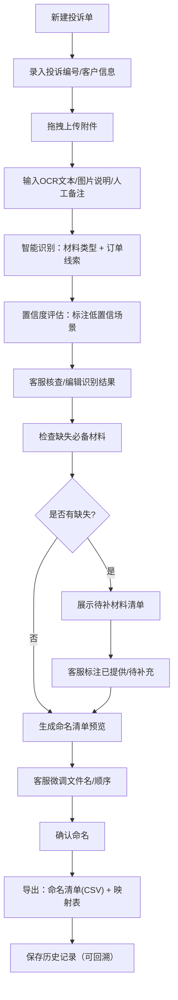

## 1. 产品概述

投诉附件自动命名系统，用于客服在处理客户投诉时，将客户提交的聊天截图、检测单、快递照片、购买凭证等附件（文件名通常为图片编号）自动识别类型、提取订单线索、生成规范化文件名，并提示缺失材料，最终导出质检可用的有序命名清单。

- **解决问题**：附件文件名混乱无意义、人工分类命名耗时易出错、质检难以快速定位材料、缺少材料发现晚导致返工
- **目标用户**：电商客服（主用户）、质检专员（下游用户）
- **核心价值**：提升投诉处理效率 60%+，降低质检返回率，实现投诉材料标准化管理

## 2. 核心功能

### 2.1 用户角色

| 角色 | 使用场景 | 核心权限 |
|------|----------|----------|
| 客服 | 处理投诉、导入附件、确认命名、导出清单 | 全部功能，含编辑、删除、导出 |
| 质检 | 接收材料包、查阅命名清单 | 只读模式，查看命名映射关系 |

### 2.2 功能模块

1. **附件管理模块**：拖拽/点击上传多文件，支持图片(PDF/JPG/PNG)，文件列表预览，批量删除
2. **识别引擎模块**：基于 OCR 文本/图片说明/人工备注，自动识别材料类型，提取订单号/手机号/日期线索
3. **命名生成模块**：按"序号-材料类型-订单号"规则生成文件名，支持人工调整
4. **置信度评估模块**：标注截图截半、同一材料多张、订单号不清、类型不确定等低置信场景
5. **材料检查模块**：检查常见必备材料是否缺失，生成待补列表
6. **命名清单模块**：预览最终命名，一键导出命名清单(CSV)，记录原始文件映射
7. **历史记录模块**：本地保存历史投诉记录，支持回溯查看

### 2.3 页面详情

| 页面名称 | 模块名称 | 功能描述 |
|----------|----------|----------|
| 主工作台 | 顶部导航 | 新建投诉单、历史记录切换、帮助入口 |
| 主工作台 | 投诉信息栏 | 投诉编号输入、客户信息备注输入 |
| 主工作台 | 附件上传区 | 拖拽上传、点击选择、文件数量统计 |
| 主工作台 | 附件识别列表 | 缩略图、原始文件名、材料类型(可编辑)、订单线索、置信度标签、OCR/备注输入框 |
| 主工作台 | 智能识别面板 | 一键识别按钮、识别进度、全局订单号建议 |
| 主工作台 | 命名清单预览 | 序号、新文件名、文件大小、原始文件名映射 |
| 主工作台 | 缺失材料警示 | 待补材料清单、材料说明、勾选确认已提供 |
| 主工作台 | 底部操作栏 | 确认命名、重置、导出(CSV/ZIP)、保存草稿 |
| 历史记录页 | 投诉列表 | 按日期排序、投诉编号搜索、查看详情 |
| 历史记录页 | 详情面板 | 命名清单复现、原始附件跳转、导出 |

## 3. 核心流程

客服登录系统后，新建投诉单并录入基础信息，然后拖拽上传客户提供的所有附件。系统对每个附件进行智能识别：若已接入OCR则自动读取文本，否则客服可粘贴OCR结果或输入人工备注。识别引擎根据关键词和规则判断材料类型（聊天截图/检测单/快递照片/购买凭证等），同时从文本中提取订单号、手机号、日期等线索，并评估识别置信度（低置信场景用红色标签标注原因）。

客服逐个核查识别结果，可修改材料类型、补充订单号、标记同组材料。系统实时汇总所有附件，根据内置必备材料清单检查缺失项并展示警示。客服确认无误后，系统按照"序号-材料类型-订单号"规则自动生成命名清单，客服可微调后一键导出 CSV 清单及重命名映射表。材料包交给质检时，文件名已有清晰顺序；客服随时可通过历史记录从命名清单回溯至原始附件。

## 4. 用户界面设计

### 4.1 设计风格
- **主色调**：深青蓝 `#0F766E`（专业可靠）+ 琥珀橙 `#F59E0B`（警示标注）
- **辅助色**：锌灰 `#F4F4F5`（背景）、浅青 `#CCFBF1`（成功高亮）、浅红 `#FEE2E2`（低置信警示）
- **按钮风格**：圆角 8px，主色实心按钮带 2px 阴影，hover 时轻微上浮 1px
- **字体**：思源黑体 / PingFang SC，标题 18px 粗体，正文 14px 常规，小字辅助 12px 浅灰
- **布局风格**：三栏卡片式布局（左：附件列表 | 中：识别编辑 | 右：命名清单+缺失检查），顶部固定导航，底部悬浮操作栏
- **图标风格**：线性 lucide 图标，16px/20px 两种规格，与文字间距 4px

### 4.2 页面设计概览

| 页面名称 | 模块名称 | UI 元素 |
|----------|----------|----------|
| 主工作台 | 顶部导航 | 深青蓝渐变背景、白色文字、新建按钮(橙黄渐变)、历史下拉、帮助图标 |
| 主工作台 | 投诉信息栏 | 浅灰卡片、左侧投诉编号输入框(带前缀图标)、右侧备注输入、提交时间自动填充 |
| 主工作台 | 附件上传区 | 虚线边框卡片、上传图标+提示文字、已上传数量徽标、hover 时边框变实变色 |
| 主工作台 | 附件识别列表 | 卡片行：左侧缩略图(64x64 圆角) + 原始文件名(等宽字体截断)；中间材料类型下拉(带置信度色条) + 订单号输入 + OCR文本框；右侧低置信标签(红底白字) + 删除按钮 |
| 主工作台 | 命名清单预览 | 有序列表样式，每行：序号徽章(深青蓝圆形) + 新文件名(等宽粗体) + 原始名映射(小字灰色) + 文件大小 |
| 主工作台 | 缺失材料警示 | 红边白底卡片、标题带警示图标、列表项：材料名 + 是否必备标签 + 勾选框 + 说明文字 |
| 主工作台 | 底部操作栏 | 固定底部、玻璃模糊背景、左侧撤销/重置、中间材料统计、右侧确认命名(主按钮) + 导出下拉(CSV/ZIP) |
| 历史记录页 | 列表 | 表格样式，斑马纹、投诉编号加粗、材料数量列、创建时间列、操作列(查看/导出/删除) |

### 4.3 响应性
- **桌面端优先**：≥1280px 三栏布局，主内容区居中最大宽度 1440px
- **平板适配**：768px-1279px 两栏布局（附件列表+识别合并，命名清单和缺失检查在下方）
- **移动端**：<768px 单栏纵向排列，上传区全宽，附件卡片横向缩略图+纵向信息，操作栏改为底部浮动圆形按钮组
- **触控优化**：所有可点击区域最小高度 44px，下拉选择器改为原生 picker，滚动区有惯性效果
