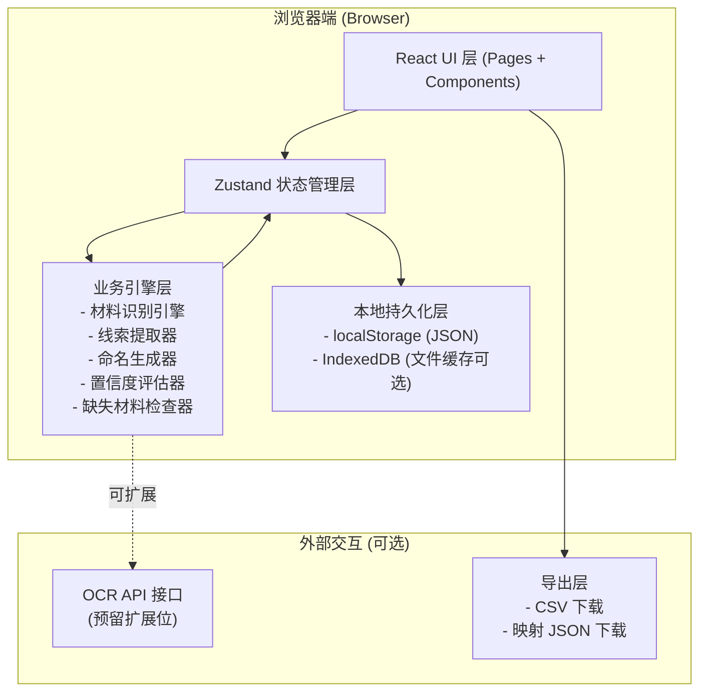
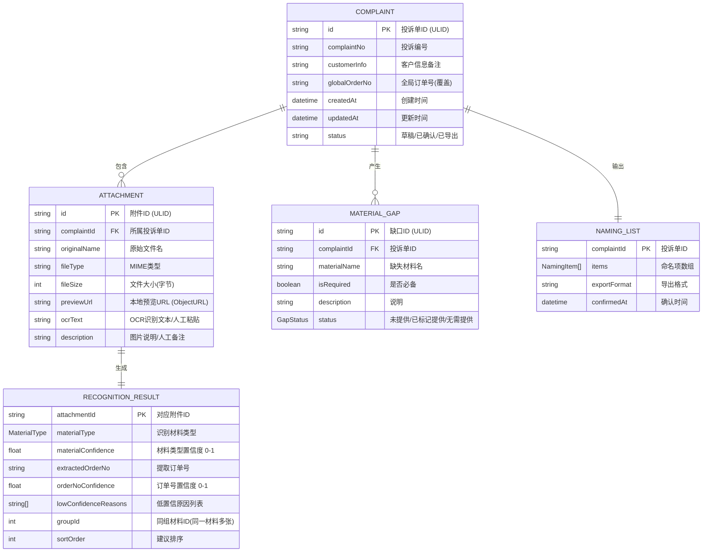

## 1. 架构设计

纯前端单页应用，无后端服务，所有数据在浏览器本地处理与存储。附件文件仅保留在内存中用于预览和下载，识别引擎完全基于关键词匹配与正则规则，OCR 文本由客服手动粘贴或输入（预留 API 接口位）。



## 2. 技术描述

- **前端框架**：React@18 + TypeScript@5，函数式组件 + Hooks
- **构建工具**：Vite@5，热更新，路径别名 `@/` 指向 `src/`
- **样式方案**：TailwindCSS@3，配合 CSS 变量定义主题色，无额外 UI 组件库（原生+自研小组件）
- **状态管理**：Zustand@4，单一全局 store 存储投诉单数据，模块化 action 拆分
- **图标库**：lucide-react，按需导入线性图标
- **持久化**：localStorage 存储 JSON 数据（投诉单≤50MB 场景足够），历史记录上限 100 条自动淘汰最早
- **数据 Mock**：内置 3 条示例投诉数据，首次访问自动注入用于演示

| 分类 | 技术选型 | 版本约束 | 理由 |
|------|----------|----------|------|
| 核心框架 | React | ^18.2.0 | 生态成熟、Hooks 适合复杂交互 |
| 类型系统 | TypeScript | ^5.3.0 | 强类型减少识别引擎逻辑错误 |
| 构建工具 | Vite | ^5.0.0 | 启动快、配置简洁 |
| 样式 | TailwindCSS | ^3.4.0 | 快速开发、设计 Token 统一 |
| 状态 | Zustand | ^4.4.0 | 轻量、避免 Redux 样板代码 |
| 图标 | lucide-react | ^0.294.0 | 轻量、风格统一 |
| 导出 | 原生 Blob + URL.createObjectURL | - | CSV/JSON 免依赖 |
| 路由 | react-router-dom | ^6.20.0 | 主工作台 + 历史记录两页路由 |

## 3. 路由定义

| 路由路径 | 页面组件 | 用途 |
|----------|----------|------|
| `/` | `WorkbenchPage` | 主工作台：新建/编辑投诉单、上传附件、识别命名、导出 |
| `/history` | `HistoryPage` | 历史记录：查看所有已保存投诉单、回溯详情、再次导出 |
| `*` | `Navigate to="/"` | 404 重定向到主工作台 |

## 4. 数据模型

### 4.1 核心实体关系



### 4.2 TypeScript 类型定义（核心）

```typescript
// 材料类型枚举
enum MaterialType {
  CHAT_SCREENSHOT = 'CHAT_SCREENSHOT',      // 聊天截图
  INSPECTION_REPORT = 'INSPECTION_REPORT', // 检测报告单
  EXPRESS_PHOTO = 'EXPRESS_PHOTO',          // 快递照片(面单/外包装)
  PURCHASE_PROOF = 'PURCHASE_PROOF',        // 购买凭证(订单/支付截图)
  PRODUCT_PHOTO = 'PRODUCT_PHOTO',          // 商品照片/问题图
  RETURN_FORM = 'RETURN_FORM',              // 退换货申请单
  OTHER = 'OTHER',                          // 其他
  UNKNOWN = 'UNKNOWN',                      // 未识别
}

// 低置信原因
enum LowConfidenceReason {
  CROPPED = 'CROPPED',                   // 截图截半/不完整
  MULTIPLE_PAGES = 'MULTIPLE_PAGES',     // 同一材料多张
  ORDER_NO_UNCLEAR = 'ORDER_NO_UNCLEAR', // 订单号不清
  TYPE_UNCERTAIN = 'TYPE_UNCERTAIN',     // 材料类型不确定
  LOW_TEXT_VOLUME = 'LOW_TEXT_VOLUME',   // OCR文本过少
}

// 材料缺口状态
enum GapStatus {
  MISSING = 'MISSING',           // 缺失待补
  MARKED_PROVIDED = 'MARKED_PROVIDED', // 已标记提供
  WAIVED = 'WAIVED',             // 确认无需
}

interface Attachment {
  id: string;
  complaintId: string;
  originalName: string;
  fileType: string;
  fileSize: number;
  previewUrl: string;
  ocrText: string;
  description: string;
}

interface RecognitionResult {
  attachmentId: string;
  materialType: MaterialType;
  materialConfidence: number;
  extractedOrderNo: string;
  orderNoConfidence: number;
  lowConfidenceReasons: LowConfidenceReason[];
  groupId: number | null;
  sortOrder: number;
}

interface NamingItem {
  attachmentId: string;
  originalName: string;
  newFileName: string;
  sequence: number;
  materialType: MaterialType;
  orderNo: string;
}

interface Complaint {
  id: string;
  complaintNo: string;
  customerInfo: string;
  globalOrderNo: string;
  createdAt: string;
  updatedAt: string;
  status: 'DRAFT' | 'CONFIRMED' | 'EXPORTED';
  attachments: Attachment[];
  recognitions: Record<string, RecognitionResult>;
  namingList: NamingItem[];
  materialGaps: MaterialGap[];
}
```

### 4.3 localStorage 存储结构

```json
{
  "complaint-rater-v1": {
    "currentComplaintId": "cmp_01HHHH...",
    "complaints": [
      { /* Complaint JSON 对象 */ }
    ],
    "settings": {
      "namingTemplate": "{seq}-{type}-{orderNo}",
      "sequencePadding": 2,
      "maxHistory": 100
    }
  }
}
```

### 4.4 必备材料配置（缺失检查依据）

```typescript
const REQUIRED_MATERIALS_RULES = [
  // 根据投诉场景匹配必备材料（可扩展）
  {
    scenario: '质量问题投诉',
    materials: [
      { name: '商品问题照片', type: MaterialType.PRODUCT_PHOTO, required: true, desc: '需清晰显示问题部位' },
      { name: '购买凭证', type: MaterialType.PURCHASE_PROOF, required: true, desc: '订单截图或支付记录' },
      { name: '聊天沟通记录', type: MaterialType.CHAT_SCREENSHOT, required: false, desc: '与客服/商家沟通截图' },
    ],
  },
  {
    scenario: '退换货投诉',
    materials: [
      { name: '退换货申请单', type: MaterialType.RETURN_FORM, required: true, desc: '申请截图或填写记录' },
      { name: '快递面单照片', type: MaterialType.EXPRESS_PHOTO, required: true, desc: '寄出快递单号清晰可见' },
      { name: '商品照片', type: MaterialType.PRODUCT_PHOTO, required: true, desc: '退货前商品状态' },
    ],
  },
  {
    scenario: '物流投诉',
    materials: [
      { name: '快递照片', type: MaterialType.EXPRESS_PHOTO, required: true, desc: '外包装/破损情况' },
      { name: '购买凭证', type: MaterialType.PURCHASE_PROOF, required: true, desc: '订单信息' },
    ],
  },
  {
    scenario: '通用投诉',
    materials: [
      { name: '购买凭证', type: MaterialType.PURCHASE_PROOF, required: true, desc: '基础必备' },
      { name: '聊天记录', type: MaterialType.CHAT_SCREENSHOT, required: false, desc: '建议提供' },
    ],
  },
];
```
