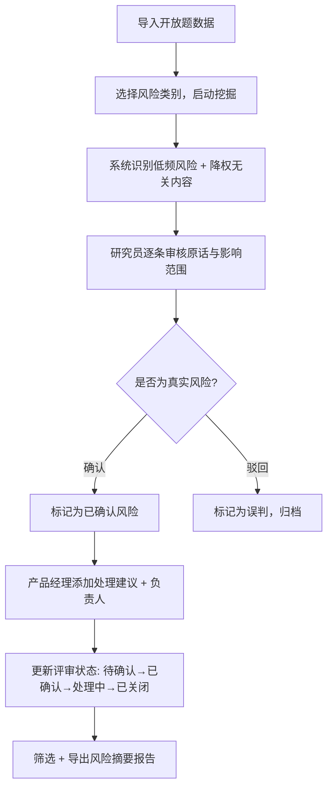

## 1. 产品概述

开放题低频风险挖掘工具，面向用户研究员，用于从调研开放题回答中识别被高频聚类淹没的低频但高严重性风险（安全、隐私、合规、付款、弱势用户体验）。保留原话与影响范围，支持研究员确认、添加处理建议与负责人、更新评审状态，最终导出低频风险摘要供产品会议讨论。

- 目标用户：用户研究员、产品经理、合规团队
- 核心价值：不让严重低频风险被"大多数人在夸"的声量掩盖，确保每条风险有处理建议和负责人跟进

## 2. 核心功能

### 2.1 用户角色

| 角色 | 注册方式 | 核心权限 |
|------|----------|----------|
| 研究员 | 邀请码注册 | 导入数据、执行挖掘、确认风险、导出报告 |
| 产品经理 | 邀请码注册 | 查看风险、添加处理建议与负责人、更新评审状态 |
| 合规人员 | 邀请码注册 | 查看风险、更新评审状态 |

### 2.2 功能模块

1. **数据导入页**：上传 CSV/Excel 文件，字段映射，数据预览
2. **风险挖掘页**：执行低频风险识别，分类浏览挖掘结果，查看原话与影响范围
3. **风险管理页**：确认/驳回风险，添加处理建议与负责人，更新评审状态
4. **风险摘要导出页**：筛选、预览并导出低频风险摘要报告

### 2.3 页面详情

| 页面名称 | 模块名称 | 功能描述 |
|----------|----------|----------|
| 数据导入页 | 文件上传区 | 拖拽上传 CSV/Excel，自动解析列头 |
| 数据导入页 | 字段映射 | 将文件列映射到"回答内容""用户ID""回答时间"等标准字段 |
| 数据导入页 | 数据预览 | 展示前20条数据，确认映射无误后导入 |
| 风险挖掘页 | 挖掘控制面板 | 选择风险类别（安全/隐私/合规/付款/弱势群体），启动挖掘 |
| 风险挖掘页 | 风险分类标签页 | 按风险类别分 Tab 展示挖掘结果 |
| 风险挖掘页 | 风险卡片列表 | 每条风险展示：原话摘要、风险类别、严重程度、影响范围、降权标记 |
| 风险挖掘页 | 原话详情弹窗 | 点击卡片展开完整原话、上下文、降权原因说明 |
| 风险管理页 | 风险确认列表 | 所有已挖掘风险，支持确认/驳回操作 |
| 风险管理页 | 处理建议编辑 | 为每条风险添加处理建议文本 |
| 风险管理页 | 负责人指派 | 从团队成员列表选择负责人 |
| 风险管理页 | 评审状态流转 | 待确认 → 已确认 → 处理中 → 已关闭，支持状态筛选 |
| 风险摘要导出页 | 筛选条件 | 按风险类别、严重程度、评审状态、时间范围筛选 |
| 风险摘要导出页 | 报告预览 | 预览即将导出的风险摘要内容 |
| 风险摘要导出页 | 导出按钮 | 导出为 CSV 或 PDF 格式 |

## 3. 核心流程

用户研究员导入调研开放题数据后，选择需要挖掘的风险类别，系统自动识别低频风险条目并降权无关内容（玩笑、引用新闻、复制粘贴、无关吐槽）。研究员逐条审核原话与影响范围，确认真实风险并驳回误判。产品经理为已确认风险添加处理建议和负责人，更新评审状态。最终筛选导出风险摘要报告用于产品会议讨论。

## 4. 用户界面设计

### 4.1 设计风格

- 主色调：深灰 #1A1A2E + 琥珀警示色 #F59E0B + 红色严重标记 #EF4444
- 辅助色：深蓝 #16213E、灰蓝 #0F3460、绿色安全 #10B981
- 按钮风格：圆角 8px，轻微阴影，主操作按钮用实色填充，次操作用描边
- 字体：思源黑体 / Noto Sans SC 为正文，标题用等宽感强的 JetBrains Mono 做数据展示
- 布局风格：左侧窄导航栏 + 右侧宽内容区，卡片式内容展示
- 图标风格：线性图标（Lucide 风格），风险类别用不同颜色标签区分
- 整体风格：工业/控制室风格（utilitarian），深色背景突出数据，警示色用于风险标记

### 4.2 页面设计概览

| 页面名称 | 模块名称 | UI 元素 |
|----------|----------|----------|
| 数据导入页 | 文件上传区 | 虚线边框拖拽区、上传图标、文件类型标签、上传进度条 |
| 数据导入页 | 字段映射 | 双列对照表，左侧文件列头，右侧下拉选择标准字段 |
| 数据导入页 | 数据预览 | 横向滚动表格，斑马纹行，高亮映射列 |
| 风险挖掘页 | 挖掘控制面板 | 类别多选胶囊按钮、启动挖掘按钮、进度动画 |
| 风险挖掘页 | 风险卡片列表 | 左侧类别Tab、右侧卡片流、卡片含严重程度色条、展开箭头 |
| 风险挖掘页 | 原话详情弹窗 | 模态弹窗、原话引用块、上下文标签、降权标记徽章 |
| 风险管理页 | 风险确认列表 | 表格布局、行内确认/驳回按钮、状态徽章 |
| 风险管理页 | 处理建议编辑 | 行内展开文本区、保存按钮 |
| 风险管理页 | 负责人指派 | 头像下拉选择器、已选负责人标签 |
| 风险管理页 | 评审状态流转 | 状态下拉选择器、颜色编码状态标签 |
| 风险摘要导出页 | 筛选条件 | 多选下拉、日期范围选择器 |
| 风险摘要导出页 | 报告预览 | A4纸样式预览区、分页指示 |
| 风险摘要导出页 | 导出按钮 | CSV/PDF双格式导出按钮、下载图标 |

### 4.3 响应式

- Desktop-first 设计，1920px 为主视口
- 1280px 以下导航栏收窄为图标模式
- 768px 以下切换为顶部Tab导航，卡片改为列表

### 4.4 3D 场景指引

不适用
