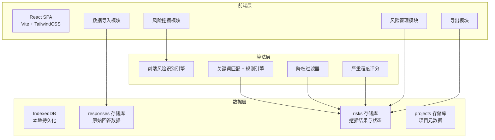
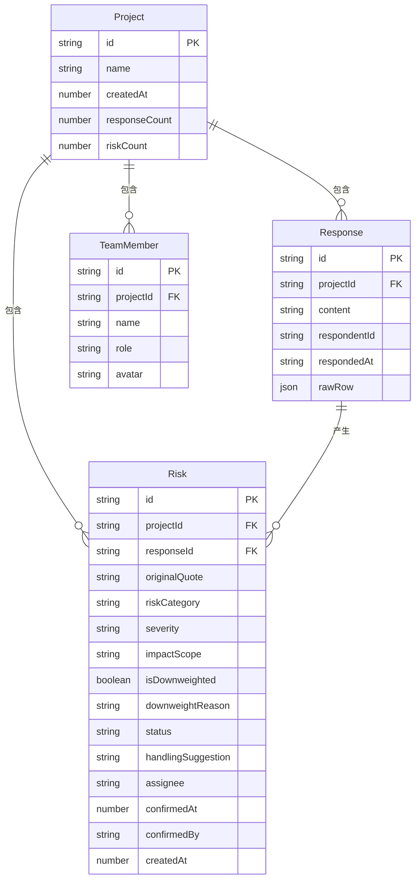

## 1. 架构设计



## 2. 技术说明

- 前端：React@18 + TailwindCSS@3 + Vite
- 初始化工具：Vite init (react-ts 模板)
- 后端：无（纯前端应用，数据存储于浏览器 IndexedDB）
- 数据库：IndexedDB（Dexie.js 封装），无需服务端
- 文件解析：papaparse（CSV）、xlsx（Excel）
- PDF 导出：jsPDF + jspdf-autotable
- 动画：Framer Motion

## 3. 路由定义

| 路由 | 用途 |
|------|------|
| `/` | 重定向到项目列表 |
| `/projects` | 项目列表页，管理多个调研项目 |
| `/projects/:id/import` | 数据导入页，上传与映射字段 |
| `/projects/:id/mining` | 风险挖掘页，执行挖掘与浏览结果 |
| `/projects/:id/risks` | 风险管理页，确认、指派、更新状态 |
| `/projects/:id/export` | 风险摘要导出页，筛选与导出 |

## 4. API 定义

无后端 API，所有数据操作通过 Dexie.js 直接读写 IndexedDB。

核心数据操作接口：

```typescript
interface Project {
  id: string;
  name: string;
  createdAt: number;
  responseCount: number;
  riskCount: number;
}

interface Response {
  id: string;
  projectId: string;
  content: string;
  respondentId?: string;
  respondedAt?: string;
  rawRow: Record<string, string>;
}

interface Risk {
  id: string;
  projectId: string;
  responseId: string;
  originalQuote: string;
  riskCategory: "safety" | "privacy" | "compliance" | "payment" | "vulnerable";
  severity: "critical" | "high" | "medium" | "low";
  impactScope: string;
  isDownweighted: boolean;
  downweightReason?: "joke" | "news_quote" | "copy_paste" | "irrelevant";
  status: "pending" | "confirmed" | "rejected" | "in_progress" | "closed";
  handlingSuggestion?: string;
  assignee?: string;
  confirmedAt?: number;
  confirmedBy?: string;
  createdAt: number;
}

interface TeamMember {
  id: string;
  name: string;
  role: "researcher" | "pm" | "compliance";
  avatar?: string;
}
```

## 5. 服务器架构图

不适用（纯前端应用）

## 6. 数据模型

### 6.1 数据模型定义



### 6.2 数据定义语言

使用 Dexie.js schema 定义：

```javascript
db.version(1).stores({
  projects: 'id, name, createdAt',
  responses: 'id, projectId, respondentId',
  risks: 'id, projectId, responseId, riskCategory, severity, status, assignee, createdAt',
  teamMembers: 'id, projectId, role'
});
```

## 7. 风险挖掘算法设计

### 7.1 关键词规则引擎

每个风险类别维护关键词列表：

- **安全风险**：泄露、被盗、黑客、漏洞、攻击、钓鱼、诈骗...
- **隐私风险**：隐私、追踪、定位、监控、数据收集、个人信息、偷窥...
- **合规风险**：违规、违法、法规、法律、政策、审核、举报...
- **付款风险**：扣费、乱扣、误导、隐藏收费、退款、收费陷阱、自动续费...
- **弱势群体**：小孩、儿童、老人、未成年人、孩子、青少年、残障...

### 7.2 降权过滤

对匹配到的条目进一步检测是否应降权：

- **玩笑**：包含"哈哈""笑死""梗"等口语化标记
- **引用新闻**：包含"据报道""新闻""记者""媒体"等
- **复制粘贴**：文本与已有条目高度重复（>80% 相似度）
- **无关吐槽**：不包含具体产品/功能描述，仅有情绪宣泄词

### 7.3 严重程度评分

基于以下维度综合评分：

- 风险类别权重（安全/付款 > 隐私/合规 > 弱势群体）
- 具体性（是否提及具体功能/场景）
- 可操作性（是否有明确的发生场景）
- 影响范围推断（是否涉及多用户、特定群体）
