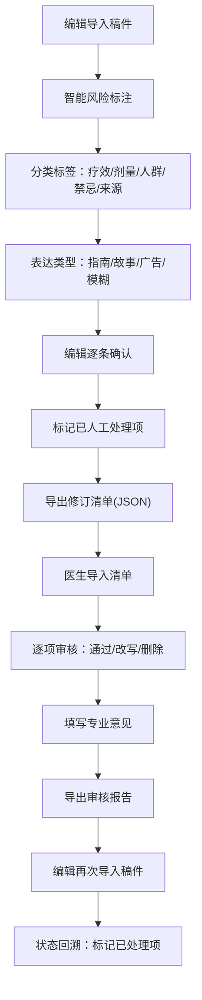

## 1. 产品概述

医学科普稿事实核对系统，服务于公众号医学编辑与医生审核协作流程。通过智能识别稿件中的治疗效果、用药剂量、适用人群、禁忌和数据来源等风险内容，辅助编辑完成稿件初筛，生成标准化修订清单供医生专业审核，全程留痕可追溯。

- 解决问题：医学科普稿口语化改写时，疗效/剂量/禁忌表述不当带来的合规风险
- 目标用户：医学科普编辑、专业审稿医生
- 产品价值：降低内容风险、提升编辑-医生协作效率、审核记录全程可追溯

## 2. 核心功能

### 2.1 用户角色

| 角色 | 说明 | 核心权限 |
|------|------|----------|
| 编辑 | 公众号医学内容编辑 | 导入稿件、查看标注、确认风险项、导出修订清单、查看审核状态 |
| 医生 | 专业医学审稿人员 | 导入修订清单、标注通过/需改写/删除、填写专业意见、导出审核结果 |

### 2.2 功能模块

1. **稿件导入页**：文本输入 / 文件上传，稿件解析存储
2. **智能标注页**：原文高亮展示，风险类别标注，分类标签区分
3. **编辑确认页**：风险清单确认，人工标记已处理，导出修订清单
4. **医生审核页**：修订清单导入，通过/改写/删除标记，专业意见填写
5. **状态回溯页**：二次导入稿件时，标记已处理风险项，查看历史意见

### 2.3 页面详情

| 页面名称 | 模块名称 | 功能描述 |
|-----------|-------------|---------------------|
| 首页/工作台 | 角色切换 | 编辑/医生模式一键切换，引导对应流程 |
| 首页/工作台 | 稿件列表 | 历史稿件概览，状态标签（待标注/待审核/已完成） |
| 稿件导入页 | 输入区 | 支持粘贴文本、上传 .txt/.md/.docx 文件 |
| 稿件导入页 | 元信息 | 稿件标题、作者、来源填写 |
| 智能标注页 | 原文预览 | 全文展示，风险句段高亮，悬停显示风险详情 |
| 智能标注页 | 风险分类标签 | 治疗效果(红)/用药剂量(橙)/适用人群(蓝)/禁忌(紫)/数据来源(青) |
| 智能标注页 | 表达类型标签 | 引用指南/患者故事/广告化表达/模糊建议 |
| 智能标注页 | 标注卡片 | 原句内容、原句位置（段落/行号）、风险等级、建议说明 |
| 编辑确认页 | 风险清单 | 列表展示所有标注项，支持逐条确认/忽略/标记已处理 |
| 编辑确认页 | 处理记录 | 编辑备注、处理时间戳、人工修正内容 |
| 编辑确认页 | 导出功能 | 生成 JSON/Excel 修订清单文件 |
| 医生审核页 | 清单导入 | 导入编辑导出的修订清单文件 |
| 医生审核页 | 审核操作 | 每项风险标记：通过 / 需改写（附改写建议）/ 删除 |
| 医生审核页 | 意见留档 | 专业意见填写、医生签名/标识、审核时间 |
| 医生审核页 | 导出审核结果 | 生成带审核意见的完整报告 |
| 状态回溯页 | 二次导入比对 | 再次导入同稿件时，自动匹配已处理风险并标记 |
| 状态回溯页 | 历史查看 | 展示该风险项的编辑处理记录和医生审核意见 |

## 3. 核心流程

### 编辑工作流
编辑导入稿件 → 系统智能标注风险 → 编辑逐条确认标注 → 编辑标记已人工处理的项 → 导出修订清单 → 发送给医生

### 医生审核流
医生导入修订清单 → 逐项审核标记（通过/改写/删除）→ 填写专业意见 → 导出审核报告 → 反馈给编辑

### 二次迭代流
编辑收到审核报告 → 修改稿件后再次导入 → 系统自动关联已处理风险 → 显示处理状态和历史意见 → 继续处理未解决项

## 4. 用户界面设计

### 4.1 设计风格
- **主色调**：医学专业深蓝 (#1e3a5f)，辅以信任绿 (#2ecc71) 和警示红 (#e74c3c)
- **辅助色**：剂量橙 (#f39c12)、人群蓝 (#3498db)、禁忌紫 (#9b59b6)、来源青 (#1abc9c)
- **背景**：柔和灰白渐变 (#f8fafc → #f1f5f9)，卡片纯白带微阴影
- **按钮风格**：圆角 8px，主按钮深蓝填充，悬停加深 10%；次要按钮描边风格
- **字体**：中文使用"思源宋体"显示大标题 + "思源黑体"正文；英文使用 Lato
- **布局**：顶部导航 + 左侧标注列表 + 右侧原文预览的三栏编辑式布局
- **图标**：线性风格 (Lucide Icons)，颜色与风险分类对应

### 4.2 页面设计概览

| 页面名称 | 模块名称 | UI 元素 |
|-----------|-------------|-------------|
| 首页 | 角色切换卡片 | 左右双卡片，悬浮放大动效，图标+角色名+描述 |
| 首页 | 稿件列表 | 表格布局，状态标签彩色胶囊，行悬停高亮 |
| 智能标注页 | 原文预览区 | 行号显示，高亮背景色对应风险类别，点击展开卡片 |
| 智能标注页 | 风险清单侧栏 | 可折叠分类分组，条目带状态徽章，支持筛选 |
| 编辑确认页 | 风险卡片 | 左侧风险标签，中间原句+位置，右侧操作按钮组 |
| 医生审核页 | 审核卡片 | 下拉选择审核结果，文本框填写意见，签名区 |
| 状态回溯页 | 时间线 | 垂直时间线展示处理历史，节点颜色对应处理状态 |

### 4.3 响应式
- 桌面优先设计 (≥1280px)，三栏布局
- 平板 (768-1279px)：标注列表与原文上下排布
- 移动端 (<768px)：单栏滚动，Tab 切换清单/原文视图
- 触屏优化：按钮最小 44×44px，卡片点击区域放大

### 4.4 动效设计
- 稿件导入后标注结果渐次显现 (stagger animation 80ms)
- 风险高亮点击时卡片滑入右侧
- 状态变更时标签颜色过渡动画 (300ms ease)
- 导出按钮带涟漪点击效果
