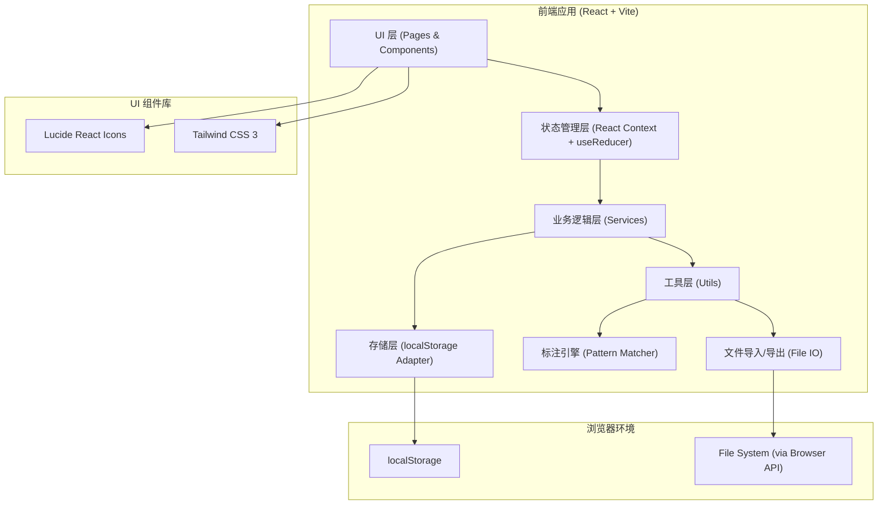
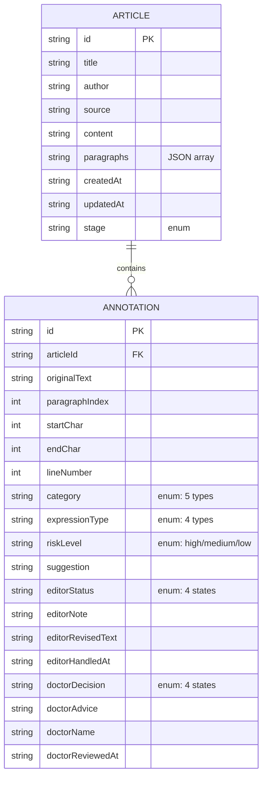

## 1. 架构设计

纯前端 SPA 应用，使用浏览器本地存储 (localStorage) 持久化数据，无需后端服务。所有文件导入/导出均在客户端完成，适合内容协作场景。



## 2. 技术描述

- **前端框架**：React@18 + TypeScript
- **构建工具**：Vite@5
- **样式方案**：Tailwind CSS@3（原子化 CSS）
- **路由管理**：React Router@6
- **图标库**：Lucide React（线性风格）
- **状态管理**：React Context + useReducer（轻量级全局状态）
- **数据持久化**：localStorage（封装 Adapter 便于后续升级 IndexedDB）
- **文件解析**：纯前端解析（.txt/.md 直接读取，模拟 .docx 解析）
- **导出格式**：JSON（主）、CSV（表格兼容 Excel）

## 3. 路由定义

| 路由 | 页面 | 对应角色 | 功能 |
|-------|---------|----------|------|
| `/` | 首页/工作台 | 双角色 | 角色切换入口、稿件历史列表 |
| `/editor/import` | 稿件导入 | 编辑 | 粘贴/上传稿件、填写元信息 |
| `/editor/annotate/:id` | 智能标注 | 编辑 | 原文高亮 + 风险清单 + 标注详情 |
| `/editor/confirm/:id` | 编辑确认 | 编辑 | 逐条确认、标记处理、导出修订清单 |
| `/doctor/import` | 清单导入 | 医生 | 导入编辑传来的修订清单 |
| `/doctor/review/:id` | 医生审核 | 医生 | 审核标记、填写意见、导出审核报告 |
| `/review-result/:id` | 审核结果 | 双角色 | 状态回溯、历史时间线、已处理标记 |

## 4. 数据模型

### 4.1 类型定义（TypeScript）

```typescript
// ========== 风险分类枚举 ==========
type RiskCategory =
  | 'treatment_effect'   // 治疗效果
  | 'dosage'             // 用药剂量
  | 'population'         // 适用人群
  | 'contraindication'   // 禁忌
  | 'data_source';       // 数据来源

type ExpressionType =
  | 'guideline'          // 引用指南
  | 'patient_story'      // 患者故事
  | 'advertising'        // 广告化表达
  | 'vague_suggestion';  // 模糊建议

type RiskLevel = 'high' | 'medium' | 'low';

type EditorStatus = 'pending' | 'confirmed' | 'ignored' | 'handled';

type DoctorDecision = 'pending' | 'approved' | 'needs_rewrite' | 'delete';

// ========== 标注项 ==========
interface Annotation {
  id: string;                    // 唯一 ID
  originalText: string;          // 原句内容
  paragraphIndex: number;        // 段落索引
  startChar: number;             // 在段落中的起始字符位置
  endChar: number;               // 在段落中的结束字符位置
  lineNumber?: number;           // 行号（可选）
  category: RiskCategory;        // 风险分类
  expressionType: ExpressionType; // 表达类型
  riskLevel: RiskLevel;          // 风险等级
  suggestion: string;            // 系统建议说明
  // 编辑处理
  editorStatus: EditorStatus;
  editorNote?: string;
  editorRevisedText?: string;
  editorHandledAt?: string;      // ISO 时间戳
  // 医生审核
  doctorDecision: DoctorDecision;
  doctorAdvice?: string;         // 专业意见
  doctorName?: string;
  doctorReviewedAt?: string;
}

// ========== 稿件 ==========
interface Article {
  id: string;
  title: string;
  author?: string;
  source?: string;
  content: string;               // 原始全文
  paragraphs: string[];          // 按段落拆分
  createdAt: string;
  updatedAt: string;
  annotations: Annotation[];
  // 审核状态追踪
  stage: 'imported' | 'annotated' | 'confirmed' | 'sent_to_doctor' | 'doctor_reviewed' | 'completed';
}

// ========== 修订清单（用于导出/导入）==========
interface RevisionManifest {
  schemaVersion: '1.0';
  exportedAt: string;
  article: {
    id: string;
    title: string;
    author?: string;
    source?: string;
    paragraphCount: number;
  };
  annotations: Array<
    Pick<Annotation,
      | 'id' | 'originalText' | 'paragraphIndex'
      | 'startChar' | 'endChar' | 'lineNumber'
      | 'category' | 'expressionType' | 'riskLevel' | 'suggestion'
      | 'editorStatus' | 'editorNote' | 'editorRevisedText' | 'editorHandledAt'
    >
  >;
}

// ========== 审核报告（医生导出）==========
interface ReviewReport {
  schemaVersion: '1.0';
  reportedAt: string;
  doctorName: string;
  articleId: string;
  articleTitle: string;
  reviewedAnnotations: Array<
    Annotation & { doctorDecision: DoctorDecision }
  >;
  summary: {
    total: number;
    approved: number;
    needsRewrite: number;
    deleted: number;
  };
}
```

### 4.2 数据关系 ER 图



## 5. 标注引擎设计

前端内置基于正则和关键词的轻量标注引擎（演示用，可替换为后端 API）：

| 风险类别 | 匹配策略示例 |
|---------|-------------|
| 治疗效果 | 关键词：治愈、根治、永不复发、100%有效、包治、特效、药到病除、立竿见影、无副作用 |
| 用药剂量 | 模式：数字 + (mg|g|ml|粒|片|袋|次/日|小时)+量词组合；每日/每次 + 数量 |
| 适用人群 | 关键词：孕妇、哺乳期、儿童、婴幼儿、老年人、肝肾功能不全、高血压患者、糖尿病患者 |
| 禁忌 | 关键词：禁用、忌用、严禁、不得使用、绝对不能、切勿、危险、禁止；否定式建议 |
| 数据来源 | 模式：研究表明/据统计/数据显示/某某% + 数字百分比；引用指南号/Cochrane/柳叶刀/NEJM 等 |
| 广告化表达 | 关键词：赶紧用、必买、强烈推荐、错过后悔、最有效、第一选择、神药、神奇 |
| 模糊建议 | 关键词：可能有效、试试看、说不定、个人认为、也许、大概、差不多、感觉 |
| 引用指南 | 关键词：根据《XX指南》/ XX 协会 / 国家卫健委 / WHO / FDA 推荐 |
| 患者故事 | 模式：我身边的XX/ 某患者 / 张阿姨 / 老李 等称呼 + 第一人称叙述特征 |

## 6. 关键文件结构

```
src/
├── main.tsx                 # 入口
├── App.tsx                  # 路由根
├── index.css                # Tailwind + 全局样式变量
├── types/
│   └── index.ts             # 全部 TS 类型
├── context/
│   └── AppContext.tsx       # 全局状态 Context
├── services/
│   ├── storage.ts           # localStorage 封装
│   ├── annotationEngine.ts  # 智能标注引擎
│   └── fileIO.ts            # 导入导出 (JSON/CSV)
├── utils/
│   ├── id.ts                # nanoid 生成
│   └── formatters.ts        # 时间/文本格式化
├── components/
│   ├── layout/              # Header, Sidebar, Container
│   ├── common/              # Button, Tag, Card, Modal, Toast
│   ├── article/             # 原文预览 + 高亮渲染
│   ├── annotation/          # 标注卡片、标注列表、筛选器
│   └── timeline/            # 处理时间线组件
├── pages/
│   ├── Home.tsx
│   ├── editor/
│   │   ├── Import.tsx
│   │   ├── Annotate.tsx
│   │   └── Confirm.tsx
│   ├── doctor/
│   │   ├── Import.tsx
│   │   └── Review.tsx
│   └── ReviewResult.tsx
└── mock/
    └── sampleArticle.ts     # 演示稿件数据
```

## 7. 存储键值设计

```
localStorage:
  - 'medical_review_articles' : Article[]  (所有稿件)
  - 'medical_review_current_role' : 'editor' | 'doctor'
```
