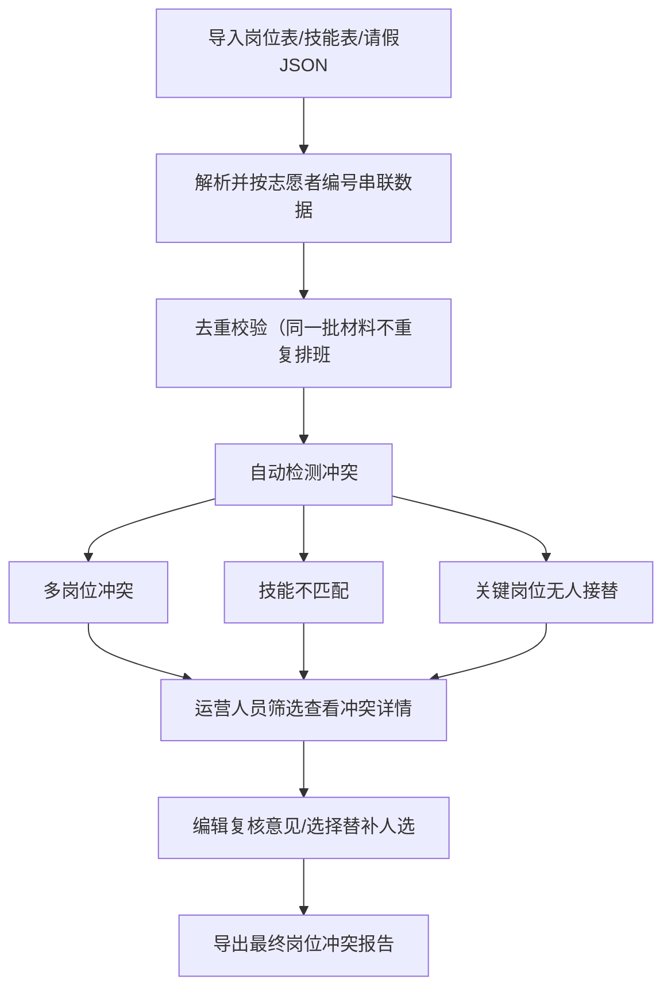

## 1. 产品概述

马拉松赛前志愿者排班冲突管理工具，是一款面向赛事运营人员的本地前端工具。
- 解决三类文件（岗位表、志愿者技能表、请假 JSON）版本不一致导致的排班混乱问题，通过志愿者编号串联全链路数据，自动识别排班冲突，支持运营人员在线复核与替补调配，并导出标准化冲突报告。

## 2. 核心功能

### 2.1 用户角色
| 角色 | 注册方式 | 核心权限 |
|------|----------|----------|
| 运营人员 | 本地工具无需注册 | 导入数据、查看冲突、编辑复核意见、管理替补人选、导出报告 |

### 2.2 功能模块
1. **数据导入模块**：三类文件上传、解析预览、版本去重校验
2. **总览仪表盘**：数据统计概览、冲突类型分布
3. **志愿者详情**：按编号串联报名/分配/请假/复核全状态
4. **冲突筛选**：多岗位冲突、技能不匹配、关键岗位无人接替
5. **复核编辑**：复核意见编辑、替补人选选择与替换
6. **报告导出**：最终岗位冲突报告导出（CSV/JSON）

### 2.3 页面详情
| 页面名称 | 模块名称 | 功能描述 |
|---------|----------|----------|
| 总览页 | 数据导入区 | 拖拽上传三类文件，解析预览，去重校验提示 |
| 总览页 | 统计仪表盘 | 志愿者总数、岗位总数、请假人数、冲突总数及分类统计 |
| 志愿者列表页 | 筛选器 | 按状态/岗位/技能等多维度筛选 |
| 志愿者列表页 | 列表表格 | 展示志愿者编号、姓名、岗位、时段、技能匹配状态、请假状态、复核状态 |
| 冲突中心页 | 冲突分类标签 | 三类冲突切换：多岗位冲突/技能不匹配/关键岗位无人 |
| 冲突中心页 | 冲突列表 | 展示冲突详情、影响范围、严重程度 |
| 复核编辑页 | 复核表单 | 编辑复核意见、选择替补人选、确认替换 |
| 报告导出页 | 导出配置 | 选择导出格式、筛选导出范围、预览导出内容 |

## 3. 核心流程

运营人员导入三类文件 → 系统自动解析并按志愿者编号串联数据 → 自动检测三类冲突 → 运营人员筛选查看冲突详情 → 在线编辑复核意见与替补人选 → 生成并导出最终冲突报告。

## 4. 用户界面设计

### 4.1 设计风格
- **主色调**：深海军蓝 (#0A2540) 为主色，活力橙 (#FF6B35) 为强调色
- **辅助色**：成功绿 (#10B981)、警告黄 (#F59E0B)、危险红 (#EF4444)
- **字体**：系统无衬线字体，清晰专业
- **布局风格**：卡片式布局，顶部导航 + 侧边分类
- **图标风格**：线性图标，简洁现代
- **整体风格**：专业数据工具风格，信息密度适中，强调数据可视化与操作效率

### 4.2 页面设计概述
| 页面名称 | 模块名称 | UI 元素 |
|---------|----------|----------|
| 总览页 | 数据导入区 | 拖拽上传卡片、文件图标、文件名、解析状态标签 |
| 总览页 | 统计卡片 | 四个数据卡片网格，带图标和趋势 |
| 冲突中心页 | 冲突标签页 | Tab切换标签页，带数量角标 |
| 冲突中心页 | 冲突列表 | 数据表格，冲突严重程度色块标注 |
| 复核编辑 | 侧滑面板 | 右侧滑出编辑面板，表单输入 |

### 4.3 响应式
- Desktop-first 设计，桌面端优先
- 支持 1280px 以上最佳展示
- 平板端自适应布局，表格支持横向滚动

### 4.4 交互动效
- 页面元素淡入加载
- 数据卡片悬停微上浮
- 冲突标记脉冲动画提示
- 侧滑面板平滑过渡
