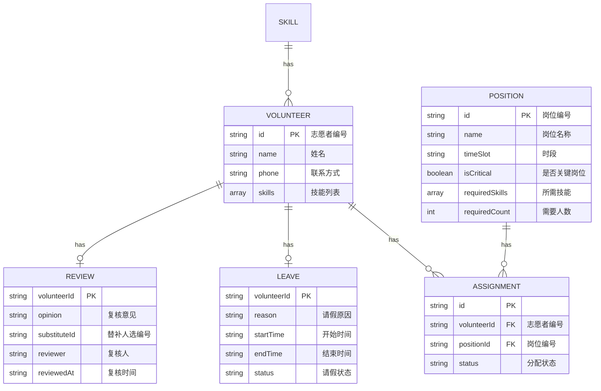

## 1. 架构设计

```mermaid
graph TD
    subgraph "前端应用（纯本地）
    A["React 18 单页应用"] --> B["状态管理（Context + useReducer）"]
    A --> C["文件解析层（CSV/JSON）"]
    A --> D["冲突检测引擎"]
    B --> E["数据持久化（localStorage）"]
    C --> F["数据模型层"]
    D --> G["UI 组件层"]
    F --> B
    end
```

## 2. 技术描述
- **前端框架**: React 18 + TypeScript
- **构建工具**: Vite 5
- **样式方案**: Tailwind CSS 3
- **状态管理**: React Context + useReducer
- **数据持久化**: localStorage
- **文件解析**: 原生 FileReader API + 自定义 CSV 解析
- **图标**: Lucide React
- **无后端，纯本地运行**

## 3. 路由定义
| 路由 | 用途 |
|------|------|
| /dashboard | 总览仪表盘（数据导入 + 统计概览） |
| /volunteers | 志愿者列表（全量数据查看筛选） |
| /conflicts | 冲突中心（三类冲突分类展示） |
| /report | 报告导出（配置与导出） |

## 4. 数据模型

### 4.1 数据模型定义



### 4.2 冲突类型定义
- **MULTI_POSITION_CONFLICT**: 同一志愿者同一时段被分配多个岗位
- **SKILL_MISMATCH**: 志愿者技能与岗位要求不匹配
- **CRITICAL_UNSTAFFED**: 关键岗位无人接替（请假后无替补）

## 5. 核心模块说明

### 5.1 文件解析模块
- `parsePositionFile`: 解析岗位表 CSV
- `parseVolunteerFile`: 解析志愿者技能表 CSV
- `parseLeaveFile`: 解析请假 JSON

### 5.2 冲突检测引擎
- `detectMultiPositionConflicts`: 检测多岗位冲突
- `detectSkillMismatch`: 检测技能不匹配
- `detectCriticalUnstaffed`: 检测关键岗位无人

### 5.3 数据关联模块
- `mergeVolunteerData`: 按志愿者编号串联所有数据
- `deduplicateAssignments`: 去重排班（同一批材料不重复排班）

### 5.4 导出模块
- `exportToCSV`: 导出 CSV 格式报告
- `exportToJSON`: 导出 JSON 格式报告
