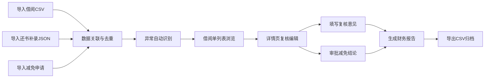

## 1. 产品概述

学校图书馆期末清账管理系统，用于解决期末清账时借阅 CSV、还书补录 JSON 和罚金减免申请数据不一致的问题。系统按借阅单号串联借出、归还、减免、复核全流程状态，支持异常数据筛选、复核意见编辑和财务报告导出。

- 核心目标：打通多源数据，消除重复计算，提高清账效率和准确性
- 目标用户：图书馆老师、财务人员

## 2. 核心功能

### 2.1 用户角色

| 角色 | 登录方式 | 核心权限 |
|------|----------|----------|
| 图书馆老师 | 本地应用无需登录 | 导入数据、查看借阅单、编辑复核意见、审批减免、导出报告 |

### 2.2 功能模块

1. **数据导入页**：借阅 CSV 导入、还书补录 JSON 导入、罚金减免申请导入、导入历史记录
2. **借阅单列表页**：全量借阅单、状态筛选、异常筛选、搜索、详情查看
3. **借阅单详情页**：借出信息、归还信息、减免申请、复核记录、时间线
4. **复核工作台**：待复核列表、批量操作、异常标记
5. **报告导出页**：逾期减免报告生成、预览、导出 CSV/Excel

### 2.3 页面详情

| 页面名称 | 模块名称 | 功能描述 |
|----------|----------|----------|
| 数据导入页 | 文件上传区 | 支持拖拽上传 CSV/JSON 文件，实时解析预览 |
| 数据导入页 | 导入记录 | 显示历史导入批次、时间、文件类型、数据条数 |
| 借阅单列表页 | 搜索筛选栏 | 按借阅单号、借阅人搜索；按状态、异常类型筛选 |
| 借阅单列表页 | 数据表格 | 展示借阅单号、借阅人、借出日期、应还日期、状态、罚金、减免、异常标记 |
| 借阅单详情页 | 信息卡片 | 借出信息、归还信息、减免申请、复核结论分块展示 |
| 借阅单详情页 | 时间线 | 按时间顺序展示全流程节点 |
| 借阅单详情页 | 复核编辑 | 修改复核意见、减免结论（通过/驳回/部分减免） |
| 报告导出页 | 报告配置 | 选择时间范围、报告类型、包含字段 |
| 报告导出页 | 预览与导出 | 表格预览、一键导出 CSV |

## 3. 核心流程

用户导入三类数据文件 → 系统按借阅单号自动关联匹配 → 去重校验避免重复计算 → 自动识别异常（逾期未还、减免超限、申请人不一致）→ 老师在详情页复核并填写意见 → 审批减免结论 → 导出财务归档报告

## 4. 用户界面设计

### 4.1 设计风格
- 主色调：深蓝墨色 (#1e3a5f)，体现学术严谨性
- 辅助色：暖金 (#c9a962)，用于强调和状态标识
- 背景色：米白 (#faf8f3)，护眼舒适
- 按钮风格：圆角矩形，轻微投影，hover 有浮起效果
- 字体：标题用思源宋体/Noto Serif SC 体现正式感，正文用思源黑体/Noto Sans SC 保证可读性
- 布局风格：卡片式布局，顶部导航 + 侧边筛选 + 主内容区
- 图标风格：线性简洁图标，统一使用 lucide-react

### 4.2 页面设计概述

| 页面名称 | 模块名称 | UI 元素 |
|----------|----------|---------|
| 数据导入页 | 上传区 | 大尺寸虚线边框上传区域，拖拽态高亮，文件图标动画 |
| 数据导入页 | 导入记录 | 时间线式记录卡片，带文件类型标签和数据条数 |
| 借阅单列表页 | 筛选栏 | 胶囊式筛选标签，搜索框带图标，下拉选择器 |
| 借阅单列表页 | 数据表格 | 斑马纹行间色，悬停高亮，异常行左侧色条标记 |
| 借阅单详情页 | 信息卡片 | 分组卡片，带图标标题，关键数据大号字体 |
| 借阅单详情页 | 时间线 | 竖线连接节点，节点用不同颜色区分状态类型 |
| 借阅单详情页 | 复核编辑 | 文本域带字数统计，按钮组主次分明 |
| 报告导出页 | 配置区 | 表单式布局，复选框组，日期选择器 |
| 报告导出页 | 预览区 | 可滚动表格预览，导出按钮醒目 |

### 4.3 响应式
- 桌面端优先设计（1280px 及以上）
- 平板端适配：侧边栏收起为抽屉，表格支持横向滚动
- 移动端：卡片堆叠布局，筛选折叠显示

### 4.4 动效与交互
- 页面切换：淡入淡出过渡
- 数据加载：骨架屏脉冲动画
- 按钮交互：hover 上移 + 阴影加深，click 缩放反馈
- 异常标记：呼吸灯效果吸引注意
- 上传拖拽：区域边框变色 + 图标轻微弹跳
