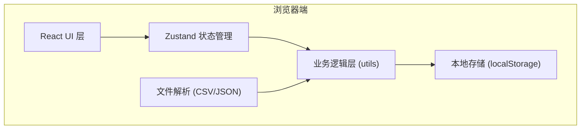
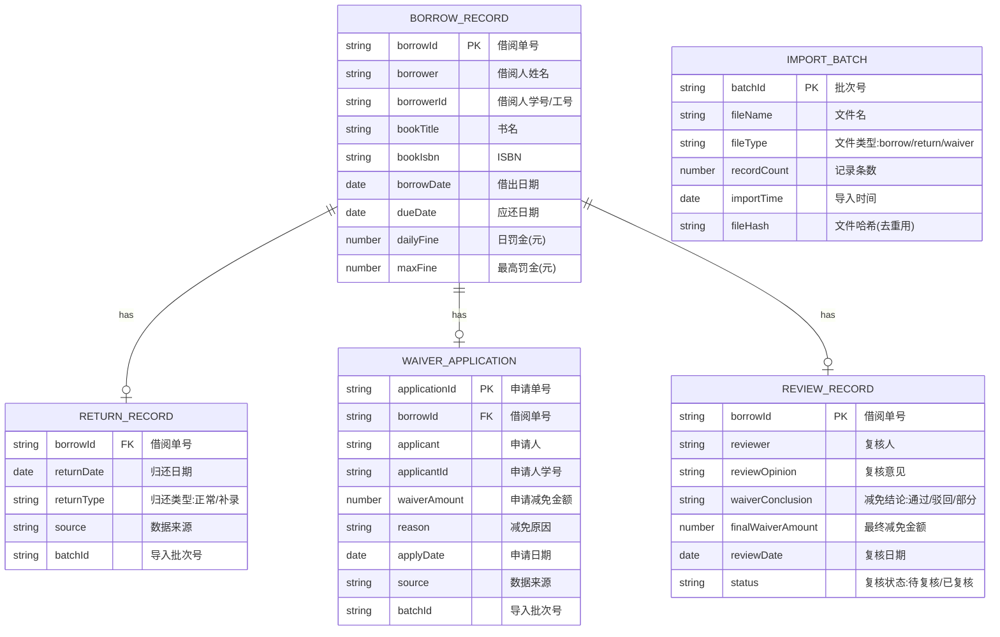

## 1. 架构设计

纯前端本地应用架构，数据存储在浏览器 localStorage 中，无需后端服务。

## 2. 技术描述

- **前端框架**：React 18 + TypeScript
- **构建工具**：Vite 5
- **样式方案**：Tailwind CSS 3
- **状态管理**：Zustand 4
- **路由**：React Router DOM 6
- **图标库**：lucide-react
- **文件解析**：原生 FileReader API + 自定义 CSV 解析
- **数据持久化**：localStorage
- **导出**：原生 Blob + CSV 生成

## 3. 路由定义

| 路由 | 页面 | 用途 |
|------|------|------|
| / | 数据导入页 | 首页，文件上传与导入记录 |
| /records | 借阅单列表 | 全量借阅单浏览与筛选 |
| /records/:id | 借阅单详情 | 单条借阅单完整信息与复核 |
| /review | 复核工作台 | 待复核借阅单批量处理 |
| /report | 报告导出 | 财务报告配置与导出 |

## 4. 数据模型

### 4.1 数据实体关系

### 4.2 状态与异常计算

- **借阅状态**：
  - 在借：有借出记录，无归还记录且未超期
  - 已逾期：有借出记录，无归还记录且当前日期 > 应还日期
  - 已归还：有借出记录 + 有归还记录，归还日期 <= 应还日期
  - 逾期已还：有借出记录 + 有归还记录，归还日期 > 应还日期

- **罚金计算**：
  - 逾期天数 = max(0, 归还日期或当前日期 - 应还日期)
  - 应缴罚金 = min(逾期天数 × 日罚金, 最高罚金)
  - 实缴罚金 = 应缴罚金 - 最终减免金额

- **异常类型**：
  - 逾期未还：无归还记录且当前日期 > 应还日期
  - 减免金额超限：申请减免金额 > 应缴罚金
  - 申请人不一致：减免申请人 ≠ 借阅人
  - 数据缺失：有归还/减免但无对应借出记录

## 5. 核心模块

### 5.1 数据层
- `src/store/useLibraryStore.ts` - Zustand 全局状态
- `src/utils/storage.ts` - localStorage 封装
- `src/utils/csvParser.ts` - CSV 文件解析
- `src/utils/jsonParser.ts` - JSON 文件解析

### 5.2 业务逻辑层
- `src/utils/borrowLogic.ts` - 借阅状态计算
- `src/utils/fineCalculator.ts` - 罚金计算
- `src/utils/validator.ts` - 异常检测
- `src/utils/exporter.ts` - 报告导出

### 5.3 组件层
- 通用组件：Layout、Sidebar、DataTable、StatusBadge、Modal、FileUpload
- 页面组件：ImportPage、RecordList、RecordDetail、ReviewPage、ReportPage

## 6. 去重策略

1. **文件级去重**：计算导入文件内容哈希值，相同哈希值的文件不允许重复导入
2. **记录级去重**：
   - 借阅记录：以借阅单号 (borrowId) 为主键，已存在则跳过
   - 归还记录：以借阅单号 + 批次号为键，同批次不重复
   - 减免申请：以申请单号 (applicationId) 为主键
3. **罚金重算保护**：已复核的借阅单，重新导入数据不自动重算罚金，需手动触发确认
