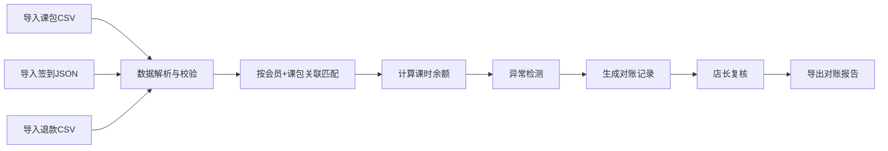
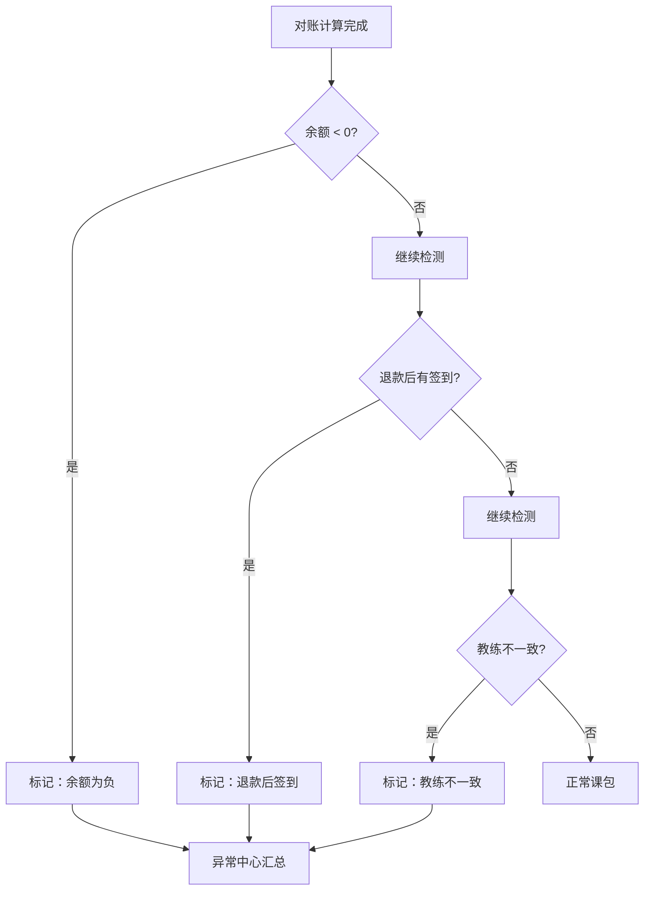

## 1. 产品概述

健身房私教课包对账系统，解决购买记录、预约签到和退款补录时间错开导致课时余额计算错误的问题。面向健身房店长和财务人员，提供数据导入、自动对账、异常检测、复核管理和报告导出的一站式解决方案。

## 2. 核心功能

### 2.1 用户角色

| 角色 | 使用方式 | 核心权限 |
|------|----------|----------|
| 店长 | 本地Web应用登录使用 | 数据导入、对账查看、异常筛选、复核意见编辑、报告导出 |
| 财务人员 | 本地Web应用登录使用 | 数据导入、对账查看、异常筛选、报告导出 |

### 2.2 功能模块

1. **数据导入页面**：课包CSV导入、签到JSON导入、退款CSV导入、导入历史记录
2. **对账总览页面**：课包对账列表、会员筛选、课包筛选、状态筛选、异常标记
3. **对账详情页面**：购买记录、签到明细、退款明细、余额计算、异常详情、复核意见
4. **异常中心页面**：余额为负、退款后仍签到、教练与预约不一致、批量处理
5. **报告导出页面**：对账报告生成、导出CSV、导出明细

### 2.3 页面详情

| 页面名称 | 模块名称 | 功能描述 |
|----------|----------|----------|
| 数据导入 | 课包导入 | 上传CSV文件，解析购买记录，预览数据，确认导入，自动去重 |
| 数据导入 | 签到导入 | 上传JSON文件，解析签到记录，关联课包，预览数据，确认导入 |
| 数据导入 | 退款导入 | 上传CSV文件，解析退款记录，关联课包，预览数据，确认导入 |
| 数据导入 | 导入历史 | 显示历史导入批次、时间、数量、状态，支持删除批次 |
| 对账总览 | 筛选区域 | 按会员姓名/手机号、课包名称、对账状态、异常类型筛选 |
| 对账总览 | 对账列表 | 显示课包编号、会员信息、购买课时、已用课时、退款课时、剩余课时、状态、异常标记 |
| 对账总览 | 统计卡片 | 总课包数、正常课包数、异常课包数、总课时、已用课时、退款课时 |
| 对账详情 | 基本信息 | 课包编号、会员姓名、手机号、购买日期、购买课时、单价、总金额 |
| 对账详情 | 签到明细 | 每次签到的日期、时间、教练、核销课时数、签到来源 |
| 对账详情 | 退款明细 | 每次退款的日期、退款课时数、退款金额、退款原因 |
| 对账详情 | 余额计算 | 公式展示、实时计算结果、异常提示 |
| 对账详情 | 复核管理 | 复核状态切换、复核意见编辑、保存复核记录 |
| 异常中心 | 异常分类 | 余额为负、退款后签到、教练不一致三类异常标签页 |
| 异常中心 | 异常列表 | 异常详情、影响课包、建议处理方式、快速跳转详情 |
| 异常中心 | 批量操作 | 批量标记已处理、批量导出异常清单 |
| 报告导出 | 报告配置 | 选择时间范围、课包范围、导出字段、导出格式 |
| 报告导出 | 报告预览 | 在线预览对账报告摘要、数据概览 |
| 报告导出 | 导出操作 | 导出CSV、导出JSON、打印报告 |

## 3. 核心流程

### 3.1 数据导入与对账流程

店长上传课包CSV、签到JSON、退款CSV三种数据文件，系统自动按会员+课包编号进行关联匹配，实时计算课时余额，检测异常情况，生成对账记录。店长可查看每个课包的详细对账情况，编辑复核意见，最终导出对账报告。

### 3.2 异常检测流程

系统自动检测三类异常：余额为负（核销+退款>购买）、退款后仍签到（退款日期之后有签到记录）、教练不一致（签到记录与预约记录教练不符）。异常课包会在总览页标记，并可在异常中心集中处理。

## 4. 用户界面设计

### 4.1 设计风格

- **主色调**：深海军蓝 (#0F2A4A) 作为主色，搭配金色 (#C9A962) 作为强调色，传达专业、可信赖的金融对账氛围
- **辅助色**：成功绿 (#10B981)、警告橙 (#F59E0B)、错误红 (#EF4444)、信息蓝 (#3B82F6)
- **背景**：浅灰底色 (#F8FAFC) 配合卡片式布局，层级分明
- **按钮风格**：圆角中等 (8px)，主按钮实色填充，次按钮描边，悬停有微动画
- **字体**：标题使用思源宋体/Noto Serif SC，正文使用思源黑体/Noto Sans SC，数字使用等宽字体
- **布局风格**：左侧导航栏 + 顶部状态栏 + 主内容区的经典后台布局
- **图标风格**：线性图标，统一2px描边，配合色彩区分状态

### 4.2 页面设计概览

| 页面名称 | 模块名称 | UI元素 |
|----------|----------|--------|
| 数据导入 | 上传区域 | 拖拽上传区、文件选择按钮、格式说明、上传进度条 |
| 数据导入 | 预览表格 | 数据表格、列名映射、错误提示、确认导入按钮 |
| 对账总览 | 统计卡片 | 四个数据卡片，渐变背景，数字动画，图标装饰 |
| 对账总览 | 筛选栏 | 搜索框、下拉选择器、标签筛选、重置按钮 |
| 对账总览 | 数据表格 | 斑马纹、悬停高亮、状态标签、异常红点、操作列 |
| 对账详情 | 信息卡片 | 左右分栏布局，标签+数值，关键数据高亮 |
| 对账详情 | 时间线 | 购买/签到/退款按时间轴排列，不同颜色区分类型 |
| 对账详情 | 复核面板 | 状态下拉框、文本域、保存按钮、历史复核记录 |
| 异常中心 | 标签切换 | 三类异常Tab，带数量徽章，切换动画 |
| 异常中心 | 异常卡片 | 异常类型图标、描述、影响课包数、处理按钮 |
| 报告导出 | 配置表单 | 日期范围选择、多选框、下拉选择、预览按钮 |
| 报告导出 | 预览区 | 报告摘要卡片、数据图表、导出按钮组 |

### 4.3 响应式

- 桌面端优先设计，主内容区最小宽度1200px
- 平板端自适应，侧边栏可折叠
- 支持触控操作，按钮最小尺寸44x44px

### 4.4 动效设计

- 页面加载：卡片渐入+上移动画，交错0.1s延迟
- 数据导入：上传进度条动画，成功状态弹跳反馈
- 状态切换：标签颜色过渡动画，0.3s缓动
- 数字变化：数字滚动动画，增强数据感知
- 表格行：悬停背景色渐变，行高轻微放大
