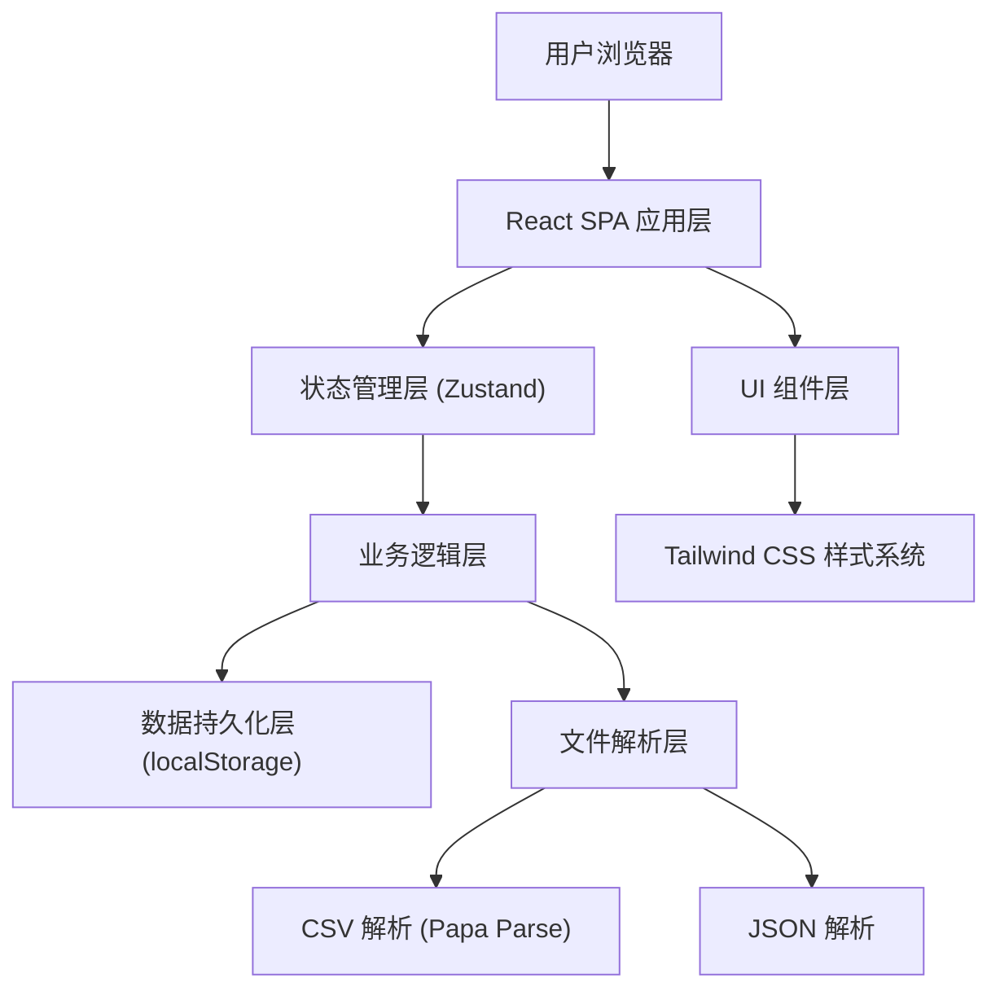
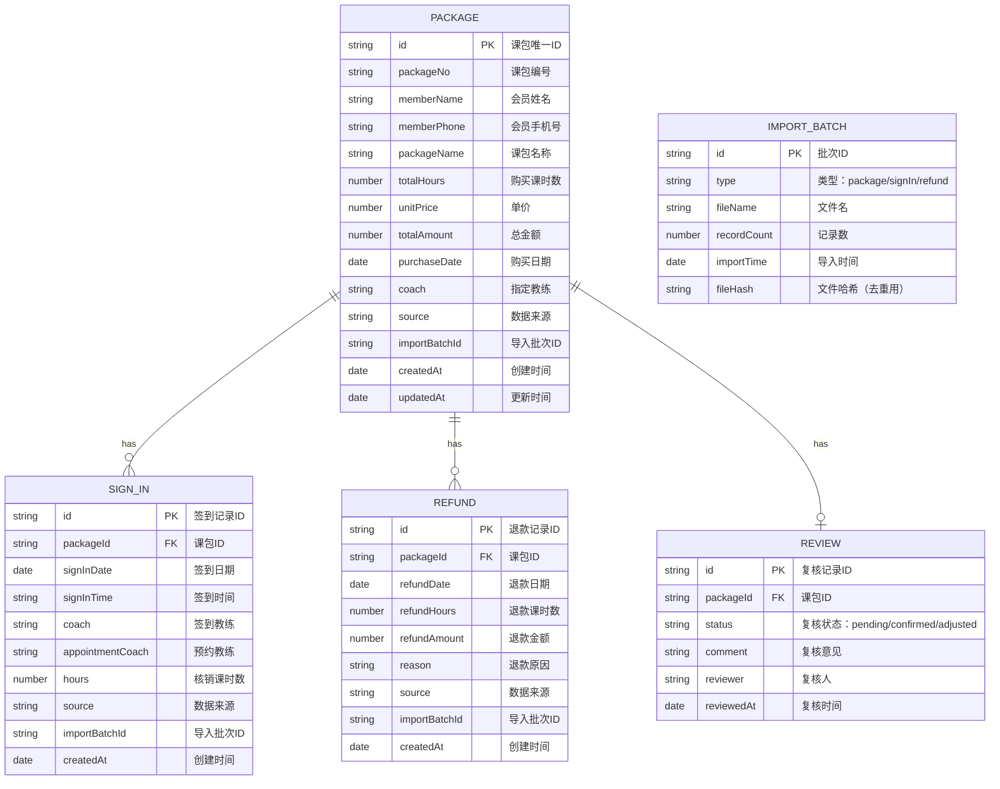

## 1. 架构设计

本系统为纯前端本地Web应用，数据存储在浏览器本地存储中，无需后端服务。采用单页应用架构，所有数据处理、对账计算、异常检测均在前端完成。



## 2. 技术描述

- **前端框架**：React@18 + TypeScript
- **构建工具**：Vite@5
- **样式方案**：Tailwind CSS@3
- **状态管理**：Zustand
- **路由管理**：React Router DOM@6
- **CSV 解析**：Papa Parse
- **UI 组件**：Headless UI + 自定义组件
- **图标库**：Lucide React
- **数据存储**：localStorage（前端本地存储）
- **导出功能**：前端生成 CSV/JSON 文件下载

## 3. 路由定义

| 路由 | 页面 | 用途 |
|------|------|------|
| / | 重定向到 /dashboard | 首页跳转 |
| /dashboard | 对账总览 | 课包对账列表、统计概览、筛选 |
| /import | 数据导入 | 课包/签到/退款数据导入、导入历史 |
| /package/:id | 对账详情 | 单个课包的详细对账信息、复核管理 |
| /exceptions | 异常中心 | 异常课包分类展示、批量处理 |
| /export | 报告导出 | 对账报告配置、预览、导出 |

## 4. 数据模型

### 4.1 数据模型定义



### 4.2 对账计算模型

每个课包的对账状态由以下字段组成：

- **已用课时**：所有有效签到记录的课时数之和
- **退款课时**：所有有效退款记录的课时数之和
- **剩余课时** = 购买课时 - 已用课时 - 退款课时
- **异常类型**：余额为负 / 退款后签到 / 教练不一致（可多选）

### 4.3 异常检测规则

1. **余额为负**：剩余课时 < 0
2. **退款后仍签到**：存在签到记录的日期晚于任一退款记录的日期
3. **教练不一致**：签到记录的教练与预约教练不一致，或签到教练与课包指定教练不一致

## 5. 去重机制

- 使用文件内容哈希（fileHash）判断文件是否已导入
- 同一批次导入的记录带有相同的 importBatchId
- 删除批次时，同时删除该批次对应的所有业务记录
- 课包去重：按 (会员手机号 + 课包编号) 作为唯一键，重复导入则更新而非新增
- 签到去重：按 (课包ID + 签到日期 + 签到时间 + 教练) 作为唯一键
- 退款去重：按 (课包ID + 退款日期 + 退款课时数) 作为唯一键

## 6. 核心模块划分

| 模块 | 职责 | 主要文件 |
|------|------|----------|
| 数据解析 | CSV/JSON文件解析、格式校验、数据映射 | src/utils/parser/ |
| 状态管理 | 全局状态、课包数据、筛选状态 | src/store/ |
| 对账计算 | 余额计算、异常检测、状态流转 | src/services/reconciliation/ |
| 数据持久化 | localStorage读写、数据迁移 | src/utils/storage.ts |
| 文件导出 | CSV/JSON生成、文件下载 | src/utils/exporter/ |
| UI组件 | 可复用组件、页面组件 | src/components/ src/pages/ |
| 路由管理 | 页面路由、导航 | src/router/ |

## 7. 导入文件格式规范

### 7.1 课包 CSV 格式

| 列名 | 类型 | 必填 | 说明 |
|------|------|------|------|
| 课包编号 | string | 是 | 唯一标识课包 |
| 会员姓名 | string | 是 | 会员姓名 |
| 会员手机号 | string | 是 | 会员联系电话 |
| 课包名称 | string | 是 | 课包产品名称 |
| 购买课时 | number | 是 | 课时数量 |
| 单价 | number | 是 | 每课时价格 |
| 总金额 | number | 否 | 可由系统计算 |
| 购买日期 | date | 是 | YYYY-MM-DD |
| 指定教练 | string | 否 | 课包指定教练 |

### 7.2 签到 JSON 格式

```json
{
  "records": [
    {
      "memberPhone": "13800138000",
      "packageNo": "PKG202401001",
      "signInDate": "2024-01-15",
      "signInTime": "14:30:00",
      "coach": "张教练",
      "appointmentCoach": "张教练",
      "hours": 1
    }
  ]
}
```

### 7.3 退款 CSV 格式

| 列名 | 类型 | 必填 | 说明 |
|------|------|------|------|
| 课包编号 | string | 是 | 关联课包 |
| 会员手机号 | string | 是 | 关联会员 |
| 退款日期 | date | 是 | YYYY-MM-DD |
| 退款课时 | number | 是 | 退款课时数量 |
| 退款金额 | number | 否 | 退款金额 |
| 退款原因 | string | 否 | 退款说明 |
