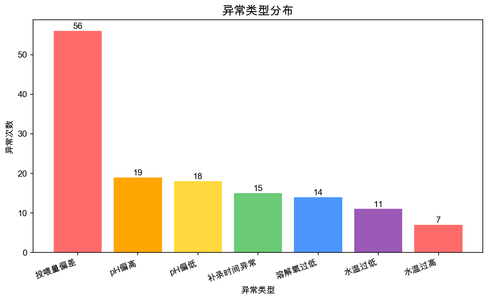
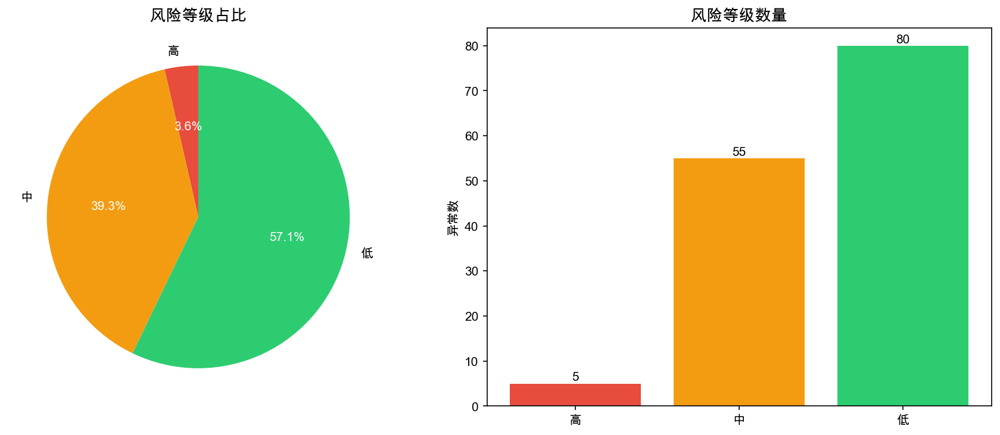
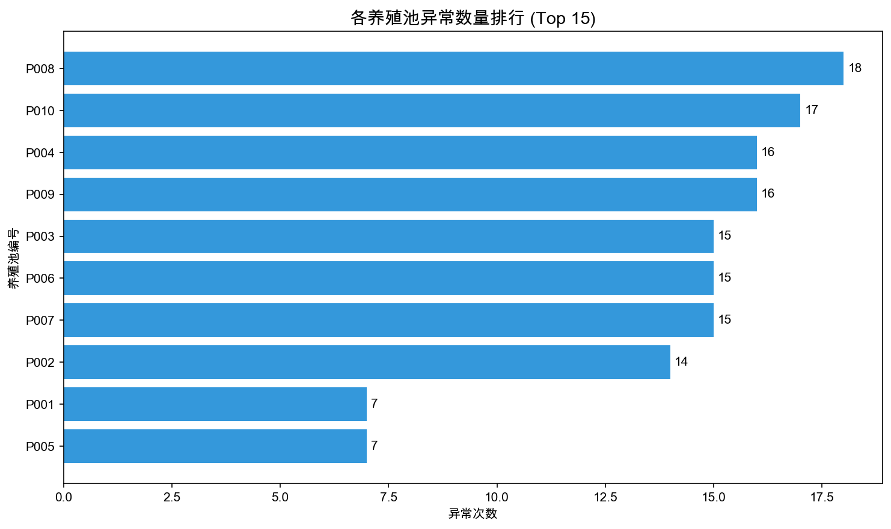
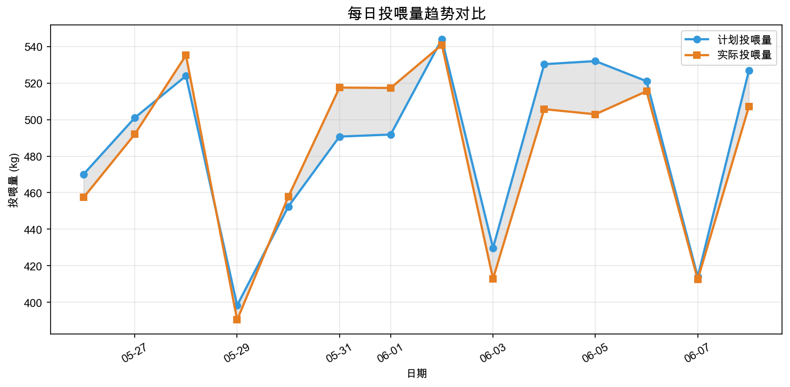
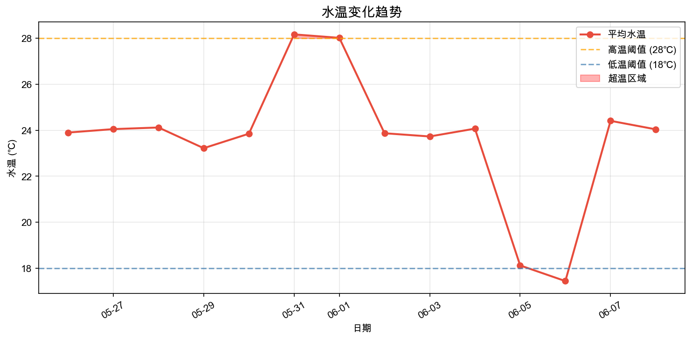

# 养殖场投喂异常分析报告

**报告生成时间：** 2026年06月09日 10:31

---

## 一、总体概览

本次分析覆盖养殖池 **10** 个，
分析时段 **2026-05-26 ~ 2026-06-08**，
共关联投喂记录 **140** 条。

### 异常汇总

- **异常总数：** 140 条
  - 🔴 高风险：5 条
  - 🟠 中风险：55 条
  - 🟢 低风险：80 条
- **涉及养殖池：** 10 个

⚠️ **重点提示：** 存在高风险异常，请场长优先关注并安排复核。

---

## 二、图表摘要

---

## 三、异常类型明细

### 1. 投喂量偏差

共发现 **56** 条投喂量偏差记录，偏差阈值：±10.0%

| 序号 | 养殖池 | 日期 | 计划量(kg) | 实际量(kg) | 偏差 | 风险等级 |
|------|--------|------|------------|------------|------|----------|
| 1 | P001 | 2026-05-31 | 30.0 | 33.3 | +11.0% | 低 |
| 2 | P001 | 2026-06-01 | 59.1 | 66.1 | +11.8% | 低 |
| 3 | P001 | 2026-06-02 | 40.8 | 44.9 | +10.1% | 低 |
| 4 | P002 | 2026-05-28 | 26.7 | 33.2 | +24.3% | 中 |
| 5 | P002 | 2026-05-31 | 31.1 | 26.8 | -13.8% | 低 |
| 6 | P002 | 2026-06-01 | 49.5 | 55.2 | +11.5% | 低 |
| 7 | P002 | 2026-06-03 | 40.9 | 26.6 | -35.0% | 高 |
| 8 | P002 | 2026-06-04 | 58.1 | 69.6 | +19.8% | 中 |
| 9 | P002 | 2026-06-05 | 73.6 | 52.2 | -29.1% | 中 |
| 10 | P002 | 2026-06-06 | 23.9 | 27.0 | +13.0% | 低 |

> 仅展示前 10 条，完整数据请查看 [风险明细CSV](csv/risk_feed_deviation.csv)

### 2. 水质超阈值

共发现 **69** 条水质指标超阈值记录。

| 序号 | 养殖池 | 日期 | 异常类型 | 详情 | 风险等级 |
|------|--------|------|----------|------|----------|
| 1 | P001 | 2026-06-05 | 水温过低 | 水温 17.8℃ 低于阈值 18.0℃ | 中 |
| 2 | P003 | 2026-06-06 | 水温过低 | 水温 17.5℃ 低于阈值 18.0℃ | 中 |
| 3 | P004 | 2026-06-06 | 水温过低 | 水温 16.4℃ 低于阈值 18.0℃ | 中 |
| 4 | P006 | 2026-06-05 | 水温过低 | 水温 16.8℃ 低于阈值 18.0℃ | 中 |
| 5 | P006 | 2026-06-06 | 水温过低 | 水温 17.5℃ 低于阈值 18.0℃ | 中 |
| 6 | P007 | 2026-06-06 | 水温过低 | 水温 16.4℃ 低于阈值 18.0℃ | 中 |
| 7 | P008 | 2026-06-05 | 水温过低 | 水温 16.5℃ 低于阈值 18.0℃ | 中 |
| 8 | P008 | 2026-06-06 | 水温过低 | 水温 17.0℃ 低于阈值 18.0℃ | 中 |
| 9 | P009 | 2026-06-06 | 水温过低 | 水温 16.0℃ 低于阈值 18.0℃ | 中 |
| 10 | P010 | 2026-06-05 | 水温过低 | 水温 16.4℃ 低于阈值 18.0℃ | 中 |

> 仅展示前 10 条，完整数据请查看 [风险明细CSV](csv/risk_water_threshold.csv)

### 3. 补录时间异常

共发现 **15** 条水质补录时间晚于投喂时间的记录。

| 序号 | 养殖池 | 日期 | 补录时间 | 风险等级 |
|------|--------|------|----------|----------|
| 1 | P001 | 2026-05-31 | 2026-06-01 18:00:00 | 中 |
| 2 | P002 | 2026-06-06 | 2026-06-07 18:00:00 | 中 |
| 3 | P003 | 2026-05-28 | 2026-05-29 18:00:00 | 中 |
| 4 | P004 | 2026-05-28 | 2026-05-29 18:00:00 | 中 |
| 5 | P004 | 2026-05-30 | 2026-05-31 18:00:00 | 中 |
| 6 | P004 | 2026-06-01 | 2026-06-02 18:00:00 | 中 |
| 7 | P006 | 2026-06-06 | 2026-06-07 18:00:00 | 中 |
| 8 | P007 | 2026-06-07 | 2026-06-08 18:00:00 | 中 |
| 9 | P008 | 2026-05-26 | 2026-05-27 18:00:00 | 中 |
| 10 | P008 | 2026-05-31 | 2026-06-01 18:00:00 | 中 |

> 仅展示前 10 条，完整数据请查看 [风险明细CSV](csv/risk_late_supplement.csv)

---

## 四、高风险池重点关注

| 养殖池 | 高风险次数 | 主要异常类型 |
|--------|------------|--------------|
| P009 | 2 | 投喂量偏差、水温过高 |
| P002 | 1 | 投喂量偏差 |
| P003 | 1 | 投喂量偏差 |
| P004 | 1 | 投喂量偏差 |

> 建议场长对以上养殖池进行现场检查，确认投喂操作规范性及水质变化原因。

---

## 五、复核与操作建议

### 操作建议

1. **投喂量偏差**：检查投喂设备是否校准，操作人员是否严格按计划执行，记录是否存在漏记错记。
2. **水质超阈值**：加强水质监测频次，分析水温突变原因，必要时调整投喂量和换水方案。
3. **补录时间异常**：规范数据录入流程，要求检测后及时录入系统，减少事后补录。

### 复核建议

请场长根据风险等级安排复核：
- 🔴 **高风险**：24 小时内完成现场复核
- 🟠 **中风险**：3 个工作日内完成复核
- 🟢 **低风险**：纳入每周例行检查

---

## 六、数据文件清单

### 风险明细 CSV

- [全部异常汇总](csv/risk_all_anomalies.csv)
- [投喂量偏差](csv/risk_feed_deviation.csv)
- [水质超阈值](csv/risk_water_threshold.csv)
- [补录时间异常](csv/risk_late_supplement.csv)

---

> 本报告由投喂异常分析工具自动生成，如有疑问请联系系统管理员。