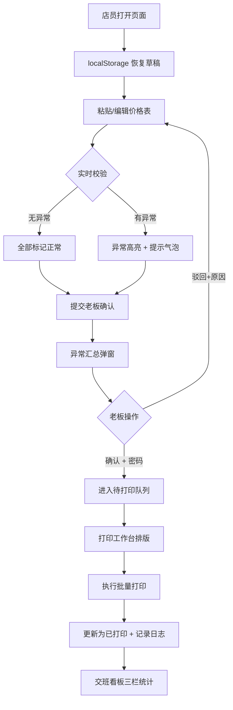

## 1. 产品概述

水果批发档口价签校验系统，解决凌晨改价时店员手写/粘贴价签容易出错（产地、等级、箱规写错、价格计算混乱）的问题。系统支持批量录入价格表、自动校验数据异常、可视化价签预览、老板确认后批量打印，并追踪打印状态供交班核对。

- 主要目的：杜绝价签信息错误导致的客诉与法务风险，降低凌晨改价的人力成本
- 目标用户：水果批发档口的店员（录入/打印）、档口老板（异常确认）
- 核心价值：校验规则自动化 + 异常强制确认 + 状态可追溯，确保每一张价签正确贴出

---

## 2. 核心功能

### 2.1 用户角色

| 角色 | 说明 | 核心权限 |
|------|------|----------|
| 店员 | 日常操作，凌晨改价当班人 | 录入/粘贴价格表、编辑价签、发起确认、查看交班看板、执行已确认的打印 |
| 老板 | 异常最终确认人 | 查看异常汇总、一键确认/驳回异常项、查看打印记录 |

### 2.2 功能模块

1. **价签录入页**：批量粘贴解析、手动增删改行、分类筛选
2. **价签校验引擎**：空值校验、重复校验、价格互算校验、促销时段校验
3. **价签预览墙**：按品类/产地/等级/箱规分组展示，异常高亮
4. **异常汇总与确认**：异常清单、逐条备注、老板确认/驳回、确认密码
5. **打印工作台**：价签排版、打印预览、批量打印、打印记录
6. **交班看板**：待确认/待打印/已打印三栏统计、打印人/时间戳

### 2.3 页面详情

| 页面名称 | 模块名称 | 功能描述 |
|----------|----------|----------|
| 价签录入页 | 批量粘贴区 | 支持从 Excel/WPS/记事本复制粘贴（制表符/逗号分隔），一键解析为结构化行 |
| 价签录入页 | 手动编辑表 | 行内编辑：品类、品名、产地、等级、箱规(斤/箱)、斤价、箱价、会员折扣、促销开始、促销结束、备注 |
| 价签录入页 | 快捷操作 | 批量"降X元"、批量设置促销时段、一键清空、导入示例 |
| 价签校验引擎 | 空值校验 | 空产地、空等级、空箱规、空价格均标红 |
| 价签校验引擎 | 重复校验 | 同(品类+品名+产地+等级+箱规)组合重复时标黄提示 |
| 价签校验引擎 | 价格互算校验 | 箱价 ≈ 斤价 × 箱规 × 会员折扣（允许 ±2% 浮动），不满足时标橙 |
| 价签校验引擎 | 促销校验 | 促销结束早于开始、无促销结束日期、历史日期标红 |
| 价签预览墙 | 分组标签页 | 按品类Tab切换，内部按产地折叠分组 |
| 价签预览墙 | 价签卡片 | 60×90mm 仿真价签样式，大字价格、等级徽章、产地条码 |
| 价签预览墙 | 异常徽标 | 卡片角标显示异常数量，hover 展开异常详情 |
| 异常汇总与确认 | 异常清单表 | 按严重等级排序（错误→警告→信息），显示异常类型、影响项数 |
| 异常汇总与确认 | 老板确认区 | 异常确认密码输入、确认按钮、驳回按钮（需填写驳回原因） |
| 异常汇总与确认 | 审计日志 | 记录确认人、确认时间、IP 地址 |
| 打印工作台 | 排版选择 | 支持 A4/不干胶/热敏纸排版，每页 10/20/30 枚 |
| 打印工作台 | 打印预览 | 分页预览、仅打印已确认项开关 |
| 打印工作台 | 打印执行 | 调用浏览器打印 API，打印后自动标记状态并记录打印人 |
| 交班看板 | 三栏卡片 | 待老板确认数 / 待打印数 / 已打印数 + 趋势箭头 |
| 交班看板 | 明细表 | 每条价签的状态、操作人、操作时间、备注 |
| 交班看板 | 交班导出 | 一键导出交班记录 CSV |

---

## 3. 核心流程

**主流程：录入 → 校验 → 预览 → 确认 → 打印 → 追踪**

1. 店员打开页面，自动恢复上次未完成的草稿
2. 批量粘贴当天价格表（或手动录入/编辑）
3. 系统实时校验，异常项在表格和预览卡片上高亮
4. 店员点击"提交老板确认"，异常汇总弹窗展示
5. 老板输入确认密码，确认后所有项进入"待打印"状态；驳回则回到编辑
6. 店员在打印工作台排版，一键批量打印，打印后自动变为"已打印"
7. 交班时查看看板，三方数量核对无误后交班

---

## 4. 用户界面设计

### 4.1 设计风格

- **主色**：深夜墨绿 `#0F2A24`，适配凌晨工作场景不刺眼
- **强调色**：警示橙 `#FF7A45`（异常提示）、确认绿 `#22C55E`（正常/确认）、警示红 `#EF4444`（严重错误）、纸质黄 `#FFF8E7`（价签底色）
- **中性色**：纸张米白 `#FAFAF5`、石墨灰 `#374151`、浅灰线条 `#E5E7EB`
- **按钮样式**：方角硬朗 2px 边框，点击 2px 下沉（实体按压感），符合档口操作直觉
- **字体**：标题使用粗宋体系列（传统货单感）`ZCOOL XiaoWei`，正文数据使用等宽数字字体 `JetBrains Mono` 保证价格数字对齐易读
- **布局风格**：左侧固定操作栏 + 右侧主工作区 + 底部异常抽屉的三段式工业布局
- **图标风格**：Lucide 线性图标，尺寸统一 18px，异常场景配实心圆点状态徽章

### 4.2 页面设计概览

| 页面名称 | 模块名称 | UI 要素 |
|----------|----------|---------|
| 录入与预览主工作区 | 顶部导航 | Logo「鲜果价签通」+ 当前日期 + 草稿自动保存指示灯 + 交班看板入口按钮 |
| 录入与预览主工作区 | 左侧批量录入面板 | 大尺寸 textarea 粘贴区 + 解析按钮 + 快捷操作工具栏（批量降价/促销/清空/示例） |
| 录入与预览主工作区 | 中部编辑表格 | 冻结表头可滚动表格，异常行左侧有色条（红/橙/黄），行内输入 + 行内删除 |
| 录入与预览主工作区 | 右侧价签预览墙 | 瀑布流卡片，3列，每张 60×90mm 比例纸质价签，带阴影和胶贴效果，异常角标 |
| 异常汇总与确认弹窗 | 头部统计 | 错误 X 项 / 警告 X 项 / 提示 X 项 三色统计条 |
| 异常汇总与确认弹窗 | 异常列表 | 可折叠分组：空值类 / 重复类 / 价格类 / 促销类，每项点击定位到表格对应行 |
| 异常汇总与确认弹窗 | 确认区 | 6位数字密码输入框 + 指纹图标按钮，底部"已确认全部异常，准许打印"勾选框 |
| 打印工作台 | 排版设置 | 纸张类型下拉、每页数量、价签尺寸滑块、边距设置 |
| 打印工作台 | 打印预览 | 模拟纸张白色背景，分页虚线，仅已确认开关 |
| 交班看板 | 三栏统计卡 | 待确认（橙）/ 待打印（蓝）/ 已打印（绿）大数字卡片，带趋势小箭头 |
| 交班看板 | 明细流水表 | 按时间倒序，状态徽章、操作人列、备注列，支持按日期筛选 |

### 4.3 响应式

- **桌面优先**：核心操作区最小宽度 1280px，左侧面板 320px + 中部表格 560px + 右侧预览 400px
- **平板适配**：≥768px，左右面板可折叠收起，表格可横向滚动
- **触屏优化**：按钮最小高度 44px，表格行内输入区域点击放大，预览卡片长按查看详情

---

### 4.4 动画与交互细节

- **草稿自动保存**：右上角指示灯，保存时绿色脉冲 1 次，失败时红色闪烁
- **价签卡片入场**：从底部向上 20px 淡入，每张卡片 stagger 延迟 50ms
- **异常高亮**：异常行色条 pulse 动画 2 秒后转为静态色条
- **确认成功**：弹窗关闭 + 全站轻微绿色闪光 300ms 过渡
- **打印完成**：每张价签卡片加盖"已打印 ✔"红色印章动画（从透明 0% 缩放 80% 到 不透明 100% 缩放 100%）
