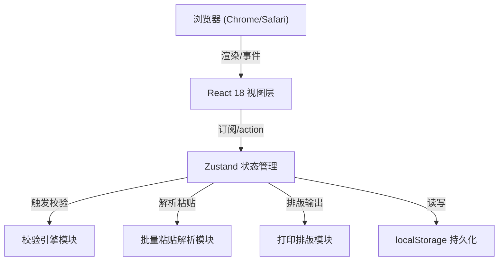
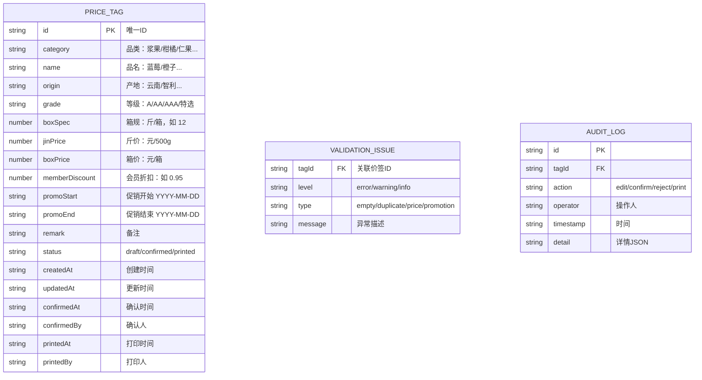

## 1. 架构设计

纯前端单页应用，无需后端服务。全部数据通过 localStorage 持久化，打印走浏览器原生 API。适合档口内网/单机离线使用场景。



---

## 2. 技术说明

- **前端框架**：React 18 + TypeScript
- **构建工具**：Vite 6
- **CSS 方案**：Tailwind CSS 3 + CSS Variables（主题色 Token 化）
- **状态管理**：Zustand 4 + 内置 persist 中间件（自动 localStorage 持久化）
- **路由**：React Router 6（Hash 模式，离线友好）
- **图标**：lucide-react
- **字体方案**：Google Fonts 引入 `ZCOOL XiaoWei` + `JetBrains Mono`
- **无后端 / 无数据库**：全部数据保存在浏览器 localStorage，数据量小（单日价签 ≤500 条），完全够用

---

## 3. 路由定义

| 路由 (Hash) | 页面 | 用途 |
|-------------|------|------|
| `#/` | 价签录入与预览工作台 | 主页面：批量粘贴 + 手动编辑 + 校验 + 预览 |
| `#/print` | 打印工作台 | 打印排版 + 打印预览 + 执行打印 |
| `#/board` | 交班看板 | 三栏统计 + 明细流水 + CSV 导出 |

---

## 4. 数据模型

### 4.1 ER 图



### 4.2 TypeScript 核心类型定义

```typescript
export type TagStatus = 'draft' | 'confirmed' | 'printed';
export type IssueLevel = 'error' | 'warning' | 'info';
export type IssueType = 'empty' | 'duplicate' | 'price' | 'promotion';

export interface PriceTag {
  id: string;
  category: string;
  name: string;
  origin: string;
  grade: string;
  boxSpec: number;
  jinPrice: number;
  boxPrice: number;
  memberDiscount: number;
  promoStart: string;
  promoEnd: string;
  remark: string;
  status: TagStatus;
  createdAt: string;
  updatedAt: string;
  confirmedAt?: string;
  confirmedBy?: string;
  printedAt?: string;
  printedBy?: string;
}

export interface ValidationIssue {
  tagId: string;
  level: IssueLevel;
  type: IssueType;
  message: string;
  field?: string;
}

export interface AuditLog {
  id: string;
  tagId: string;
  action: 'edit' | 'confirm' | 'reject' | 'print';
  operator: string;
  timestamp: string;
  detail?: string;
}

export interface AppState {
  tags: PriceTag[];
  issues: ValidationIssue[];
  logs: AuditLog[];
  currentOperator: string;
  lastSavedAt?: string;
  saveStatus: 'idle' | 'saving' | 'saved' | 'failed';
}
```

---

## 5. 核心模块职责

### 5.1 模块划分

| 模块 | 路径 | 职责 |
|------|------|------|
| Zustand Store | `src/store/useAppStore.ts` | 全局状态 + persist 中间件 + actions |
| 校验引擎 | `src/utils/validator.ts` | 接收 tags 数组，返回 issues 数组，纯函数 |
| 粘贴解析器 | `src/utils/parser.ts` | 接收粘贴文本，返回 PriceTag[]，支持 CSV/TSV |
| 价格计算器 | `src/utils/priceCalc.ts` | 斤价↔箱价互算、会员价计算 |
| 打印引擎 | `src/utils/printer.ts` | 拼版、分页、生成打印 CSS |
| 交班导出 | `src/utils/exporter.ts` | 导出 CSV |
| ID 生成 | `src/utils/id.ts` | nanoid 精简版 |

### 5.2 校验规则（validator.ts）

```
空值校验（error）：
  - origin 为空 → "产地不能为空"
  - grade 为空 → "等级不能为空"
  - boxSpec ≤ 0 → "箱规必须大于0"
  - jinPrice ≤ 0 且 boxPrice ≤ 0 → "斤价/箱价至少填一个"
  - name 为空 → "品名不能为空"
  - category 为空 → "品类不能为空"

重复校验（warning）：
  - 按 (category + name + origin + grade + boxSpec) 分组
  - 组内出现第 2 条及以上 → "与第 N 行组合重复"

价格互算校验（warning）：
  - 若 jinPrice > 0 且 boxSpec > 0：
    - 预期箱价 = jinPrice × boxSpec × memberDiscount
    - 实际箱价与预期偏差 > ±2% → "箱价偏差 X%，建议 Y 元"
  - 若 boxPrice > 0 且 boxSpec > 0：
    - 预期斤价 = boxPrice / (boxSpec × memberDiscount)
    - 偏差 > ±2% → "斤价偏差 X%"

促销校验（error）：
  - promoStart 为空且 promoEnd 不为空 → "促销开始日期未填"
  - promoEnd < promoStart → "促销结束早于开始"
  - promoEnd < 今日 → "促销已过期"
  - promoStart 不为空且 promoEnd 为空 → "促销结束日期未填（warning）"
```

### 5.3 粘贴解析格式（parser.ts）

支持 **Tab 分隔（Excel/WPS 复制）** 和 **逗号分隔（CSV）** 两种格式，自动识别分隔符。

列顺序（允许中文表头）：
```
品类, 品名, 产地, 等级, 箱规, 斤价, 箱价, 会员折扣, 促销开始, 促销结束, 备注
```

---

## 6. Zustand Store 设计

```typescript
// src/store/useAppStore.ts
import { create } from 'zustand';
import { persist, createJSONStorage } from 'zustand/middleware';

interface Actions {
  addTag: (tag: Partial<PriceTag>) => void;
  updateTag: (id: string, patch: Partial<PriceTag>) => void;
  removeTag: (id: string) => void;
  bulkAddTags: (tags: Partial<PriceTag>[]) => void;
  bulkUpdate: (ids: string[], patch: Partial<PriceTag>) => void;
  removeAll: () => void;
  parsePaste: (text: string) => { ok: number; fail: number };
  revalidate: () => void;
  submitConfirm: (password: string, operator: string) => boolean;
  rejectConfirm: (reason: string, operator: string) => void;
  markPrinted: (ids: string[], operator: string) => void;
  setOperator: (name: string) => void;
}

// persist 配置：key = 'fruit-tag-app-v1'
// 保存 tags / logs / currentOperator
// issues 每次 revalidate 实时计算，不持久化
```

---

## 7. 目录结构

```
src/
├── main.tsx               # 入口
├── App.tsx                # Router + Layout
├── index.css              # Tailwind + 主题变量 + 打印样式
├── router.tsx             # 路由配置
├── store/
│   └── useAppStore.ts     # Zustand Store
├── pages/
│   ├── Workbench.tsx      # 主工作台（录入+预览+异常抽屉）
│   ├── PrintStation.tsx   # 打印工作台
│   └── HandoverBoard.tsx  # 交班看板
├── components/
│   ├── layout/
│   │   ├── TopNav.tsx
│   │   └── SidePanel.tsx
│   ├── input/
│   │   ├── PasteArea.tsx
│   │   ├── BulkToolbar.tsx
│   │   └── EditableTable.tsx
│   ├── preview/
│   │   ├── PreviewWall.tsx
│   │   ├── CategoryTabs.tsx
│   │   ├── PriceTagCard.tsx
│   │   └── OriginGroup.tsx
│   ├── issues/
│   │   ├── IssuesDrawer.tsx
│   │   ├── IssueItem.tsx
│   │   ├── ConfirmModal.tsx
│   │   └── StatsBar.tsx
│   ├── print/
│   │   ├── LayoutSettings.tsx
│   │   ├── PrintPreviewSheet.tsx
│   │   └── PriceTagPrint.tsx
│   └── board/
│       ├── StatCard.tsx
│       ├── LogTable.tsx
│       └── ExportBtn.tsx
├── utils/
│   ├── validator.ts
│   ├── parser.ts
│   ├── priceCalc.ts
│   ├── printer.ts
│   ├── exporter.ts
│   └── id.ts
├── types/
│   └── index.ts
├── hooks/
│   └── useDebouncedFn.ts  # 防抖自动保存
└── data/
    └── sampleData.ts      # 示例数据（导入示例功能）
```

---

## 8. 打印排版方案（纯 CSS）

- 使用 `@media print` 媒体查询
- 价签卡片尺寸用 CSS 的 `@page` 定义纸张
- 排版用 CSS Grid：`grid-template-columns: repeat(5, 1fr)` 等
- A4 每排 5 枚 × 6 排 = 30 枚
- 不干胶 (100×150) 每排 2 枚 × 5 排 = 10 枚
- 热敏 (60mm 宽) 单排连续
- 仅已确认项：`.tag-unconfirmed { display: none }`

---

## 9. 密码与审计（前端模拟）

- 老板确认密码：默认 `888888`（首次使用弹窗提示修改），存在 localStorage
- 操作人：首次打开页面要求输入店员姓名，持久化
- 审计日志：每次状态变更追加 logs 数组，不可删除
- 所有时间戳：`new Date().toISOString()`（本地时区）
